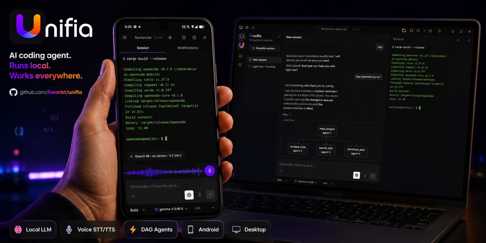

<p align="center">
  
</p>
<p align="center">El agente de programación con IA de código abierto.</p>
<p align="center">
  <a href="https://github.com/Rwanbt/unifia/releases"></a>
  <a href="https://github.com/Rwanbt/unifia/actions/workflows/release.yml"></a>
</p>

<p align="center">
  <a href="README.md">English</a> |
  <a href="README.zh.md">简体中文</a> |
  <a href="README.zht.md">繁體中文</a> |
  <a href="README.ko.md">한국어</a> |
  <a href="README.de.md">Deutsch</a> |
  <a href="README.es.md">Español</a> |
  <a href="README.fr.md">Français</a> |
  <a href="README.it.md">Italiano</a> |
  <a href="README.da.md">Dansk</a> |
  <a href="README.ja.md">日本語</a> |
  <a href="README.pl.md">Polski</a> |
  <a href="README.ru.md">Русский</a> |
  <a href="README.bs.md">Bosanski</a> |
  <a href="README.ar.md">العربية</a> |
  <a href="README.no.md">Norsk</a> |
  <a href="README.br.md">Português (Brasil)</a> |
  <a href="README.th.md">ไทย</a> |
  <a href="README.tr.md">Türkçe</a> |
  <a href="README.uk.md">Українська</a> |
  <a href="README.bn.md">বাংলা</a> |
  <a href="README.gr.md">Ελληνικά</a> |
  <a href="README.vi.md">Tiếng Việt</a>
</p>

[](https://github.com/Rwanbt/unifia)

<!-- WHY-FORK-MATRIX -->
## ¿Por qué este fork?

> **TL;DR** — el único agente de programación open source que incluye un orquestador DAG, una API REST de tareas, scoping MCP por agente, una FSM de sesión con 9 estados, un escáner de vulnerabilidades integrado *y* una aplicación Android de primera clase con inferencia LLM en el dispositivo. Ningún otro CLI — propietario u open — combina todo esto.

> See the English [README.md](README.md) for the full positioning prose (vs. vendor-locked CLIs, vs. BYOM peers, vs. specialized CLIs) and architecture diagram.

### Capability matrix — this fork vs. the 2026 landscape

Legend: ✅ shipped · ❌ absent · *partial* limited/incomplete · *plugin* via community add-on · *paid* behind a subscription tier.

#### Orchestration, API surface, governance

| Capability                             | **This fork** | Claude Code | Codex CLI | Gemini CLI | opencode (upstream) | Aider | Goose | Cline | Roo Code | Cursor | Continue | Crush | Qwen Code |
| -------------------------------------- | :-----------: | :---------: | :-------: | :--------: | :-----------------: | :---: | :---: | :---: | :------: | :----: | :------: | :---: | :-------: |
| Open source                            |       ✅       |      ❌      |  partial  |      ✅     |          ✅          |   ✅   |   ✅   |   ✅   |    ✅     |    ❌    |     ✅     |   ✅   |     ✅     |
| BYOM (bring your own model)            |       ✅       |      ❌      |     ❌     |      ❌     |          ✅          |   ✅   |   ✅   |   ✅   |    ✅     |  partial |     ✅     |   ✅   |   partial  |
| Local models (llama.cpp / Ollama)      |       ✅       |      ❌      |     ❌     |      ❌     |          ✅          |   ✅   |   ✅   |   ✅   |    ✅     |    ❌    |     ✅     |   ✅   |     ✅     |
| Parallel agents in isolated worktrees  |    ✅ native   |  ✅ (Teams)  |  partial  |      ❌     |      via plugin     |   ❌   | partial | ✅ (v3.58) | partial | ❌ | ❌ | ❌ |     ❌     |
| Explicit **DAG orchestration**         | ✅ **unique**  |    ad-hoc   |     ❌     |      ❌     |          ❌          |   ❌   | recipes (linear) | ❌ | ❌ | ❌ |     ❌     |   ❌   |     ❌     |
| **REST task API** (programmable)       | ✅ **unique**  | partial (SDK) |  ❌    |      ❌     |          ❌          |   ❌   |   ❌   |   ❌   |    ❌     |    ❌    |     ❌     |   ❌   |     ❌     |
| **TUI task dashboard**                 |       ✅       |      ❌      |     ❌     |      ❌     |       partial       |   ❌   |   ❌   |   ❌   |    ❌     |   n/a   |    n/a    |   ❌   |   partial  |
| MCP support                            | ✅ + **per-agent scoping** | ✅ | ✅ | ✅ | ✅ | via plugins | ✅ | ✅ | ✅ | partial | ✅ |   ❌   |     ✅     |
| **9-state session FSM**                | ✅ **unique** (6/9 persisted) | ❌ |     ❌     |      ❌     |        basic        |   ❌   |   ❌   |   ❌   |    ❌     |    ❌    |     ❌     |   ❌   |     ❌     |
| Built-in **vulnerability scanner**     | ✅ **unique**  |      ❌      |     ❌     |      ❌     |          ❌          |   ❌   |   ❌   |   ❌   |    ❌     |    ❌    |     ❌     |   ❌   |     ❌     |
| **DLP / secret redaction** before LLM call | ✅         |   partial    |     ❌     |      ❌     |          ❌          |   ❌   |   ❌   |   ❌   |    ❌     |    ❌    |     ❌     |   ❌   |     ❌     |
| **Per-agent tool allow/deny**          |       ✅       |   partial    |     ❌     |      ❌     |        basic        |   ❌   |   ❌   |   ❌   |  partial  |    ❌    |     ❌     |   ❌   |     ❌     |
| Docker sandboxing (bash only) | ✅ bash-only | ❌         |     ✅     |      ❌     |          ❌          |   ❌   |   ❌   |   ❌   |    ❌     |    ❌    |     ❌     |   ❌   |     ❌     |
| Git auto-commits / rollback            |       ✅       |      ✅      |     ✅     |      ✅     |      ✅ (signed)     |   ✅   |   ✅   |   ✅   |    ✅     |    ✅    |     ✅     |   ✅   |     ✅     |

#### Intelligence, context, developer UX

| Capability                             | **This fork** | Claude Code | Codex CLI | Gemini CLI | opencode (upstream) | Aider | Goose | Cline | Roo Code | Cursor | Continue | Crush | Qwen Code |
| -------------------------------------- | :-----------: | :---------: | :-------: | :--------: | :-----------------: | :---: | :---: | :---: | :------: | :----: | :------: | :---: | :-------: |
| LSP integration (go-to-def, diagnostics) | ✅           |   partial    |  partial  |   partial   |          ✅          | partial | partial | ✅   |    ✅     |    ✅    |     ✅     | partial |  partial  |
| Plugin SDK (`@opencode/plugin`)        |       ✅       |   partial    |     ❌     |      ❌     |          ✅          |   ❌   |   ✅   |   ✅   |    ✅     |    ✅    |     ✅     |   ❌   |     ❌     |
| Prompt caching (cloud + local KV)      |       ✅       |      ✅      |     ✅     |      ✅     |          ✅          |   ✅   |   ✅   |   ✅   |    ✅     |    ✅    |     ✅     |   ✅   |     ✅     |
| **RAG: BM25 or vector (selectable)** + exponential decay | ✅ | ❌  |     ❌     |      ❌     |          ❌          |   ❌   |   ❌   | vector only | ❌      |  vector only |  vector only |  ❌   |     ❌     |
| **Auto-learn** (requires `learner` agent configured) | opt-in | ❌  |  ❌     |      ❌     |          ❌          |   ❌   |   ❌   |   ❌   |    ❌     |    ❌    |     ❌     |   ❌   |     ❌     |
| Auto-compact (AI summarization)        |       ✅       |      ✅      |     ✅     |      ✅     |          ✅          |   ✅   |   ✅   |   ✅   |    ✅     |    ✅    |     ✅     | partial |     ✅     |
| Unified-diff edit engine               |       ✅       |      ✅      |     ✅     |   partial   |          ✅          |   ✅   | partial | partial |    ✅     | partial |  partial  | partial |  partial  |
| ACP (Agent Client Protocol) layer      |       ✅       |      ❌      |     ❌     |      ❌     |        basic        |   ❌   |   ❌   |   ❌   |    ❌     |    ❌    |     ❌     |   ❌   |     ❌     |

#### Platform reach & multimodal

| Capability                             | **This fork** | Claude Code | Codex CLI | Gemini CLI | opencode (upstream) | Aider | Goose | Cline | Roo Code | Cursor | Continue | Crush | Qwen Code |
| -------------------------------------- | :-----------: | :---------: | :-------: | :--------: | :-----------------: | :---: | :---: | :---: | :------: | :----: | :------: | :---: | :-------: |
| First-class **Android app**            | ✅ **unique**  |      ❌      |     ❌     |      ❌     |          ❌          |   ❌   |   ❌   |   ❌   |    ❌     |    ❌    |     ❌     |   ❌   |     ❌     |
| iOS (remote mode)                      |       ✅       |      ❌      |     ❌     |      ❌     |          ❌          |   ❌   |   ❌   |   ❌   |    ❌     |    ❌    |     ❌     |   ❌   |     ❌     |
| Adaptive runtime (VRAM/CPU, thermal Android-only) | ✅ partial | ❌ |  ❌     |      ❌     |      hardcoded      | hardcoded | hardcoded | hardcoded | hardcoded | n/a | hardcoded | hardcoded | hardcoded |
| **STT** (voice-to-text, Parakeet) | ✅ desktop + mobile | ❌ |     ❌     |      ❌     |          ❌          |   ❌   |   ❌   | partial  |    ❌     |    ❌    |     ❌     |   ❌   |     ❌     |
| **TTS** (Kokoro desktop + mobile; Pocket desktop only + voice clone) | ✅ | ❌ |    ❌     |      ❌     |          ❌          |   ❌   |   ❌   |   ❌   |    ❌     |    ❌    |     ❌     |   ❌   |     ❌     |
| **OAuth deep-link callback** (Tauri)   |       ✅       |      ❌      |     ❌     |      ❌     |          ❌          |   ❌   |   ❌   |   ❌   |    ❌     |    ❌    |     ❌     |   ❌   |     ❌     |
| **mDNS service discovery** (CLI flag `--mdns`) | opt-in | ❌ |   ❌     |      ❌     |          ❌          |   ❌   |   ❌   |   ❌   |    ❌     |    ❌    |     ❌     |   ❌   |     ❌     |
| **Upstream branch watcher** (`vcs.branch.behind`) | ✅ **unique** | ❌ |    ❌     |      ❌     |          ❌          |   ❌   |   ❌   |   ❌   |    ❌     |    ❌    |     ❌     |   ❌   |     ❌     |
| **Collaborative mode** (JWT + presence + file-lock) | ✅ | ❌      |     ❌     |      ❌     |          ❌          |   ❌   |   ❌   |   ❌   |    ❌     | partial |     ❌     |   ❌   |     ❌     |
| **AnythingLLM bridge**                 | ✅ **unique**  |      ❌      |     ❌     |      ❌     |          ❌          |   ❌   |   ❌   |   ❌   |    ❌     |    ❌    |     ❌     |   ❌   |     ❌     |
| **GDPR export/erasure route**          | ✅ **unique**  |      ❌      |     ❌     |      ❌     |          ❌          |   ❌   |   ❌   |   ❌   |    ❌     |    ❌    |     ❌     |   ❌   |     ❌     |
| Price                                  |  free + BYOM  |  $20/mo sub |$20/mo sub |  1000/day free | free + BYOM    | free + BYOM | free + BYOM | free + BYOM | free + BYOM | $20/mo sub | free + BYOM | free + BYOM | free + BYOM |

---

<!-- ACCORDION-APPLIED -->

<details>
<summary><b>⚡ De un vistazo</b></summary>
<br>

## ⚡ De un vistazo

OpenCode (fork) — un agente de programación con IA que corre en **escritorio, servidor y teléfono**, con modelos locales de extremo a extremo, sin dependencia de la nube y con primitivas de gobernanza nivel enterprise incluidas. Fork de [anomalyco/opencode](https://github.com/anomalyco/opencode) mantenido por [Rwanbt](https://github.com/Rwanbt).

### Install

```bash
# CLI (macOS / Linux / Windows)
# No public Unifia package or installer is published yet. Build from source:
git clone https://github.com/Rwanbt/unifia.git
cd unifia
bun install
bun run --cwd packages/opencode build --single

# Desktop app + Android APK
# → https://github.com/Rwanbt/unifia/releases/latest
```

### 8 cosas que solo este fork empaqueta

|   |   |
| - | - |
| 🤖 **DAG orchestration** | Wave-based parallel agents, up to 5 concurrent |
| 🧠 **Local LLM end-to-end** | llama.cpp + runtime that auto-tunes to your VRAM / CPU |
| 📱 **Android app** | On-device inference, terminal, PTY — single APK |
| 🎙️ **Voice STT / TTS** | Parakeet (25 languages) + Kokoro desktop+mobile / Pocket TTS desktop |
| 🔒 **9-state session FSM** | 6 of 9 states persist to SQLite, audit log survives restart |
| 🔌 **REST task API** | 8 endpoints — drive the agent from cron, Temporal, Airflow |
| 🛡️ **Vulnerability scanner** | Auto-scans every edit / write for secrets & injection sinks |
| 🔍 **RAG: BM25 or vector** | Selectable at index time + exponential confidence decay |

### Ejecutar tu primera tarea

```bash
# This checkout still exposes the compatibility CLI name `opencode`.
bun run --cwd packages/opencode dev
bun run packages/opencode/src/index.ts run "fix the failing test in src/"
```

> 💡 ¿Necesitas detalles? Cada sección a continuación está colapsada — haz clic para expandir solo las que te interesen.

---


</details>

<details>
<summary><b>Funcionalidades del fork</b></summary>
<br>

## Funcionalidades del fork

> Este es un fork de [anomalyco/opencode](https://github.com/anomalyco/opencode) mantenido por [Rwanbt](https://github.com/Rwanbt).
> Sincronizado con upstream. Ver la [rama dev](https://github.com/Rwanbt/unifia/tree/dev) para los últimos cambios.

#### IA local primero

OpenCode ejecuta modelos de IA localmente en hardware de consumo (8 GB VRAM / 16 GB RAM), sin ninguna dependencia de la nube para modelos 4B-7B.

**Optimización de prompts (reducción del 94%)**
- Prompt de sistema de ~1K tokens para modelos locales (vs ~16K para la nube)
- Esquemas de herramientas esqueleto (firmas de 1 línea vs prosa de varios KB)
- Lista blanca de 7 herramientas (bash, read, edit, write, glob, grep, question)
- Sin sección de skills, información de entorno mínima

**Motor de inferencia (llama.cpp b8731)**
- Backend GPU Vulkan, descargado automáticamente en la primera carga de modelo
- **Configuración adaptativa en tiempo de ejecución** (`packages/opencode/src/local-llm-server/auto-config.ts`): `n_gpu_layers`, hilos, tamaño de batch/ubatch, cuantización de caché KV y tamaño de contexto derivados de la VRAM detectada, RAM libre, partición CPU big.LITTLE, backend GPU (CUDA/ROCm/Vulkan/Metal/OpenCL) y estado térmico. Reemplaza al antiguo `--n-gpu-layers 99` fijo — un Android de 4 GB ahora funciona en modo CPU de respaldo en lugar de ser terminado por OOM, los escritorios de gama alta reciben un batch ajustado en lugar del 512 por defecto.
- `--flash-attn on` — Flash Attention para eficiencia de memoria
- `--cache-type-k/v` — Caché KV con cuantización estándar de llama.cpp; nivel adaptativo (f16 / q8_0 / q4_0) según margen de VRAM
- `--fit on` — ajuste secundario de VRAM exclusivo del fork (opt-in vía `OPENCODE_LLAMA_ENABLE_FIT=1`)
- Decodificación especulativa (`--model-draft`) con guardia de VRAM (desactivación automática si < 4 GB libre)
- Slot único (`-np 1`) para minimizar la huella de memoria
- **Arnés de benchmark** (`bun run bench:llm`): medición reproducible de FTL / TPS / RSS pico / tiempo total por modelo, por ejecución, salida JSONL para archivado en CI

**Reconocimiento de voz (Parakeet TDT 0.6B v3 INT8)**
- NVIDIA Parakeet vía ONNX Runtime — ~300ms para 5s de audio (18x tiempo real)
- 25 idiomas europeos (inglés, francés, alemán, español, etc.)
- Cero VRAM: solo CPU (~700 MB RAM)
- Descarga automática del modelo (~460 MB) al primer pulso del micrófono
- Animación de forma de onda durante la grabación

**Síntesis de voz (Kyutai Pocket TTS)**
- TTS nativo francés creado por Kyutai (París), 100M parámetros
- 8 voces integradas: Alba, Fantine, Cosette, Eponine, Azelma, Marius, Javert, Jean
- Clonación de voz zero-shot: sube un WAV o graba desde el micrófono
- Solo CPU, ~6x tiempo real, servidor HTTP en el puerto 14100
- Fallback: motor Kokoro TTS ONNX (54 voces, 9 idiomas, CMUDict G2P)

**Gestión de modelos**
- Búsqueda en HuggingFace con insignias de compatibilidad VRAM/RAM por modelo
- Descargar, cargar, descargar, eliminar modelos GGUF desde la interfaz
- Catálogo pre-seleccionado: Gemma 3 4B, Qwen3 4B/1.7B/0.6B
- Tokens de salida dinámicos según el tamaño del modelo
- Detección automática del modelo draft (0.5B-0.8B) para decodificación especulativa

**Configuración**
- Preajustes: Fast / Quality / Eco / Long Context (optimización con un clic)
- Widget de monitoreo de VRAM con barra de uso codificada por colores (verde / amarillo / rojo)
- Tipo de caché KV: auto / q8_0 / q4_0 / f16
- Descarga a GPU: auto / gpu-max / balanced
- Memory mapping: auto / on / off
- Alternancia de búsqueda web (icono de globo en la barra de prompt)

**Fiabilidad del agente (modelos locales)**
- Guardias pre-vuelo (a nivel de código, 0 tokens): verificación de existencia de archivo antes de editar, verificación del contenido de old_string, lectura obligatoria antes de edición, prevención de escritura sobre archivo existente
- Ruptura automática de bucle infinito: 2x llamadas de herramientas idénticas → error inyectado (guardia a nivel de código, no solo en el prompt)
- Telemetría de herramientas: tasa de éxito/error por sesión con desglose por herramienta, registrado automáticamente

**Multiplataforma**: Windows (Vulkan), Linux, macOS, Android

#### Tareas en segundo plano

Delegue trabajo a subagentes que se ejecutan de forma asíncrona. Establezca `mode: "background"` en la herramienta task y devuelve un `task_id` inmediatamente mientras el agente trabaja en segundo plano. Se publican eventos de bus (`TaskCreated`, `TaskCompleted`, `TaskFailed`) para el seguimiento del ciclo de vida.

#### Equipos de agentes

Orqueste múltiples agentes en paralelo usando la herramienta `team`. Defina subtareas con aristas de dependencia; `computeWaves()` construye un DAG y ejecuta tareas independientes simultáneamente (hasta 5 agentes en paralelo). Control de presupuesto mediante `max_cost` (dólares) y `max_agents`. El contexto de tareas completadas se pasa automáticamente a las dependientes.

#### Aislamiento Git worktree

Cada tarea en segundo plano obtiene automáticamente su propio git worktree. El espacio de trabajo se vincula a la sesión en la base de datos. Si una tarea no produce cambios en archivos, el worktree se limpia automáticamente. Esto proporciona aislamiento a nivel de git sin contenedores.

#### API de gestión de tareas

API REST completa para la gestión del ciclo de vida de tareas:

| Método | Ruta | Descripción |
|--------|------|-------------|
| GET | `/task/` | Listar tareas (filtrar por padre, estado) |
| GET | `/task/:id` | Detalles de tarea + estado + info de worktree |
| GET | `/task/:id/messages` | Obtener mensajes de la sesión de tarea |
| POST | `/task/:id/cancel` | Cancelar una tarea en ejecución o en cola |
| POST | `/task/:id/resume` | Reanudar tarea completada/fallida/bloqueada |
| POST | `/task/:id/followup` | Enviar mensaje de seguimiento a tarea inactiva |
| POST | `/task/:id/promote` | Promover tarea de segundo plano a primer plano |
| GET | `/task/:id/team` | Vista agregada del equipo (costos, diffs por miembro) |

#### Panel de tareas TUI

Plugin de barra lateral que muestra tareas en segundo plano activas con iconos de estado en tiempo real:

| Icono | Estado |
|-------|--------|
| `~` | Running / Retrying |
| `?` | Queued / Awaiting input |
| `!` | Blocked |
| `x` | Failed |
| `*` | Completed |
| `-` | Cancelled |

Diálogo con acciones: abrir sesión de tarea, cancelar, reanudar, enviar seguimiento, verificar estado.

#### Alcance MCP por agente

Listas de permitir/denegar por agente para servidores MCP. Configure en `opencode.json` bajo el campo `mcp` de cada agente. La función `toolsForAgent()` filtra las herramientas MCP disponibles según el alcance del agente que realiza la llamada.

```json
{
  "agents": {
    "explore": {
      "mcp": { "deny": ["dangerous-server"] }
    }
  }
}
```

#### Ciclo de vida de sesión de 9 estados

Las sesiones rastrean uno de 9 estados, persistidos en la base de datos:

`idle` · `busy` · `retry` · `queued` · `blocked` · `awaiting_input` · `completed` · `failed` · `cancelled`

Los estados persistentes (`queued`, `blocked`, `awaiting_input`, `completed`, `failed`, `cancelled`) sobreviven a reinicios de la base de datos. Los estados en memoria (`idle`, `busy`, `retry`) se reinician al reiniciar.

#### Agente orquestador

Agente coordinador de solo lectura (máximo 50 pasos). Tiene acceso a las herramientas `task` y `team` pero todas las herramientas de edición están denegadas. Delega la implementación a los agentes build/general y sintetiza los resultados.

---


</details>

<details>
<summary><b>Arquitectura técnica</b></summary>
<br>

## Arquitectura técnica

### Soporte multi-proveedor

Más de 21 proveedores listos para usar: Anthropic, OpenAI, Google Gemini, Azure, AWS Bedrock, Vertex AI, OpenRouter, GitHub Copilot, XAI, Mistral, Groq, DeepInfra, Cerebras, Cohere, TogetherAI, Perplexity, Vercel, Venice, GitLab, Gateway, además de cualquier endpoint compatible con OpenAI. Precios obtenidos de [models.dev](https://models.dev).

### Sistema de agentes

| Agente | Modo | Acceso | Descripción |
|--------|------|--------|-------------|
| **build** | primary | full | Agente de desarrollo predeterminado |
| **plan** | primary | read-only | Análisis y exploración de código |
| **general** | subagent | full (no todowrite) | Tareas complejas de múltiples pasos |
| **explore** | subagent | read-only | Búsqueda rápida en el codebase |
| **orchestrator** | subagent | read-only + task/team | Coordinador multi-agente (50 pasos) |
| **critic** | subagent | read-only + bash + LSP | Revisión de código: bugs, seguridad, rendimiento |
| **tester** | subagent | full (no todowrite) | Escribir y ejecutar tests, verificar cobertura |
| **documenter** | subagent | full (no todowrite) | JSDoc, README, documentación inline |
| compaction | hidden | none | Resumen de contexto impulsado por IA |
| title | hidden | none | Generación de título de sesión |
| summary | hidden | none | Resumen de sesión |

### Integración LSP

Soporte completo del Language Server Protocol con indexación de símbolos, diagnósticos y soporte multi-lenguaje (TypeScript, Deno, Vue, y extensible). El agente navega el código mediante símbolos LSP en lugar de búsqueda textual, permitiendo go-to-definition preciso, find-references y detección de errores de tipo en tiempo real.

### Soporte MCP

Cliente y servidor Model Context Protocol. Soporta transportes stdio, HTTP/SSE y StreamableHTTP. Flujo de autenticación OAuth para servidores remotos. Capacidades de tool, prompt y resource. Alcance por agente mediante listas de permitir/denegar.

### Arquitectura cliente/servidor

API REST basada en Hono con rutas tipadas y generación de especificación OpenAPI. Soporte WebSocket para PTY (pseudo-terminal). SSE para streaming de eventos en tiempo real. Auth básica, CORS, compresión gzip. El TUI es un frontend; el servidor puede controlarse desde cualquier cliente HTTP, la interfaz web o una aplicación móvil.

### Gestión de contexto

Auto-compactación con resumen impulsado por IA cuando el uso de tokens se acerca al límite de contexto del modelo. Poda consciente de tokens con umbrales configurables (`PRUNE_MINIMUM` 20KB, `PRUNE_PROTECT` 40KB). Las salidas de la herramienta skill están protegidas de la poda.

### Motor de edición

Parcheo de diffs unificados con verificación de hunks. Aplica hunks dirigidos a regiones específicas del archivo en lugar de sobrescrituras completas. Herramienta multi-edit para operaciones por lotes en múltiples archivos.

### Sistema de permisos

Permisos de 3 estados (`allow` / `deny` / `ask`) con coincidencia de patrones comodín. Más de 100 definiciones de aridad de comandos bash para control detallado. Aplicación de límites del proyecto que impide el acceso a archivos fuera del espacio de trabajo.

### Reversión basada en git

Sistema de snapshots que registra el estado de archivos antes de cada ejecución de herramienta. Soporta `revert` y `unrevert` con cálculo de diff. Los cambios se pueden revertir por mensaje o por sesión.

### Seguimiento de costos

Costo por mensaje con desglose completo de tokens (input, output, reasoning, cache read, cache write). Límites de presupuesto por equipo (`max_cost`). Comando `stats` con agregación por modelo y por día. Costo de sesión en tiempo real mostrado en el TUI. Datos de precios obtenidos de models.dev.

### Sistema de plugins

SDK completo (`@opencode/plugin`) con arquitectura de hooks. Carga dinámica desde paquetes npm o el sistema de archivos. Plugins integrados para autenticación de Codex, GitHub Copilot, GitLab y Poe.

---


</details>

<details>
<summary><b>Conceptos erróneos comunes</b></summary>
<br>

## Conceptos erróneos comunes

Para evitar confusión por resúmenes generados por IA de este proyecto:

- El **TUI es TypeScript** (SolidJS + @opentui para renderizado en terminal), no Rust.
- **Tree-sitter** se usa solo para resaltado de sintaxis del TUI y análisis de comandos bash, no para análisis de código a nivel de agente.
- **No hay sandboxing Docker/E2B** -- el aislamiento se proporciona mediante git worktrees.
- **No hay base de datos vectorial ni sistema RAG** -- el contexto se gestiona mediante indexación de símbolos LSP + auto-compactación.
- **No hay un "modo watch" que proponga correcciones automáticas** -- el file watcher existe solo para fines de infraestructura.
- La **auto-corrección** usa el bucle estándar del agente (el LLM ve errores en resultados de herramientas y reintenta), no un mecanismo especializado de reparación automática.


</details>

<details>
<summary><b>Matriz de capacidades</b></summary>
<br>

## Matriz de capacidades

| Capacidad | Estado | Notas |
|-----------|--------|-------|
| Background tasks | Implemented | `mode: "background"` on task tool |
| Agent teams (DAG) | Implemented | Wave-based parallel execution, budget control |
| Git worktree isolation | Implemented | Auto-created per background task |
| Task REST API | Implemented | 8 endpoints for full lifecycle |
| TUI task dashboard | Implemented | Sidebar + dialog actions |
| MCP agent scoping | Implemented | Per-agent allow/deny config |
| 9-state lifecycle | Implemented | Persistent to SQLite |
| Orchestrator agent | Implemented | Read-only coordinator |
| Multi-provider (21+) | Implemented | Including local models |
| LSP integration | Implemented | Symbols, diagnostics, multi-language |
| MCP protocol | Implemented | Client + server, 3 transports |
| Plugin system | Implemented | SDK + hook architecture |
| Cost tracking | Implemented | Per-message, per-team, per-model |
| Context auto-compact | Implemented | AI summarization + pruning |
| Git rollback/snapshots | Implemented | Revert/unrevert per message |
| Docker sandboxing | Implemented | Optional via `experimental.sandbox.type: "docker"` |
| Vector DB / RAG | Implemented | `experimental.rag.enabled: true`, SQLite + cosine similarity |
| Dry run / command preview | Implemented | `dry_run` param on bash/edit/write tools |
| Specialized agents | Implemented | critic, tester, documenter subagents |
| Auto-learn | Implemented | Post-session lesson extraction to `.opencode/learnings/` |
| Vulnerability scanner | Implemented | Auto-scan on edit/write for secrets, injections, unsafe patterns |
| DLP / AgentShield | Implemented | `experimental.dlp.enabled: true`, redacts secrets before LLM calls |
| Policy engine | Implemented | `experimental.policy.enabled: true`, conditional rules + custom policies |
| Confidence/decay | Implemented | Time-based scoring for RAG embeddings, exponential decay |
| Memory conflict resolution | Dead code | `rag/conflict.ts` is unit-tested but not invoked in production; treat as unimplemented |
| Per-message token display | Partial | Stored in DB, shown as session aggregate |

### IA Local (Escritorio + Móvil)
| Capacidad | Estado | Notas |
|-----------|--------|-------|
| Local LLM (llama.cpp b8731) | Implemented | Vulkan GPU, auto-download runtime, `--fit` auto-VRAM |
| **Configuración adaptativa en tiempo de ejecución** | Implemented | `auto-config.ts`: n_gpu_layers / hilos / batch / cuant KV derivados de VRAM detectada, RAM, big.LITTLE, backend GPU, estado térmico |
| **Arnés de benchmark** | Implemented | `bun run bench:llm` mide FTL, TPS, RSS pico, tiempo total por modelo; salida JSONL |
| Flash Attention | Implemented | `--flash-attn on` on desktop and mobile |
| KV cache quantization | Implemented | q4_0 / q8_0 / f16 adaptive with standard llama.cpp quantization (~50% KV memory savings at q4_0) |
| Exact tokenizer (OpenAI) | Implemented | `js-tiktoken` para gpt-*/o1/o3/o4; empírico 3.5 caracteres/token para Llama/Qwen/Gemma |
| Speculative decoding | Implemented | VRAM Guard (desktop) / RAM Guard (mobile), draft model auto-detection |
| HuggingFace model search | Implemented | Respuesta validada con Zod, insignias VRAM, gestor de descargas, 9 modelos precurados |
| **Descargas GGUF reanudables** | Implemented | Cabecera HTTP `Range` — una interrupción 4G no reinicia una transferencia de 4 GB desde cero |
| Tool telemetry | Implemented | Per-session success/error rate logging with per-tool breakdown |
| Reinicio con disyuntor | Implemented | `ensureCorrectModel` se detiene tras 3 reinicios en 120 s para evitar bucles de burn-cycle |

### Seguridad y Gobernanza
| Capacidad | Estado | Notas |
|-----------|--------|-------|
| **CSP estricta (escritorio + móvil)** | Implemented | `connect-src` limitado a loopback + HuggingFace + proveedores HTTPS; sin `unsafe-eval`, `object-src 'none'`, `frame-ancestors 'none'` |
| **Endurecimiento de release Android** | Implemented | `isDebuggable=false`, `allowBackup=false`, `isShrinkResources=true`, `FOREGROUND_SERVICE_TYPE_SPECIAL_USE` |
| **Endurecimiento de release escritorio** | Implemented | Devtools ya no se fuerzan a activadas — restaurado el valor predeterminado de Tauri 2 (solo en debug) para que un punto de apoyo XSS no pueda engancharse a `__TAURI__` en producción |
| **Validación de entrada de comandos Tauri** | Implemented | Guards de `download_model` / `load_llm_model` / `delete_model`: charset del nombre de archivo, allowlist HTTPS hacia `huggingface.co` / `hf.co` |
| **Cadena de logging Rust** | Implemented | `log` + `android_logger` en móvil; sin `eprintln!` en release → sin filtraciones de path/URL a logcat |
| **Rastreador de auditoría de seguridad** | Implemented | [`SECURITY_AUDIT.md`](SECURITY_AUDIT.md) — todos los hallazgos clasificados como S1/S2/S3 con `path:line`, estado y justificación de corrección aplazada |

---


</details>

<details>
<summary><b>Future Roadmap</b></summary>
<br>

## Future Roadmap

Three major initiatives are planned on dedicated feature branches. Each is designed to be modular — they can be developed independently and merged when ready.

### 🤝 Collaborative Mode ()

**Goal**: Multiple developers interacting with agents simultaneously in real-time.

| Component | Description |
|-----------|-------------|
| Multi-user auth | JWT-based authentication on the Hono server, user sessions, role-based access |
| WebSocket broadcast | Real-time event streaming to all connected clients (agent activity, file changes, task status) |
| File concurrency | Lock-based or CRDT-based conflict resolution when multiple agents/users edit the same file |
| Presence UI | See who is connected, what they're working on, which agents are assigned to whom |
| Shared context | Cross-user session history, shared learnings, team-wide RAG index |

**Scale**: ~3000+ LOC, major architectural change. Requires refactoring the server for multi-tenant support.

### 📱 Mobile Version ()

**Goal**: Run OpenCode as a native mobile app on Android and iOS, with full agent capabilities.

| Component | Description |
|-----------|-------------|
| **Tauri 2.0 migration** | Leverage Tauri's mobile targets (Android/iOS) to package the existing SolidJS frontend as a native app |
| **Runtime adaptation** | Bundle the TypeScript agent core with Vite for WebView execution; delegate performance-critical tasks to Tauri's Rust layer |
| **isomorphic-git** | Replace system  calls with isomorphic-git for pure-JS git operations within the mobile sandbox |
| **File system access** | Use  for sandboxed file access + Document Picker integration |
| **Remote mode** | Connect to a desktop OpenCode instance over a secure tunnel (Tailscale/Cloudflare) for full capability without local execution |
| **Mobile-optimized UI** | Conversational interface that hides terminal complexity; swipe-based diff review; virtual keyboard optimizations |

**Platform comparison**:
- **Android** (via Termux or Tauri): Full Node.js support, broad file access, excellent performance
- **iOS** (via Tauri/a-Shell): Sandbox restrictions, limited native packages, but strong Apple Silicon performance for local models

**Scale**: ~2000+ LOC for the Tauri mobile shell, ~500 LOC for isomorphic-git adapter, ~300 LOC for remote mode.

### 🔗 AnythingLLM Fusion ()

**Goal**: Merge OpenCode's agentic coding capabilities with [AnythingLLM](https://github.com/mintplex-labs/anything-llm)'s document RAG and multi-user chat platform.

| Component | Description |
|-----------|-------------|
| **Context bridge** | Pipe AnythingLLM's indexed documents (PDFs, wikis, Confluence, etc.) into OpenCode's system prompt as additional context |
| **Agent skill plugin** | Expose OpenCode's core commands (, , edit, bash) as an AnythingLLM Agent Skill via HTTP API |
| **Unified vector store** | Merge OpenCode's SQLite RAG with AnythingLLM's vector DB backends (LanceDB, Pinecone, Chroma) for a single knowledge layer |
| **Multi-user workspace** | Leverage AnythingLLM's existing multi-user and workspace management for team environments |
| **Containerized deployment** | Docker Compose setup running both backends, with shared auth and a unified API gateway |

**Synergy**: AnythingLLM excels at document ingestion and RAG over non-code content. OpenCode excels at code manipulation, agentic tool use, and multi-provider LLM orchestration. Combined, they create a full-stack AI development platform that can reason over documentation AND write/execute code.

**Scale**: ~1500+ LOC for the bridge layer, ~500 LOC for the Agent Skill adapter, ~300 LOC for vector store unification.

---

### Instalación

```bash
# YOLO
# No public Unifia installer is published; use the source build documented above.

# Gestores de paquetes
```

> [!TIP]
> Elimina versiones anteriores a 0.1.x antes de instalar.

### App de escritorio (BETA)

OpenCode también está disponible como aplicación de escritorio. Descárgala directamente desde la [página de releases](https://github.com/Rwanbt/unifia/releases) o desde [opencode.ai/download](https://github.com/Rwanbt/unifia/releases/latest).

| Plataforma            | Descarga                              |
| --------------------- | ------------------------------------- |
| macOS (Apple Silicon) | `opencode-desktop-darwin-aarch64.dmg` |
| macOS (Intel)         | `opencode-desktop-darwin-x64.dmg`     |
| Windows               | `opencode-desktop-windows-x64.exe`    |
| Linux                 | `.deb`, `.rpm`, o AppImage            |

```bash
# macOS (Homebrew)
# Windows (Scoop)
scoop bucket add extras; scoop install extras/opencode-desktop
```

#### Directorio de instalación

El script de instalación respeta el siguiente orden de prioridad para la ruta de instalación:

1. `$OPENCODE_INSTALL_DIR` - Directorio de instalación personalizado
2. `$XDG_BIN_DIR` - Ruta compatible con la especificación XDG Base Directory
3. `$HOME/bin` - Directorio binario estándar del usuario (si existe o se puede crear)
4. `$HOME/.opencode/bin` - Alternativa por defecto

```bash
# Ejemplos
# No public Unifia installer is published; use the source build documented above.
# No public Unifia installer is published; use the source build documented above.
```

### Agents

OpenCode incluye dos agents integrados que puedes alternar con la tecla `Tab`.

- **build** - Por defecto, agent con acceso completo para trabajo de desarrollo
- **plan** - Agent de solo lectura para análisis y exploración de código
  - Niega ediciones de archivos por defecto
  - Pide permiso antes de ejecutar comandos bash
  - Ideal para explorar codebases desconocidas o planificar cambios

Además, incluye un subagent **general** para búsquedas complejas y tareas de varios pasos.
Se usa internamente y se puede invocar con `@general` en los mensajes.

Más información sobre [agents](https://github.com/Rwanbt/unifia/tree/dev/packages/web/src/content/docs/agents).

### Documentación

Para más información sobre cómo configurar OpenCode, [**ve a nuestra documentación**](https://github.com/Rwanbt/unifia/tree/dev/packages/web/src/content/docs).

### Contribuir

Si te interesa contribuir a OpenCode, lee nuestras [docs de contribución](./CONTRIBUTING.md) antes de enviar un pull request.

### Construyendo sobre OpenCode

Si estás trabajando en un proyecto relacionado con OpenCode y usas "opencode" como parte del nombre; por ejemplo, "opencode-dashboard" u "opencode-mobile", agrega una nota en tu README para aclarar que no está construido por el equipo de OpenCode y que no está afiliado con nosotros de ninguna manera.

### FAQ

#### ¿En qué se diferencia de Claude Code?

Es muy similar a Claude Code en cuanto a capacidades. Estas son las diferencias clave:

- 100% open source
- No está acoplado a ningún proveedor. Aunque recomendamos los modelos que ofrecemos a través de [OpenCode Zen](https://github.com/Rwanbt/unifia/tree/dev/packages/web/src/content/docs/providers.mdx); OpenCode se puede usar con Claude, OpenAI, Google o incluso modelos locales. A medida que evolucionan los modelos, las brechas se cerrarán y los precios bajarán, por lo que ser agnóstico al proveedor es importante.
- Soporte LSP listo para usar
- Un enfoque en la TUI. OpenCode está construido por usuarios de neovim y los creadores de [terminal.shop](https://terminal.shop); vamos a empujar los límites de lo que es posible en la terminal.
- Arquitectura cliente/servidor. Esto, por ejemplo, permite ejecutar OpenCode en tu computadora mientras lo controlas de forma remota desde una app móvil. Esto significa que el frontend TUI es solo uno de los posibles clientes.

---

**Únete a nuestra comunidad** [Discord](https://discord.gg/opencode) | [X.com](https://x.com/opencode)


</details>
