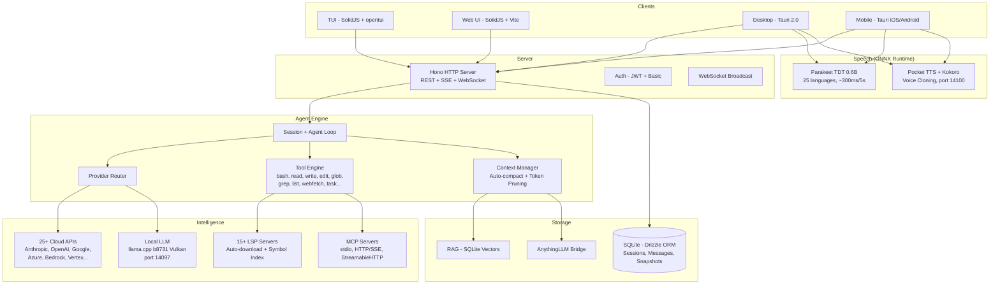

<p align="center">
  
  <a href="https://github.com/Rwanbt/unifia">
    <picture>
      <source srcset="packages/console/app/src/asset/logo-ornate-dark.svg" media="(prefers-color-scheme: dark)">
      <source srcset="packages/console/app/src/asset/logo-ornate-light.svg" media="(prefers-color-scheme: light)">
      
    </picture>
  </a>
</p>
<p align="center">The open source AI coding agent.</p>
<p align="center">
  <a href="https://github.com/Rwanbt/unifia/releases"></a>
  <a href="https://github.com/Rwanbt/unifia/actions/workflows/fork-release.yml"></a>
</p>

<p align="center">
  <a href="README.md">English</a> |
  <a href="README.zh.md">简体中文</a> |
  <a href="README.zht.md">繁體中文</a> |
  <a href="README.ko.md">한국어</a> |
  <a href="README.de.md">Deutsch</a> |
  <a href="README.es.md">Español</a> |
  <a href="README.fr.md">Français</a> |
  <a href="README.it.md">Italiano</a> |
  <a href="README.da.md">Dansk</a> |
  <a href="README.ja.md">日本語</a> |
  <a href="README.pl.md">Polski</a> |
  <a href="README.ru.md">Русский</a> |
  <a href="README.bs.md">Bosanski</a> |
  <a href="README.ar.md">العربية</a> |
  <a href="README.no.md">Norsk</a> |
  <a href="README.br.md">Português (Brasil)</a> |
  <a href="README.th.md">ไทย</a> |
  <a href="README.tr.md">Türkçe</a> |
  <a href="README.uk.md">Українська</a> |
  <a href="README.bn.md">বাংলা</a> |
  <a href="README.gr.md">Ελληνικά</a> |
  <a href="README.vi.md">Tiếng Việt</a>
</p>


> [!WARNING]
> **Unofficial fork notice:** this repository is an independent, unofficial fork of [Unifia](https://github.com/anomalyco/opencode), maintained by [Rwanbt/unifia](https://github.com/Rwanbt/unifia). It is not built, operated, endorsed, or supported by the upstream Unifia team.

Releases, binaries, issues, roadmap, and support for this fork are maintained here.
---

<!-- ACCORDION-APPLIED -->

## ⚡ At a glance

Unifia Workbench — an orchestrated AI coding agent that runs on **desktop, server, and phone**, with local models end-to-end and governance primitives built into the fork. It is based on [upstream Unifia](https://github.com/anomalyco/opencode) and distributed from the [Rwanbt fork](https://github.com/Rwanbt/unifia). The final product name is not fixed yet.

### Install

```bash
# CLI (macOS / Linux / Windows)
# The upstream installer is intentionally not used for this fork. Use a fork release artifact or build from source.

# Desktop app + Android APK
# → https://github.com/Rwanbt/unifia/releases/latest
```

### 10 things this fork bundles that no other CLI does

|   |   |
| - | - |
| 🤖 **DAG orchestration** | Wave-based parallel agents, up to 5 concurrent |
| 🧠 **Local LLM end-to-end** | llama.cpp + runtime that auto-tunes to your VRAM / CPU / thermal state |
| 📱 **Android app** | On-device inference, terminal, PTY — single APK |
| 🎙️ **Voice STT / TTS** | Parakeet (25 languages) + Kokoro / Pocket TTS + voice cloning |
| 🔒 **9-state session FSM** | Persistent, auditable states for every session |
| 🔌 **REST task API** | 8 endpoints — drive the agent from cron, Temporal, Airflow |
| 🛡️ **Vulnerability scanner** | Auto-scans every edit / write for secrets & injection sinks |
| 🔍 **Hybrid RAG** | BM25 + vector + time-decay confidence scoring |
| 🗣️ **Debate agent** | Multi-model divergence, blind-spot extraction, red-team checks, and synthesis |
| ⚡ **Auto agent** | Explicit full-auto primary agent with confirmation and permission semantics |

### Run your first task

```bash
unifia                                  # launch the TUI
unifia run "fix the failing test in src/"   # one-shot
```

> 💡 Need details? Every section below is collapsed — click to expand only the parts you care about.

---

<details>
<summary><b>📊 Why this fork? — Comparison vs. Claude Code, Codex, Cursor, Aider, Cline…</b></summary>
<br>

## Why This Fork?

> **TL;DR — this is the only open-source coding agent that ships a DAG-based orchestrator, a REST task API, per-agent MCP scoping, a 9-state session FSM, a built-in vulnerability scanner, _and_ a first-class Android app with on-device LLM inference. No other CLI — proprietary or open — combines all of these.**

### The one-sentence pitch

> An orchestrated coding agent that runs on desktop, server, _and_ phone, with local models end-to-end, zero cloud dependency, and enterprise-grade governance primitives baked in — not bolted on.

### Capability matrix — this fork vs. the 2026 landscape

Legend: ✅ shipped · ❌ absent · *partial* limited/incomplete · *plugin* via community add-on · *paid* behind a subscription tier.

#### Orchestration, API surface, governance

| Capability                             | **This fork** | Claude Code | Codex CLI | Gemini CLI | unifia (upstream) | Aider | Goose | Cline | Roo Code | Cursor | Continue | Crush | Qwen Code |
| -------------------------------------- | :-----------: | :---------: | :-------: | :--------: | :-----------------: | :---: | :---: | :---: | :------: | :----: | :------: | :---: | :-------: |
| Open source                            |       ✅       |      ❌      |  partial  |      ✅     |          ✅          |   ✅   |   ✅   |   ✅   |    ✅     |    ❌    |     ✅     |   ✅   |     ✅     |
| BYOM (bring your own model)            |       ✅       |      ❌      |     ❌     |      ❌     |          ✅          |   ✅   |   ✅   |   ✅   |    ✅     |  partial |     ✅     |   ✅   |   partial  |
| Local models (llama.cpp / Ollama)      |       ✅       |      ❌      |     ❌     |      ❌     |          ✅          |   ✅   |   ✅   |   ✅   |    ✅     |    ❌    |     ✅     |   ✅   |     ✅     |
| Parallel agents in isolated worktrees  |    ✅ native   |  ✅ (Teams)  |  partial  |      ❌     |      via plugin     |   ❌   | partial | ✅ (v3.58) | partial | ❌ | ❌ | ❌ |     ❌     |
| Explicit **DAG orchestration**         | ✅ **unique**  |    ad-hoc   |     ❌     |      ❌     |          ❌          |   ❌   | recipes (linear) | ❌ | ❌ | ❌ |     ❌     |   ❌   |     ❌     |
| **REST task API** (programmable)       | ✅ **unique**  | partial (SDK) |  ❌    |      ❌     |          ❌          |   ❌   |   ❌   |   ❌   |    ❌     |    ❌    |     ❌     |   ❌   |     ❌     |
| **TUI task dashboard**                 |       ✅       |      ❌      |     ❌     |      ❌     |       partial       |   ❌   |   ❌   |   ❌   |    ❌     |   n/a   |    n/a    |   ❌   |   partial  |
| MCP support                            | ✅ + **per-agent scoping** | ✅ | ✅ | ✅ | ✅ | via plugins | ✅ | ✅ | ✅ | partial | ✅ |   ❌   |     ✅     |
| **9-state session FSM**                | ✅ **unique** (6/9 persisted) | ❌ |     ❌     |      ❌     |        basic        |   ❌   |   ❌   |   ❌   |    ❌     |    ❌    |     ❌     |   ❌   |     ❌     |
| Built-in **vulnerability scanner**     | ✅ **unique**  |      ❌      |     ❌     |      ❌     |          ❌          |   ❌   |   ❌   |   ❌   |    ❌     |    ❌    |     ❌     |   ❌   |     ❌     |
| **DLP / secret redaction** before LLM call | ✅         |   partial    |     ❌     |      ❌     |          ❌          |   ❌   |   ❌   |   ❌   |    ❌     |    ❌    |     ❌     |   ❌   |     ❌     |
| **Per-agent tool allow/deny**          |       ✅       |   partial    |     ❌     |      ❌     |        basic        |   ❌   |   ❌   |   ❌   |  partial  |    ❌    |     ❌     |   ❌   |     ❌     |
| Docker sandboxing (bash only) | ✅ bash-only | ❌         |     ✅     |      ❌     |          ❌          |   ❌   |   ❌   |   ❌   |    ❌     |    ❌    |     ❌     |   ❌   |     ❌     |
| Git auto-commits / rollback            |       ✅       |      ✅      |     ✅     |      ✅     |      ✅ (signed)     |   ✅   |   ✅   |   ✅   |    ✅     |    ✅    |     ✅     |   ✅   |     ✅     |

#### Intelligence, context, developer UX

| Capability                             | **This fork** | Claude Code | Codex CLI | Gemini CLI | unifia (upstream) | Aider | Goose | Cline | Roo Code | Cursor | Continue | Crush | Qwen Code |
| -------------------------------------- | :-----------: | :---------: | :-------: | :--------: | :-----------------: | :---: | :---: | :---: | :------: | :----: | :------: | :---: | :-------: |
| LSP integration (go-to-def, diagnostics) | ✅           |   partial    |  partial  |   partial   |          ✅          | partial | partial | ✅   |    ✅     |    ✅    |     ✅     | partial |  partial  |
| Plugin SDK (`@unifia/plugin`)        |       ✅       |   partial    |     ❌     |      ❌     |          ✅          |   ❌   |   ✅   |   ✅   |    ✅     |    ✅    |     ✅     |   ❌   |     ❌     |
| Prompt caching (cloud + local KV)      |       ✅       |      ✅      |     ✅     |      ✅     |          ✅          |   ✅   |   ✅   |   ✅   |    ✅     |    ✅    |     ✅     |   ✅   |     ✅     |
| **RAG: BM25 or vector (selectable)** + exponential decay | ✅ | ❌  |     ❌     |      ❌     |          ❌          |   ❌   |   ❌   | vector only | ❌      |  vector only |  vector only |  ❌   |     ❌     |
| **Auto-learn** (requires `learner` agent configured) | opt-in | ❌  |  ❌     |      ❌     |          ❌          |   ❌   |   ❌   |   ❌   |    ❌     |    ❌    |     ❌     |   ❌   |     ❌     |
| Auto-compact (AI summarization)        |       ✅       |      ✅      |     ✅     |      ✅     |          ✅          |   ✅   |   ✅   |   ✅   |    ✅     |    ✅    |     ✅     | partial |     ✅     |
| Unified-diff edit engine               |       ✅       |      ✅      |     ✅     |   partial   |          ✅          |   ✅   | partial | partial |    ✅     | partial |  partial  | partial |  partial  |
| ACP (Agent Client Protocol) layer      |       ✅       |      ❌      |     ❌     |      ❌     |        basic        |   ❌   |   ❌   |   ❌   |    ❌     |    ❌    |     ❌     |   ❌   |     ❌     |

#### Platform reach & multimodal

| Capability                             | **This fork** | Claude Code | Codex CLI | Gemini CLI | unifia (upstream) | Aider | Goose | Cline | Roo Code | Cursor | Continue | Crush | Qwen Code |
| -------------------------------------- | :-----------: | :---------: | :-------: | :--------: | :-----------------: | :---: | :---: | :---: | :------: | :----: | :------: | :---: | :-------: |
| First-class **Android app**            | ✅ **unique**  |      ❌      |     ❌     |      ❌     |          ❌          |   ❌   |   ❌   |   ❌   |    ❌     |    ❌    |     ❌     |   ❌   |     ❌     |
| iOS (remote mode)                      |     planned   |      ❌      |     ❌     |      ❌     |          ❌          |   ❌   |   ❌   |   ❌   |    ❌     |    ❌    |     ❌     |   ❌   |     ❌     |
| Adaptive runtime (VRAM/CPU, thermal Android-only) | ✅ partial | ❌ |  ❌     |      ❌     |      hardcoded      | hardcoded | hardcoded | hardcoded | hardcoded | n/a | hardcoded | hardcoded | hardcoded |
| **STT** (voice-to-text, Parakeet) | ✅ desktop + mobile | ❌ |     ❌     |      ❌     |          ❌          |   ❌   |   ❌   | partial  |    ❌     |    ❌    |     ❌     |   ❌   |     ❌     |
| **TTS** (Kokoro desktop + mobile; Pocket desktop only + voice clone) | ✅ | ❌ |    ❌     |      ❌     |          ❌          |   ❌   |   ❌   |   ❌   |    ❌     |    ❌    |     ❌     |   ❌   |     ❌     |
| **OAuth deep-link callback** (Tauri)   |       ✅       |      ❌      |     ❌     |      ❌     |          ❌          |   ❌   |   ❌   |   ❌   |    ❌     |    ❌    |     ❌     |   ❌   |     ❌     |
| **mDNS service discovery** (CLI flag `--mdns`) | opt-in | ❌ |   ❌     |      ❌     |          ❌          |   ❌   |   ❌   |   ❌   |    ❌     |    ❌    |     ❌     |   ❌   |     ❌     |
| **Upstream branch watcher** (`vcs.branch.behind`) | ✅ **unique** | ❌ |    ❌     |      ❌     |          ❌          |   ❌   |   ❌   |   ❌   |    ❌     |    ❌    |     ❌     |   ❌   |     ❌     |
| **Collaborative mode** (JWT + presence + file-lock) | experimental | ❌ |    ❌     |      ❌     |          ❌          |   ❌   |   ❌   |   ❌   |    ❌     | partial |     ❌     |   ❌   |     ❌     |
| **AnythingLLM bridge**                 | ✅ **unique**  |      ❌      |     ❌     |      ❌     |          ❌          |   ❌   |   ❌   |   ❌   |    ❌     |    ❌    |     ❌     |   ❌   |     ❌     |
| **GDPR export/erasure route**          | ✅ **unique**  |      ❌      |     ❌     |      ❌     |          ❌          |   ❌   |   ❌   |   ❌   |    ❌     |    ❌    |     ❌     |   ❌   |     ❌     |
| Price                                  |  free + BYOM  |  $20/mo sub |$20/mo sub |  1000/day free | free + BYOM    | free + BYOM | free + BYOM | free + BYOM | free + BYOM | $20/mo sub | free + BYOM | free + BYOM | free + BYOM |

### Positioning by category

#### vs. vendor-locked premium CLIs (Claude Code, Codex, Amazon Q)

Their strength: a proprietary frontier model deeply integrated. Claude Opus 4.6 sits at 80.8 % on SWE-bench Verified. Their ceiling: no BYOM, no local model, no open core, no mobile.

- **We lose**: the raw quality of a locked-in frontier model. If you run this fork against a weaker backend, you inherit that backend's limits.
- **We win**: sovereignty, zero marginal cost on local models, open architecture (DAG, REST, MCP scoping), and — the card nobody else holds — **the phone in your pocket**.

> Plug Opus 4.6 / Sonnet 4.6 into this fork via BYOM and you get parity on raw reasoning _plus_ everything they can't give you.

#### vs. open-source BYOM peers (unifia upstream, Aider, Cline, Continue, Roo Code)

Same philosophy. What sets this fork apart is **five engineering decisions competitors don't match**:

1. **Native DAG orchestration** — declarative sub-tasks with dependency edges and wave-based parallel execution. The rest of the field either has ad-hoc sub-agents (Claude Code), linear recipes (Goose), or nothing. A DAG lets you model real dependencies (fan-out then join) instead of scripting them.
2. **REST task API** — 8 endpoints for the full task lifecycle (`list / get / cancel / resume / followup / promote / team / messages`). Turns the agent into a **platform**: cron, Temporal, Airflow, or another agent can drive it. No other open CLI exposes this.
3. **Explicit 9-state session FSM** (`idle · busy · retry · queued · blocked · awaiting_input · completed · failed · cancelled`) — persistent states survive DB restarts. Competitors have implicit `running/done/error` at best. An explicit FSM = better debugging, better crash recovery, and an **audit log enterprises can actually reason about**.
4. **Per-agent MCP scoping** — principle of least privilege applied to tools. Others scope MCP globally (every agent sees every server) or not at all. When you hand an agent a shell, you shouldn't also hand it the production database.
5. **Built-in vulnerability scanner** — auto-scans edits/writes for secrets, injection sinks, unsafe patterns. Normally outsourced to Snyk/Semgrep; shipping it in-band closes the loop before the bad diff is even committed.

- **We lose**: maturity and discoverability. Aider has 39 k stars, 4.1 M installs, 15 B tokens/week. This fork starts from zero on that axis.
- **We win**: on architecture. Every item above is a _shipped feature_, not a roadmap item.

#### vs. specialized CLIs (Warp 2.0, Crush, Plandex, Kimi CLI, Qwen Code)

Different category. Those tools bet on terminal UX (Warp, Crush), XXL context (Plandex = 2 M tokens), or a niche model (Qwen3-Coder 480B, Kimi). This fork is **platform/infrastructure**, not a single-angle product. If you want a prettier prompt, go elsewhere. If you want to run 10 agents in parallel across worktrees and query them from another service, start here.

### The card nobody else holds: mobile

**None of the 30+ serious coding CLIs shipping in 2026 has a mobile app.** PocketPal and MLC Chat run models on-device but they are chats, not coding agents.

This fork + the Android app are **architecturally unified** — same agent model, same session format, same MCP surface. That yields a proposition no one else can make:

> An orchestrated coding agent executable on desktop, server, _or_ phone, with local models end-to-end.

Kick off 5 tasks in isolated worktrees from a laptop. Check their progress from a phone, on the subway, offline, on an on-device 4B model. Consolidate results via the DAG. That scenario exists here and nowhere else.

### What this fork does **not** claim

- We do **not** outperform Claude Opus on SWE-bench when you run this fork against a weaker backend. Quality-of-model is decoupled from quality-of-orchestration — pick both.
- We do **not** have the adoption of Aider or Cline yet. If you need the biggest plugin registry today, they win.
- We do **not** position against niche specialists (Warp's UX, Plandex's 2 M context). Different sport.

### Diagram — where the fork adds value

```
                   ┌──────────────────────────────────────────┐
                   │            Your orchestrator             │
                   │  (cron, Temporal, Airflow, another LLM)  │
                   └────────────────┬─────────────────────────┘
                                    │ REST /task/* (fork-only)
                                    ▼
┌───────────────────────────────────────────────────────────────────────────┐
│                        Unifia (this fork)                               │
│                                                                           │
│  ┌─────────────┐   DAG waves    ┌──────────────┐                          │
│  │ Orchestrator│ ─────────────▶ │  Agent pool  │ ──▶ isolated worktrees   │
│  │ (read-only) │                │  (5 parallel)│      (git, no Docker)    │
│  └─────────────┘                └──────┬───────┘                          │
│         │                              │                                  │
│         ▼                              ▼                                  │
│   9-state FSM              per-agent MCP scoping                          │
│   (persistent)             (least-privilege tools)                        │
│         │                              │                                  │
│         ▼                              ▼                                  │
│   vulnerability scanner on every edit/write                               │
│                                                                           │
└───────────────┬───────────────────────────────────────────┬───────────────┘
                │                                           │
                ▼                                           ▼
   Local LLM (llama.cpp b8731)                  Cloud providers (25+)
   + adaptive runtime (auto-config.ts)          with ephemeral prompt cache
   desktop + **Android**                        Anthropic, OpenAI, Gemini…
```

---

</details>

<details>
<summary><b>🧠 Fork Features — Local AI, teams, task API, MCP scoping, vuln scanner</b></summary>
<br>

## Fork Features

> This is a working-name fork of [upstream Unifia](https://github.com/anomalyco/opencode), maintained in [Rwanbt/unifia](https://github.com/Rwanbt/unifia).
> See [`docs/FORK-DISTRIBUTION.md`](docs/FORK-DISTRIBUTION.md) for the temporary naming and distribution boundary.

#### Local-First AI

Unifia runs AI models locally on consumer hardware (8 GB VRAM / 16 GB RAM), with zero cloud dependency for 4B–7B models.

**Prompt Optimization (94% reduction)**
- ~1K token system prompt for local models (vs ~16K for cloud)
- Skeleton tool schemas (1-line signatures vs multi-KB prose)
- 7-tool whitelist (bash, read, edit, write, glob, grep, question)
- No skills section, minimal environment info

**Inference Engine (llama.cpp b8731)**
- Vulkan GPU backend, auto-downloaded on first model load
- **Runtime adaptive config** (`packages/unifia/src/local-llm-server/auto-config.ts`):
_gpu_layers`, threads, batch/ubatch size, KV cache quant and context size derived from detected VRAM, free RAM, big.LITTLE CPU split, GPU backend (CUDA/ROCm/Vulkan/Metal/OpenCL) and thermal state. Replaces the old hardcoded `--n-gpu-layers 99` — a 4 GB Android now runs in CPU fallback instead of OOM-killing, flagship desktops get tuned batch instead of the 512 default.
- `--flash-attn on` — Flash Attention for memory efficiency (desktop; mobile auto-disables when GPU is off or KV is unquantized)
- `--cache-type-k/v` — standard llama.cpp KV-cache quantization; adaptive tier (f16 / q8_0 / q4_0) selected from detected VRAM headroom
- `--fit on` — fork-only secondary VRAM adjustment (opt-in via `UNIFIA_LLAMA_ENABLE_FIT=1`)
- Speculative decoding (`--model-draft`) with VRAM Guard (auto-disables when < 4 GB VRAM headroom)
- Single slot (`-np 1`) to minimize memory footprint
- **Benchmark harness** (`bun run bench:llm`): reproducible FTL / TPS / peak RSS / wall-time measurement per model, per run, JSONL output for CI archival

**Speech-to-Text (Parakeet TDT 0.6B v3 INT8)**
- NVIDIA Parakeet via ONNX Runtime — ~300ms for 5s of audio (18x real-time)
- 25 European languages (English, French, German, Spanish, etc.)
- Zero VRAM: CPU-only (~700 MB RAM)
- Auto-download model (~460 MB) on first mic press
- Waveform animation during recording

**Text-to-Speech (Kyutai Pocket TTS)**
- French-native TTS created by Kyutai (Paris), 100M parameters
- 8 built-in voices: Alba, Fantine, Cosette, Eponine, Azelma, Marius, Javert, Jean
- Zero-shot voice cloning: upload WAV or record from mic
- CPU-only, ~6x real-time, HTTP server on port 14100
- Fallback: Kokoro TTS ONNX engine (54 voices, 9 languages, CMUDict G2P)

**Model Management**
- HuggingFace search with VRAM/RAM compatibility badges per model
- Download, load, unload, delete GGUF models from the UI
- Pre-curated catalog (verified HF repos): Gemma 3 4B, Qwen3 4B/1.7B/0.6B
- Dynamic output tokens based on model size
- Draft model auto-detection (0.5B–0.8B) for speculative decoding

**Configuration**
- Presets: Fast / Quality / Eco / Long Context (one-click optimization)
- VRAM monitoring widget with color-coded usage bar (green / yellow / red)
- KV cache type: auto / q8_0 / q4_0 / f16
- GPU offloading: auto / gpu-max / balanced
- Memory mapping: auto / on / off
- Web search toggle (globe icon in prompt toolbar)

**Agent Reliability (local models)**
- Pre-flight guards (code-level, 0 tokens): file-exists check before edit, old_string content verification, read-before-edit enforcement, write-on-existing prevention
- Loop auto-break: both identical consecutive tool calls **and** repeated failed edits on the same file trigger an error injection so the agent stops cycling (`session/processor.ts`)
- Tool telemetry: per-session success/error counts with per-tool breakdown, emitted to structured logs (not persisted to SQLite — recover via log shipping if needed)

**Cross-platform**: Windows (Vulkan), Linux, macOS, Android

#### Debate mode

`debate` is a native primary agent wired into `packages/unifia/src/agent/agent.ts`. It uses the collective-intelligence orchestrator in `packages/unifia/src/collective/` and is exposed through the `debate` tool and `/debate` server routes. It runs multiple models in parallel, extracts atomic claims, detects blind spots, can red-team the result, and produces a persisted synthesis report. Tiers include `free`, `quick`, `standard`, and `deep`.

#### Auto mode

The fork also contains an explicit `auto` primary agent. It grants configured tools without ordinary permission prompts, with a TUI confirmation boundary and protection against silently overriding a user-defined `agent.auto`. This is distinct from the prompt toolbar presets (`Ask`, `Auto Edit`, and `Full Auto`). The implementation is currently on the fork `dev` line and must be merged into `main` before being presented as a `main` release feature.

#### Background Tasks

Delegate work to subagents that run asynchronously. Set `mode: "background"` on the task tool and it returns a `task_id` immediately while the agent works in the background. Bus events (`TaskCreated`, `TaskCompleted`, `TaskFailed`) are published for lifecycle tracking.

#### Agent Teams

Orchestrate multiple agents in parallel using the `team` tool. Define sub-tasks with dependency edges; `computeWaves()` builds a DAG and executes independent tasks concurrently (up to 5 parallel agents). Budget control via `max_cost` (dollars) and `max_agents`. Context from completed tasks is automatically passed to dependents.

#### Git Worktree Isolation

Each background task automatically gets its own git worktree. The workspace is linked to the session in the database. If a task produces no file changes, the worktree is cleaned up automatically. This provides git-level isolation without containers.

#### Task Management API

Full REST API for task lifecycle management:

| Method | Path | Description |
|--------|------|-------------|
| GET | `/task/` | List tasks (filter by parent, status) |
| GET | `/task/:id` | Get task details + status + worktree info |
| GET | `/task/:id/messages` | Retrieve task session messages |
| POST | `/task/:id/cancel` | Cancel a running or queued task |
| POST | `/task/:id/resume` | Resume completed/failed/blocked task |
| POST | `/task/:id/followup` | Send follow-up message to idle task |
| POST | `/task/:id/promote` | Promote background task to foreground |
| GET | `/task/:id/team` | Aggregated team view (costs, diffs per member) |

#### TUI Task Dashboard

Sidebar plugin showing active background tasks with real-time status icons:

| Icon | Status |
|------|--------|
| `~` | Running / Retrying |
| `?` | Queued / Awaiting input |
| `!` | Blocked |
| `x` | Failed |
| `*` | Completed |
| `-` | Cancelled |

Dialog with actions: open task session, cancel, resume, send follow-up, check status.

#### MCP Agent Scoping

Per-agent allow/deny lists for MCP servers. Configure in `unifia.json` under each agent's `mcp` field. The `toolsForAgent()` function filters available MCP tools based on the calling agent's scope.

```json
{
  "agents": {
    "explore": {
      "mcp": { "deny": ["dangerous-server"] }
    }
  }
}
```

#### 9-State Session Lifecycle

Sessions track one of 9 states, persisted to the database:

`idle` · `busy` · `retry` · `queued` · `blocked` · `awaiting_input` · `completed` · `failed` · `cancelled`

Persistent states (`queued`, `blocked`, `awaiting_input`, `completed`, `failed`, `cancelled`) survive database restarts. In-memory states (`idle`, `busy`, `retry`) reset on restart.

#### Orchestrator Agent

Read-only coordinator agent (50 max steps). Has access to `task` and `team` tools but all edit tools are denied. Delegates implementation to build/general agents and synthesizes results.

---

</details>

<details>
<summary><b>🏗️ Technical Architecture — Providers, LSP, MCP, edit engine, permissions</b></summary>
<br>

## Technical Architecture

### Multi-Provider Support

25+ providers out of the box: Anthropic, OpenAI, Google Gemini, Azure, AWS Bedrock, Vertex AI, OpenRouter, GitHub Copilot, XAI, Mistral, Groq, DeepInfra, Cerebras, Cohere, TogetherAI, Perplexity, Vercel, Venice, GitLab, Gateway, Ollama Cloud, plus any OpenAI-compatible endpoint (Ollama, LM Studio, vLLM, LocalAI). Pricing sourced from [models.dev](https://models.dev).

### Agent System

| Agent | Mode | Access | Description |
|-------|------|--------|-------------|
| **build** | primary | full | Default development agent |
| **plan** | primary | read-only | Analysis and code exploration |
| **debate** | primary | read/web | Multi-model debate, blind-spot detection, red-team checks, and synthesis |
| **auto** | primary | full (confirmation) | Explicit full-auto execution mode; implemented on `dev`, pending merge into `main` |
| **general** | subagent | full (no todowrite) | Complex multi-step tasks |
| **explore** | subagent | read-only | Fast codebase search |
| **orchestrator** | subagent | read-only + task/team | Multi-agent coordinator (50 steps) |
| **critic** | subagent | read-only + bash + LSP | Code review: bugs, security, performance |
| **tester** | subagent | full (no todowrite) | Write and run tests, verify coverage |
| **documenter** | subagent | full (no todowrite) | JSDoc, README, inline documentation |
| compaction | hidden | none | AI-driven context summarization |
| title | hidden | none | Session title generation |
| summary | hidden | none | Session summarization |

### LSP Integration

Full Language Server Protocol support with symbol indexing, diagnostics, and multi-language support (TypeScript, Deno, Vue, and extensible). The agent navigates code via LSP symbols rather than text search, enabling precise go-to-definition, find-references, and real-time type error detection.

### MCP Support

Model Context Protocol client and server. Supports stdio, HTTP/SSE, and StreamableHTTP transports. OAuth authentication flow for remote servers. Tool, prompt, and resource capabilities. Per-agent scoping via allow/deny lists.

### Client/Server Architecture

Hono-based REST API with typed routes and OpenAPI spec generation. WebSocket support for PTY (pseudo-terminal). SSE for real-time event streaming. Basic auth, CORS, gzip compression. The TUI is one frontend; the server can be driven from any HTTP client, the web UI, or a mobile app.

### Context Management

Auto-compact with AI-driven summarization when token usage approaches the model's context limit. Token-aware pruning with configurable thresholds (`PRUNE_MINIMUM` 20KB, `PRUNE_PROTECT` 40KB). Skill tool outputs are protected from pruning.

### Edit Engine

Unified diff patching with hunk verification. Applies targeted hunks to specific file regions rather than full-file overwrites. Multi-edit tool for batch operations across files.

### Permission System

3-state permissions (`allow` / `deny` / `ask`) with wildcard pattern matching. 100+ bash command arity definitions for fine-grained control. Project boundary enforcement prevents file access outside the workspace.

### Git-Backed Rollback

Snapshot system that records file state before each tool execution. Supports `revert` and `unrevert` with diff computation. Changes can be rolled back per-message or per-session.

### Cost Tracking

Per-message cost with full token breakdown (input, output, reasoning, cache read, cache write). Per-team budget limits (`max_cost`). `stats` command with per-model and per-day aggregation. Real-time session cost displayed in TUI. Pricing data fetched from models.dev.

### Plugin System

Full SDK (`@unifia/plugin`) with hook architecture. Dynamic loading from npm packages or filesystem. Built-in plugins for Codex, GitHub Copilot, GitLab, and Poe authentication.

---

</details>

<details>
<summary><b>⚠️ Common Misconceptions (read this before trusting an AI summary of the repo)</b></summary>
<br>

## Common Misconceptions

To prevent confusion from AI-generated summaries of this project:

- The **TUI is TypeScript** (SolidJS + @opentui for terminal rendering), not Rust.
- **Tree-sitter** is used for TUI syntax highlighting and bash command parsing only, not for agent-level code analysis.
- **Docker sandboxing** is optional (`experimental.sandbox.type: "docker"`); default isolation is via git worktrees.
- **RAG** is optional (`experimental.rag.enabled: true`); default context is managed via LSP symbol indexing + auto-compact.
- There is **no "watch mode" that proposes automatic fixes** -- the file watcher exists for infrastructure purposes only.
- **Self-correction** uses the standard agent loop (the LLM sees errors in tool results and retries), not a specialized auto-repair mechanism.

</details>

<details>
<summary><b>✅ Full Capabilities Matrix — Status of every feature</b></summary>
<br>

## Capabilities Matrix

### Core Agent Features
| Capability | Status | Notes |
|-----------|--------|-------|
| Background tasks | Implemented | `mode: "background"` on task tool |
| Agent teams (DAG) | Implemented | Wave-based parallel execution, budget control |
| Git worktree isolation | Implemented | Auto-created per background task |
| Task REST API | Implemented | 8 endpoints for full lifecycle |
| TUI task dashboard | Implemented | Sidebar + dialog actions |
| MCP agent scoping | Implemented | Per-agent allow/deny config |
| 9-state lifecycle | Implemented | 6 of the 9 states (queued / blocked / awaiting_input / completed / failed / cancelled) persist in SQLite; the other 3 (idle / busy / retry) are in-memory and reset on restart |
| Orchestrator agent | Implemented | Read-only coordinator |
| Multi-provider (25+) | Implemented | Including local models via OpenAI-compatible API |
| LSP integration | Implemented | Symbols, diagnostics, multi-language |
| MCP protocol | Implemented | Client + server, 3 transports |
| Plugin system | Implemented | SDK + hook architecture |
| Cost tracking | Implemented | Per-message, per-team, per-model |
| Context auto-compact | Implemented | AI summarization + pruning |
| Git rollback/snapshots | Implemented | Revert/unrevert per message |
| Specialized agents | Implemented | critic, tester, documenter subagents |
| Dry run / command preview | Implemented | `dry_run` param on bash/edit/write tools |
| Auto-learn | Implemented | Post-session lesson extraction to `.opencode/learnings/` |
| Web search | Implemented | Globe toggle in prompt toolbar |

### Local AI (Desktop + Mobile)
| Capability | Status | Notes |
|-----------|--------|-------|
| Local LLM (llama.cpp b8731) | Implemented | Vulkan GPU, auto-download runtime, `--fit` auto-VRAM |
| **Adaptive runtime config** | Implemented | `auto-config.ts`: n_gpu_layers / threads / batch / KV quant derived from detected VRAM, RAM, big.LITTLE, GPU backend, thermal state |
| **Benchmark harness** | Implemented | `bun run bench:llm` measures FTL, TPS, peak RSS, wall per model; JSONL output |
| Flash Attention | Implemented | `--flash-attn on` on desktop and mobile |
| KV cache quantization | Implemented | q4_0 / q8_0 / f16 adaptive selection (standard llama.cpp quantization — no custom rotation) |
| Exact tokenizer (OpenAI) | Implemented | `js-tiktoken` for gpt-*/o1/o3/o4; empirical 3.5 chars/token for Llama/Qwen/Gemma |
| Speculative decoding | Implemented | VRAM Guard (desktop) / RAM Guard (mobile), draft model auto-detection |
| VRAM / RAM monitoring | Implemented | Desktop: nvidia-smi, Mobile: `/proc/meminfo` |
| Configuration presets | Implemented | Fast / Quality / Eco / Long Context |
| HuggingFace model search | Implemented | Desktop: Zod-validated response + regex-sanitised rfilename; mobile: basic typed parsing. VRAM badges, download manager, 4 pre-curated models (verified HF repos) |
| **Resumable GGUF downloads** | Implemented | HTTP `Range` header — 4G interruption doesn't restart a 4 GB transfer from zero |
| STT (Parakeet TDT 0.6B) | Implemented | ONNX Runtime, ~300ms/5s, 25 languages, desktop + mobile (mic listener wired both sides) |
| TTS (Pocket TTS) | Implemented | 8 voices, zero-shot voice cloning, French-native (desktop only — no Python sidecar on Android) |
| TTS (Kokoro) | Implemented | 54 voices, 9 languages, ONNX on **desktop + Android** (6 Tauri commands wired in `speech.rs` mobile, CPUExecutionProvider) |
| Prompt reduction (94%) | Implemented | ~1K tokens vs ~16K for cloud, skeleton tool schemas |
| Pre-flight guards | Implemented | File-exists, old_string verification, read-before-edit, write-on-existing (code-level, 0 tokens) |
| Doom loop auto-break | Implemented | Auto-injects error on 2x identical calls (code-level, not prompt) |
| Tool telemetry | Implemented | Per-session success/error rate logging with per-tool breakdown |
| Circuit breaker restart | Implemented | `ensureCorrectModel` bails after 3 restarts in 120 s to avoid burn-cycle loops |

### Security & Governance
| Capability | Status | Notes |
|-----------|--------|-------|
| Docker sandboxing | Implemented | Optional via `experimental.sandbox.type: "docker"` |
| Vulnerability scanner | Implemented | Auto-scan on edit/write for secrets, injections, unsafe patterns (does not intercept external file writes) |
| Docker sandbox | Opt-in (bash only) | `experimental.sandbox.type: "docker"` routes `bash` executions through a container. `edit`/`write` tools still touch the host filesystem — not full isolation |
| DLP / AgentShield | Opt-in | `experimental.dlp.enabled: true`, redacts secrets before LLM calls |
| Policy engine | Opt-in | `experimental.policy.enabled: true`, conditional rules + custom policies |
| **Strict CSP (desktop + mobile)** | Implemented | `connect-src` scoped to loopback + HuggingFace + HTTPS providers; `script-src` permits `'wasm-unsafe-eval'` (needed by llama.cpp WASM shims), `object-src 'none'`, `frame-ancestors 'none'` |
| **Android release hardening** | Implemented | `isDebuggable=false`, `isMinifyEnabled=true`, `isShrinkResources=true`, `FOREGROUND_SERVICE_TYPE_SPECIAL_USE`; WebView inspector gated on `ApplicationInfo.FLAG_DEBUGGABLE` |
| **Desktop release hardening** | Implemented | `devtools` Tauri feature removed from `Cargo.toml` default set — release builds no longer expose the devtools surface; debug builds retain the webview inspector Tauri auto-enables |
| **Tauri command input validation** | Implemented | `download_model` / `load_llm_model` / `delete_model` guards: filename charset, HTTPS allowlist to `huggingface.co` / `hf.co` |
| **Rust logging chain** | Implemented | `log` + `android_logger` on mobile; no `eprintln!` in release → no path/URL leaks to logcat |
| **Security audit tracker** | Implemented | [`SECURITY_AUDIT.md`](SECURITY_AUDIT.md) — all findings classified S1/S2/S3 with `path:line`, status, and deferred fix rationale |

> **Threat model caveat:** the permission system and sandbox toggle are UX primitives, **not a security boundary**. Host-mode bash, all edit/write tools, and MCP servers run with the user's own privileges. If you need true isolation, run Unifia inside a VM or a full-environment container. See [`SECURITY.md`](SECURITY.md).

### Knowledge & Memory
| Capability | Status | Notes |
|-----------|--------|-------|
| Vector DB / RAG | Opt-in | `experimental.rag.enabled: true`, SQLite + cosine similarity |
| BM25 or vector retrieval (selectable) | Implemented | `rag/index.ts:173` dispatches to `bm25Search` or `vectorSearch` based on the configured provider. **Not a hybrid fusion** — pick one at index time |
| Confidence/decay | Implemented | Time-based scoring for RAG embeddings, exponential decay (`rag/confidence.ts`) |
| Memory conflict resolution | Dead code | `rag/conflict.ts` exists and is unit-tested but is **not invoked anywhere in production**. Treat as unimplemented until wired into `rag/index.ts` |

### Platform Extensions
| Capability | Status | Notes |
|-----------|--------|-------|
| Mobile app — Android (Tauri) | Implemented | Embedded runtime (Bun + bash + ripgrep + toybox), on-device LLM via llama.cpp JNI, STT (Parakeet), TTS (Kokoro) |
| Mobile app — iOS | Planned | Tauri iOS target not generated yet — `scripts/build-ios.sh` exists but no `gen/ios/` project |
| **OAuth callback deep link** | Implemented | `unifia://oauth/callback?providerID=…&code=…&state=…` auto-finalises the token exchange; no copy-paste of the auth code required |
| **Upstream branch watcher** | Opt-in | Periodic `git fetch` (warm-up 30 s, interval 5 min) emits `vcs.branch.behind`; surfaced via `platform.notify()` on desktop and mobile |
| **mDNS service discovery** | Opt-in | `server/mdns.ts` publishes the server; requires explicit enable via `shouldPublishMDNS` |
| **Viewport-sized PTY spawn** | Implemented | `Pty.create({cols, rows})` uses an estimator from `window.innerWidth/innerHeight` — shells start at their final dimensions, fixes the Android first-prompt-invisible bug on mksh/bash |
| Collaborative mode | Experimental (opt-in) | `experimental.collaborative.enabled: true`. JWT auth, presence, file locking, WebSocket broadcast — feature-complete, low field exposure |
| AnythingLLM bridge | Experimental (opt-in) | `experimental.anythingllm.enabled: true`. 4 MCP tools + plugin context injection + Agent-Skills HTTP API |
| Per-message token display | Partial | Stored in DB, shown as session aggregate |

---

</details>

<details>
<summary><b>🧭 Architecture diagram</b></summary>
<br>

## Architecture



### Service Ports

| Service | Port | Protocol |
|---------|------|----------|
| Unifia Server | 4096 | HTTP (REST + SSE + WebSocket) |
| LLM (llama-server) | 14097 | HTTP (OpenAI-compatible) |
| TTS (pocket-tts) | 14100 | HTTP (FastAPI) |

</details>

<details>
<summary><b>🔐 Security & Governance (sandbox, permissions, DLP, policy, privacy)</b></summary>
<br>

## Security & Governance

| Feature | Description |
|---------|-------------|
| **Sandbox** | Optional Docker execution (`experimental.sandbox.type: "docker"`) or host mode with project boundary enforcement |
| **Permissions** | 3-state system (`allow` / `deny` / `ask`) with wildcard pattern matching. 100+ bash command definitions for fine-grained control |
| **DLP** | Data Loss Prevention (`experimental.dlp`) redacts secrets, API keys, and credentials before sending to LLM providers |
| **Policy Engine** | Conditional rules (`experimental.policy`) with `block` or `warn` actions. Protect paths, limit edit size, custom regex patterns |
| **Privacy** | Local-first: all data in SQLite on disk. No telemetry by default. Secrets never logged. No data sent to third parties beyond the configured LLM provider |

</details>

<details>
<summary><b>🔗 Intelligence Interface (MCP, providers, RAG, AnythingLLM)</b></summary>
<br>

## Intelligence Interface

| Feature | Description |
|---------|-------------|
| **MCP Compliant** | Full Model Context Protocol support — client and server modes, per-agent tool scoping via allow/deny lists |
| **Context Files** | `.opencode/` directory with `unifia.jsonc` config. Agents defined as markdown with YAML frontmatter. Custom instructions via `instructions` config |
| **Provider Router** | 25+ providers via `Provider.parseModel("provider/model")`. Automatic fallback, cost tracking, token-aware routing |
| **RAG System** | Optional local vector search (`experimental.rag`) with configurable embedding models (OpenAI/Google). Auto-indexes modified files |
| **AnythingLLM Bridge** | Optional integration (`experimental.anythingllm`) — context injection, MCP server adapter, vector store bridge, Agent Skills HTTP API |

---

</details>

<details>
<summary><b>🌿 Implemented fork extensions — Collaboration, Android, knowledge bridge</b></summary>
<br>

## Feature Branches (Implemented on `dev`)

Three major features have been implemented on dedicated branches and merged into `dev`. Each is feature-gated and backward-compatible.

### Collaborative Mode (`dev_collaborative_mode`)

Multi-user real-time collaboration. Implemented:
- **JWT authentication** — HMAC-SHA256 tokens with refresh rotation, backward-compatible with basic auth
- **User management** — Registration, roles (admin/member/viewer), RBAC enforcement
- **WebSocket broadcast** — Real-time event streaming via GlobalBus → Broadcast wiring
- **Presence system** — Online/idle/away status with 30s heartbeat
- **File locking** — Optimistic locks on edit/write tools with conflict detection
- **Frontend** — Login form, presence indicator, observer badge, WebSocket hooks

Config: `experimental.collaborative.enabled: true`

### Android application (`dev_mobile`) — implemented and functional

Native Android app via Tauri 2.0 with **embedded runtime** — a single APK, zero external dependencies. Android is implemented and functional; only the native iOS client remains planned. Implemented:

**Layer 1 — Embedded Runtime (Android, 100% native performance):**
- **Static binaries in APK** — Bun, Bash, Ripgrep, Toybox (aarch64, packaged as `.so` libraries) extracted at first launch (~15s). `git` is intentionally not bundled — source projects are expected to be mounted from `/sdcard/` (see external storage below)
- **Bundled CLI** — Unifia CLI as a JS bundle run by the embedded Bun, no network required for core
- **Direct process spawning** — No Termux, no intents — `std::process::Command` from Rust directly
- **Auto-start server** — `bun unifia-cli.js serve` on localhost with UUID auth, same as desktop sidecar

**Layer 2 — On-Device LLM Inference:**
- **llama.cpp via JNI** — Kotlin LlamaEngine loads native .so libraries with JNI bridge
- **File-based IPC** — Rust writes commands to `llm_ipc/request`, Kotlin daemon polls and returns results
- **llama-server** — OpenAI-compatible HTTP API on port 14097 for provider integration
- **Model management** — Download GGUF models from HuggingFace, load/unload/delete, 4 pre-curated models (Gemma 3 4B, Qwen3 4B/1.7B/0.6B)
- **Provider registration** — Local model appears as "Local AI" provider in model selector
- **Flash Attention** — `--flash-attn on` when GPU offload is active and KV cache is quantized (auto-disabled for CPU fallback)
- **KV cache quantization** — `--cache-type-k/v q4_0` via standard llama.cpp quantization (~50% KV memory savings at q4_0)
- **Speculative decoding** — Auto-detects draft model (0.5B–0.8B) with RAM Guard via `/proc/meminfo`
- **RAM monitoring** — Device memory widget (total/used/free) via `/proc/meminfo`
- **Configuration presets** — Same Fast/Quality/Eco/Long Context presets as desktop
- **Smart GPU selection** — Vulkan for Adreno 730+ (SD 8 Gen 1+), OpenCL for older SoCs, CPU fallback
- **Big-core pinning** — Detects ARM big.LITTLE topology, pins inference to performance cores only

**Layer 3 — Extended Environment (optional download, ~150MB):**
- **proot + Alpine rootfs** — Full Linux with `apt install` for additional packages
- **Bind-mounted Layer 1** — Bun/Git/rg still run at native speed inside proot
- **On-demand** — Downloaded only when user enables "Extended Environment" in settings

**Layer 4 — Speech & Media:**
- **STT (Parakeet TDT 0.6B)** — Same ONNX Runtime engine as desktop, ~300ms/5s audio, 25 languages
- **Waveform animation** — Visual feedback during recording
- **Native file picker** — `tauri-plugin-dialog` for file/directory selection and attachments

**Shared (Android + iOS):**
- **Platform abstraction** — Extended `Platform` type with `"mobile"` + `"ios"/"android"` OS detection
- **Remote connection** — Connect to desktop Unifia server over network (iOS-only or Android fallback)
- **Interactive terminal** — Full PTY via custom musl `librust_pty.so` (forkpty wrapper), Ghostty WASM renderer with canvas fallback
- **External storage** — Symlinks from server HOME to `/sdcard/` directories (Documents, Downloads, projects)
- **Mobile UI** — Responsive sidebar, touch-optimized message input, mobile diff view, 44px touch targets, safe area support
- **Push notifications** — SSE-to-native notification bridge for background task completion
- **Mode selector** — Choose Local (Android) or Remote (iOS + Android) on first launch
- **Mobile action menu** — Quick access to terminal, fork, search, and settings from session header


---

</details>

---
<details>
<summary><b>Future Roadmap</b></summary>
<br>

## Future Roadmap

The next product direction is defined by the Obsidian plan `Plan directeur V2 — Unifia Fusion production-ready`. The Android application and optional knowledge bridge are already implemented and are intentionally not listed as future work.

### 🎨 OpenDesign + OpenWork fusion

Unify the design and productivity layers around the same workspace model:

- **OpenDesign layer** — workspace-scoped design tokens, `DESIGN.md` contracts, design-pack manifests, controlled prompt injection, and automated design-compliance reports.
- **OpenWork layer** — project/workspace management, structured artefacts, memory, extensions, and resumable productivity workflows with explicit approvals.
- **Shared foundation** — capability manifests, scoped storage, migrations, auditability, observability, release gates, and kill switches so design and work automation remain safe and reversible.

This follows the vault sequence: workspace OS and storage scopes, then OpenDesign, Artifact Studio, memory/session intelligence, and workflow automation. The vault plan is the authoritative implementation roadmap.

###  Native iOS client

Android is already implemented and functional. The remaining mobile client work is a native iOS target, initially prioritizing remote mode and Apple's sandbox constraints.

</details>
[](https://github.com/Rwanbt/unifia)

### Installation

Use a fork release artifact from [Rwanbt/unifia/releases](https://github.com/Rwanbt/unifia/releases/latest), or build from source:

```bash
git clone https://github.com/Rwanbt/unifia.git
cd unifia
bun install
bun run --cwd packages/unifia build --single
```

The upstream installer, npm package, Homebrew formula, Scoop package and `unifia.ai/download` are intentionally not used for this fork. Fork-specific package channels will be added after the rebrand.

### Desktop App and Android APK

Download the platform artifact from the [fork releases page](https://github.com/Rwanbt/unifia/releases). Check each release note for signing and production-readiness status before deployment.

| Platform | Artifact |
| --- | --- |
| macOS | `.dmg` |
| Windows | `.exe` or `.msi` |
| Linux | `.deb`, `.rpm`, or AppImage |
| Android | `.apk` |

### Agents

See the complete [Agent System](#agent-system) table above for all built-in primary, subagent, and hidden agents. The fork-specific `debate` and `auto` modes are documented there with their current branch status.


### Documentation

For more info on how to configure Unifia, [**use the versioned fork docs**](packages/web/src/content/docs).

### Contributing

If you're interested in contributing to Unifia, please read our [contributing docs](./CONTRIBUTING.md) before submitting a pull request.
\n
<details>
<summary><b>❓ FAQ</b></summary>
<br>

### FAQ

#### How is this different from Claude Code?

It's very similar to Claude Code in terms of capability. Here are the key differences:

- 100% open source
- Not coupled to any provider. Although we recommend the models we provide through upstream Unifia Zen, Unifia can be used with Claude, OpenAI, Google, or even local models. As models evolve, the gaps between them will close and pricing will drop, so being provider-agnostic is important.
- Out-of-the-box LSP support
- A focus on TUI. Unifia is built by neovim users and the creators of [terminal.shop](https://terminal.shop); we are going to push the limits of what's possible in the terminal.
- A client/server architecture. This, for example, can allow Unifia to run on your computer while you drive it remotely from a mobile app, meaning that the TUI frontend is just one of the possible clients.


</details>
---

**Community**: use the [fork issues](https://github.com/Rwanbt/unifia/issues) for fork support. The [upstream Discord](https://discord.gg/opencode) is for upstream Unifia and may not reflect fork releases.
