<!-- SPDX-License-Identifier: MIT -->
<!-- Copyright (c) 2026 Unifia contributors -->

# M1 IMPLEMENTATION PLAN — UNIFIA AUTOMATE Durable Core

> **Statut** : DRAFT (planning only — no code, no commit)
> **Phase** : M1 (livrable §195-197 du plan V2.3.1)
> **Date** : 2026-09-01
> **Auteur** : agent Mavis mvs_83753c70941d4379a59833ab2a799e19
> **Source canonique** :
> [`docs/automation-v2/IMPLEMENTATION_CARD_INDEX.md`](../automation-v2/IMPLEMENTATION_CARD_INDEX.md),
> [`docs/automation-v2/PACKAGE_MIGRATION_MAP.md`](../automation-v2/PACKAGE_MIGRATION_MAP.md),
> [`docs/automation-v2/EXECUTION_STATUS.md`](../automation-v2/EXECUTION_STATUS.md),
> [`docs/automation-v2/RISK_REGISTER.md`](../automation-v2/RISK_REGISTER.md),
> plan V2.3.1 (vault) §101-130 (M1 concepts) + §192-197 (M1 gate) + §195-196 (M1 IMPLEMENT + M1 TESTS).

---

## 0. Reader's map

| Section | Contenu |
|---|---|
| §1 | Pré-requis et état au 2026-09-01 |
| §2 | Les 12 cartes M1 (Durable Core) |
| §3 | Mapping carte → ADR / fichiers / acceptance |
| §4 | Classification GREEN / YELLOW / RED |
| §5 | Spikes GREEN prêts à exécuter |
| §6 | DAG d'implémentation (Mermaid) |
| §7 | Risques transverses M1 |
| §8 | Critères de sortie M1 (gate §197) |
| §9 | Suite immédiate |

Le document est un **plan**. Aucune ligne de code source n'est écrite ici.
Les seuls artefacts produits par ce document sont les 5 spikes GREEN décrits §5
(chacun ~200 lignes, dans `docs/automation-v2/spikes/`) qui sont à exécuter
par les sessions suivantes.

---

## 1. Pré-requis et état au 2026-09-01

### 1.1 Fondations déjà livrées (33 commits sur `agent/automate-v2-baseline-20260901`)

| Livrable | Statut | Source |
|---|---|---|
| PRE-0 evidence baseline | **DONE** | `docs/automation-v2/BASELINE.md` |
| PRE-1 package migration map (50 packages) | **DONE** | `docs/automation-v2/PACKAGE_MIGRATION_MAP.md` |
| PRE-1.2 implementation card index (66 cartes) | **DONE** | `docs/automation-v2/IMPLEMENTATION_CARD_INDEX.md` |
| Threat Model V1 (35 threats) | **DONE** | `docs/automation-v2/THREAT_MODEL.md` |
| EXECUTION_PROFILE_REQUIREMENTS (8 profils) | **DONE** | `docs/automation-v2/EXECUTION_PROFILE_REQUIREMENTS.md` |
| certification/gates.yaml initial | **DONE** | `docs/automation-v2/certification/gates.yaml` |
| 24/25 ADR DECIDED | **DONE** | `docs/adr/ADR-000..024-*.md` (ADR-000 PROPOSED) |
| M0-01 substrate spike (4/2/1/7) | **DONE** | `docs/automation-v2/spikes/M0-01-EVIDENCE.md` |
| M0-02 canonicalization spike (8/1) | **DONE** | `docs/automation-v2/spikes/M0-02-EVIDENCE.md` |
| M0-03 expression spike (8/3/2) | **DONE** | `docs/automation-v2/spikes/M0-03-EVIDENCE.md` |
| M0-04 secure-storage spike (8/8 PASS) | **DONE** | `docs/automation-v2/spikes/M0-04-EVIDENCE.md` |
| M0-05 network-authority spike (6/2/0) | **DONE** | `docs/automation-v2/spikes/M0-05-EVIDENCE.md` |
| M0-06 capability-enforcement spike (6 PASS, 1 MISSING) | **DONE** | `docs/automation-v2/spikes/M0-06-EVIDENCE.md` |
| 7 M1 type contracts | **DONE** | `packages/contracts/src/{scope,workflow-ir,digest,protection,credential,identity,timer}.ts` |
| 1 M1 artifact record contract (bonus) | **DONE** | `packages/contracts/src/artifact-record.ts` |
| `@unifia/secret-broker` scaffold (23/23 tests verts) | **DONE** | `packages/secret-broker/` |
| C-PRE1-01 phase 1+2 (statique + round-trip) | **DONE** | `packages/app/src/pages/workbench/automate-decode.ts` + tests |
| C-PRE1-05 isolation scope | **DONE** (déjà couvert par `orchestrator.test.ts`) | `packages/workbench-orchestrator/test/orchestrator.test.ts` |

### 1.2 Ce qui BLOQUE le démarrage M1 côté implémentation

| Blocker | Type | Owner | Action |
|---|---|---|---|
| **R-001** — commit `09f1329a8d` non confirmé (provider hierarchy) | externe | Erwan | `git revert 09f1329a8d` ou confirmer |
| **ADR-000** — substrate (Native / DBOS / Temporal) | externe | Erwan | choisir entre Option A / B / D |
| **C-PRE1-01 phase 3** — e2e Playwright 8 sorties §16.3 | M1 interne | worker | après ADR-000 |
| **C-PRE1-04** — workbench-server REFACTOR (97 Ko) | M1 interne | worker | après ADR-000 |

### 1.3 Verdict GO pour la planification M1

Architecture : 24/25 ADR DECIDED, 0 Critical, 0 High (multi-review OK).
Implémentation : bloquée par R-001 et ADR-000 (les deux externes).

**Conséquence** : on peut dès maintenant :

- concevoir et **exécuter les 7 cartes GREEN** (sans ADR-000) ;
- **ébaucher les 3 cartes YELLOW** (interface ; reportée de l'impl) ;
- **attendre ADR-000** pour les 2 cartes RED (substrate physique).

---

## 2. Les 12 cartes M1 (Durable Core)

Plan V2.3.1 §195 liste 15 items M1. Le `IMPLEMENTATION_CARD_INDEX.md`
les regroupe en **12 cartes** « Durable Core ». Voici la décomposition
retenue, avec mapping direct vers le plan §195.

| # | Carte | Source §195 | ADR principal | Cible catégories |
|---:|---|---|---|---|
| 1 | **C-M1-01** Canonicalization (JCS + SHA-256 runtime) | "canonicalization" | ADR-001 | **GREEN** |
| 2 | **C-M1-02** DigestEnvelope + contentDigest wiring | "DigestEnvelope" | ADR-001 | **GREEN** |
| 3 | **C-M1-03** WorkflowIR loader + static validator | "WorkflowDefinition / WorkflowVersion / WorkflowIR" | ADR-002 + ADR-003 | **YELLOW** |
| 4 | **C-M1-04** OwnershipScope / DeploymentScope enforcement + structural tests | "OwnershipScope / DeploymentScope" | ADR-020 | **GREEN** |
| 5 | **C-M1-05** Trigger contracts + scheduler interface (durable timer hook) | "Trigger contracts" | ADR-002 + ADR-022 | **YELLOW** |
| 6 | **C-M1-06** ArtifactRef / ArtifactRecord + ArtifactStore enforcement | "ArtifactRef / ArtifactRecord contract" | ADR-005 | **GREEN** |
| 7 | **C-M1-07** At-rest protection envelope + SecretBroker OS-level integration | "at-rest protection contract" | ADR-010 | **GREEN** |
| 8 | **C-M1-08** Capability Authority enforcer (M0-06 finding) | implicite — C-AR-01 du multi-review | ADR-002 + ADR-005 | **GREEN** |
| 9 | **C-M1-09** WorkflowRun identities + durable authority adapter | "durable authority adapter" + "WorkflowRun identities" | ADR-004 | **RED** |
| 10 | **C-M1-10** Logical invocation identities (effect-slot, idempotency, UNKNOWN_EXTERNAL_STATE) | "logical invocation identities" | ADR-007 | **YELLOW** |
| 11 | **C-M1-11** History + MaterializedRunProjection | "history / projections" | ADR-004 + ADR-022 | **RED** |
| 12 | **C-M1-12** Observability foundation (kernel-side logs/metrics/traces) | "observability foundation" | nouveau, aligné THREAT_MODEL §1.1 | **GREEN** |

**Comptage** : 7 GREEN + 3 YELLOW + 2 RED = 12 cartes.

### 2.1 Carte bisectrice — C-AR-01 Capability Authority enforcer

Le spike M0-06 (`docs/automation-v2/spikes/M0-06-EVIDENCE.md`) a établi qu'`@unifia/capability-runtime` est un **vérificateur**, pas un **enforcer**. Le `MULTI_REVIEW.md` enregistre ce finding comme **C-AR-01 (Medium)**, et la carte M1-08 le couvre. C'est aussi la première brique du pipeline `WorkflowIR → trusted manifest → Capability Authority → Policy → grant → executor` (plan §114).

---

## 3. Mapping carte → ADR / fichiers / acceptance

Chaque carte est livrée avec :

- **Blocked-by-ADR-000** : oui / non (dépend de la décision substrate)
- **Blocked-by-other-ADR** : autres ADR qui doivent être DECIDED avant la carte
- **Blocked-by-external-decision** : décisions hors ADR (utilisateur, environnement, etc.)
- **Status of M1-contracts dependency** : 7 contrats M1 ✓ livrés + autres pré-requis
- **Files to be touched** : chemins précis (relatifs à `D:\App\unifia\.worktrees\rev3m-20260901\design\`)
- **Acceptance criteria** : 1 ligne par critère, testable
- **Estimated effort** : S (1-2 j) / M (3-5 j) / L (1-2 sem)
- **Order** : ordre d'implémentation 1-12 (cf. DAG §6)
- **Depends on** : IDs des cartes qui doivent être livrées avant

### 3.1 C-M1-01 — Canonicalization (JCS + SHA-256 runtime)

| Champ | Valeur |
|---|---|
| Goal | Implémenter `@unifia/digest-runtime` qui calcule un `DigestEnvelope` (JCS-v1 + SHA-256) à partir d'un objet typé. Reprend l'évidence M0-02 (8/9 PASS, contrainte « integer-only »). |
| Blocked-by-ADR-000? | **Non** — la couche algorithmique est substrate-agnostic |
| Blocked-by-other-ADR? | ADR-001 (DECIDED), ADR-002 (DECIDED) |
| Blocked-by-external-decision? | aucune |
| Status M1-contracts | `packages/contracts/src/digest.ts:30-131` ✓ — `DigestDomainSchema`, `DigestEnvelopeSchema`, 7 domaines, branded types |
| Files to touch | `packages/digest-runtime/src/index.ts` (nouveau), `packages/digest-runtime/test/digest.test.ts` (nouveau), `packages/digest-runtime/package.json`, `packages/digest-runtime/tsconfig.json` |
| Acceptance | (a) `digest(canonical({a:1, b:2}))` retourne un `DigestEnvelope` domain=`"workflow-version"`, `value: <64 hex>`. (b) Deux inputs équivalents en JCS (ordre clé différent) → même `value`. (c) Entier `1` et flottant `1.0` produisent des `value` distincts après contrainte integer-only. (d) 7 domaines produisent 7 `value` distincts pour un même payload. (e) `DigestEnvelope` invalid (mauvais `domain`) → `ZodError`. |
| Effort | **S** |
| Order | **1** |
| Depends on | aucune |

### 3.2 C-M1-02 — DigestEnvelope + contentDigest wiring

| Champ | Valeur |
|---|---|
| Goal | Câbler `DigestEnvelope` dans les contrats où un `contentDigest` est attendu : `ArtifactRef` (ADR-005), `WorkflowVersion.versionDigest` (ADR-002), `ApprovalEffectDigest` (futur M3), `keyRef` typé d'`AtRestProtectionEnvelope` (ADR-010). Pas de re-canonicalisation : on délègue à `@unifia/digest-runtime`. |
| Blocked-by-ADR-000? | **Non** |
| Blocked-by-other-ADR? | ADR-001, ADR-002, ADR-005, ADR-010 (tous DECIDED) |
| Blocked-by-external-decision? | aucune |
| Status M1-contracts | `packages/contracts/src/digest.ts:74-131` ✓ (envelope + branded types) ; wiring côté `artifact-record.ts:27-29` ✓ (`contentDigest: DigestEnvelopeSchema`) ; `workflow-ir.ts:241-251` ✓ (`versionDigest: DigestEnvelopeSchema`) |
| Files to touch | `packages/contracts/src/index.ts` (re-export `digest.ts` + tests cross-module) ; `packages/contracts/test/digest-wiring.test.ts` (nouveau — vérifie que chaque contrat typé expose le bon branded type) |
| Acceptance | (a) `WorkflowVersionSchema.parse({...})` exige `versionDigest: DigestEnvelopeSchema` valide, sinon `ZodError`. (b) `ArtifactRefSchema.parse({...})` accepte un `contentDigest: DigestEnvelope<"artifact-bytes">` typé. (c) Un branded `WorkflowVersionDigest` n'est pas assignable à un `ArtifactBytesDigest` (TS error en compilation). (d) Cross-domain guard : `asDomainDigest(env, "policy")` jette si `env.domain !== "policy"`. (e) Aucune nouvelle dépendance runtime. |
| Effort | **S** |
| Order | **2** |
| Depends on | C-M1-01 |

### 3.3 C-M1-03 — WorkflowIR loader + static validator

| Champ | Valeur |
|---|---|
| Goal | Charger un `WorkflowDefinition` depuis un fichier `.json` du workspace (`.unifia/workflows/<id>.json`), valider le Zod schema de `workflow-ir.ts`, le promouvoir en `WorkflowVersion` immuable (calcul du `versionDigest`), et le ranger dans le store (substrate). Couvre aussi la **validation statique** (plan §5, §119) : capability analysis, taint analysis, network policy, expression validation (CEL). |
| Blocked-by-ADR-000? | **Partiellement** — le **loader** et le **validator** sont substrate-agnostics ; la **promotion** (commit du `WorkflowVersion` dans le store) doit passer par le substrate. ADR-000 tranche comment le store durable est branché. |
| Blocked-by-other-ADR? | ADR-001 (DECIDED), ADR-002 (DECIDED), ADR-003 (DECIDED — expression), ADR-005 (DECIDED) |
| Blocked-by-external-decision? | aucune (loader pur est implémentable sans ADR-000) |
| Status M1-contracts | `packages/contracts/src/workflow-ir.ts:214-279` ✓ (Definition + Version + Deployment + IR), `packages/contracts/src/timer.ts:30-43` ✓ (Overlap + CatchUp policies) |
| Files to touch | `packages/workflow-catalog/src/loader.ts` (nouveau, dans le catalogue existant) ; `packages/workflow-catalog/src/validator.ts` (nouveau — capability + taint + network statique) ; `packages/workflow-catalog/test/loader.test.ts` ; `packages/workflow-catalog/test/validator.test.ts` ; refactor minimal de `packages/workflow-catalog/src/index.ts:1-252` (cartographié C-PRE1-03, statut `EXTEND`) |
| Acceptance | (a) `loadDefinition(json)` retourne un `WorkflowDefinition` validé Zod ou jette `ZodError`. (b) `promoteToVersion(definition, versionNumber, actor)` calcule `versionDigest` (JCS + SHA-256) et retourne un `WorkflowVersion` immuable. (c) Le validator rejette un node `family: "tool.http"` sans `requirements.capabilities` contenant `network.request`. (d) Le validator rejette un node avec `family: "tool.shell"` (non encore dans les 6 familles, plan §57). (e) `getIR(definitionId, versionNumber, deploymentScope)` retourne un `WorkflowIR` complet et tous les champs sont des branded types corrects. (f) Loader refuse un fichier avec `id === ""` ou `version < 1`. |
| Effort | **M** |
| Order | **3** (commence après C-M1-01, C-M1-02 ; l'impl promotion attend ADR-000 — voir §4.2) |
| Depends on | C-M1-01, C-M1-02 |

### 3.4 C-M1-04 — OwnershipScope / DeploymentScope enforcement + structural tests

| Champ | Valeur |
|---|---|
| Goal | Garantir qu'à chaque appel d'un adapter (Capability Authority, Secret Broker, Artifact Store, Network Authority, Audit), un `OwnershipScope` (et optionnellement un `DeploymentScope`) est présent et que l'adapter refuse les opérations hors scope. Tests structurels (plan §226, ADR-020 C-4) : A ne peut pas lire les credentials / artefacts / logs de B. |
| Blocked-by-ADR-000? | **Non** — la règle est un invariant de typage, pas de substrate |
| Blocked-by-other-ADR? | ADR-020 (DECIDED) |
| Blocked-by-external-decision? | aucune |
| Status M1-contracts | `packages/contracts/src/scope.ts:29-52` ✓ (`OwnershipScopeSchema` + `DeploymentScopeSchema`) |
| Files to touch | `packages/capability-runtime/src/index.ts` (ajout scope check, ADR-002 §114), `packages/secret-broker/src/index.ts` (déjà fait en scaffold, mais `projectId?` manquant — scope.ts a 2 champs, broker en a 2 aussi : OK) ; `packages/artifact-runtime/src/index.ts:158-217` (ajout `OwnershipScope` requis en entrée) ; `packages/contracts/test/scope-isolation.test.ts` (nouveau — 8 vecteurs : A-org-A, A-org-B, A-ws, A-no-scope, etc.) |
| Acceptance | (a) `secret-broker.resolveCredential(ref, scope)` jette `TenantMismatchError` si `ref.scope !== scope` (déjà testé, 23/23 verts). (b) `ArtifactStore.create(input)` exige `input.ownershipScope` non null et refuse si `workspaceId === ""` (à ajouter). (c) `CapabilityRegistry.check(capability, principal, scope)` refuse si `principal.scopes` ne contient pas l'`OwnershipScope` demandée (TM-T-01, TM-T-02). (d) Tests structurels A-vs-B : 8 vecteurs verts, scope mismatch = exception typée. (e) Aucune régression sur les 1192 tests `packages/app` et les 96 tests `contracts`. |
| Effort | **M** |
| Order | **4** |
| Depends on | aucune (mais à coupler avec C-M1-08, C-M1-07 pour enforcement bout-en-bout) |

### 3.5 C-M1-05 — Trigger contracts + scheduler interface

| Champ | Valeur |
|---|---|
| Goal | Implémenter l'interface `TriggerScheduler` qui consomme un `TriggerBinding` + un `TriggerRuntimeState` et déclenche un nouveau `WorkflowRun` selon `OverlapPolicy` × `CatchUpPolicy` (plan §101). Le scheduler est substrate-agnostic au niveau de l'interface ; l'implémentation (qui s'appuie sur le `DurableTimerAuthority` du substrate) attend ADR-000. |
| Blocked-by-ADR-000? | **Partiellement** — l'interface `TriggerScheduler` et la **logique de décision** (overlap, catch-up, IANA timezone, DST) sont substrate-agnostiques ; l'**enregistrement du timer** dans le `DurableTimerAuthority` dépend du substrate. |
| Blocked-by-other-ADR? | ADR-002 (DECIDED), ADR-022 (DECIDED), ADR-008 (DECIDED) |
| Blocked-by-external-decision? | aucune (interface pure est implémentable) |
| Status M1-contracts | `packages/contracts/src/workflow-ir.ts:158-202` ✓ (`TriggerDefinitionSchema` + `TriggerBindingSchema` + `TriggerRuntimeStateSchema`) ; `packages/contracts/src/timer.ts:30-43` ✓ (`OverlapPolicySchema` + `CatchUpPolicySchema`) ; `packages/contracts/src/identity.ts:21-36` ✓ (`WorkerIdSchema`) |
| Files to touch | `packages/scheduler/src/index.ts` (nouveau), `packages/scheduler/src/overlap.ts` (nouveau — `applyOverlap(policy, current, candidate)`), `packages/scheduler/src/catchup.ts` (nouveau — `applyCatchUp(policy, missedSlots, maxCatchUp)`), `packages/scheduler/test/scheduler.test.ts` (nouveau) ; éventuellement `packages/workflow-catalog/src/index.ts` pour `createBinding(...)` |
| Acceptance | (a) `applyOverlap("forbid", {inFlight: "r1"}, {firing: "r2"})` retourne `{ accept: false }`. (b) `applyOverlap("queue", ..., ...)` retourne `{ accept: true, queued: true }`. (c) `applyOverlap("replace", ..., ...)` retourne `{ accept: true, cancel: "r1" }`. (d) `applyCatchUp("fire-each-missed", [t1, t2, t3], maxCatchUp=2h)` retourne 2 firings dans la fenêtre. (e) `applyCatchUp("fire-once", [...], ...)` retourne 1 firing avec le slot le plus récent. (f) DST forward ambiguous (e.g. 2026-03-29T02:30 Europe/Paris) — le scheduler refuse avec `AMBIGUOUS_TIME`. (g) Le scheduler expose `nextFireAt(binding, now)` qui calcule le prochain slot cron sans allocation. |
| Effort | **M** |
| Order | **5** (commence après C-M1-04 ; l'enregistrement du timer durable attend ADR-000) |
| Depends on | C-M1-04 |

### 3.6 C-M1-06 — ArtifactRef / ArtifactRecord + ArtifactStore enforcement

| Champ | Valeur |
|---|---|
| Goal | Étendre `packages/artifact-runtime/src/index.ts` pour : (1) ajouter `OwnershipScope` + `DeploymentScope?` obligatoires à `ArtifactInput` ; (2) ajouter `taints` + `classification` au record, **uniquement déterminés par le store** (le caller ne peut pas les fixer, plan §71, TM-AR-01) ; (3) calculer le `contentDigest` (`ArtifactBytesDigest`) côté store, pas caller (TM-AR-02) ; (4) construire l'`AtRestProtectionEnvelope` côté store via le Secret Broker ; (5) appliquer la **large payload rule** (plan §70) : si `content.byteLength > 64 KiB`, le runtime remplace l'output par un `ArtifactRef`. |
| Blocked-by-ADR-000? | **Non** |
| Blocked-by-other-ADR? | ADR-001 (DECIDED), ADR-005 (DECIDED), ADR-010 (DECIDED), ADR-020 (DECIDED) |
| Blocked-by-external-decision? | aucune |
| Status M1-contracts | `packages/contracts/src/artifact-record.ts:26-99` ✓ (`ArtifactRefSchema`, `TaintSchema`, `ClassificationSchema`, `ArtifactRecordSchema`, `ArtifactWriteRequestSchema`, `ARTIFACT_INLINE_THRESHOLD_BYTES`) ; `packages/contracts/src/scope.ts:29-52` ✓ |
| Files to touch | `packages/artifact-runtime/src/index.ts:158-309` (refactor `ArtifactStore.create` et `#writeVersion`), `packages/artifact-runtime/test/artifact.test.ts` (étendre), `packages/artifact-runtime/src/store-enforce.ts` (nouveau — couche d'enforcement scope/taint/classification) |
| Acceptance | (a) `ArtifactStore.create({...inputs})` jette si `inputs.ownershipScope === undefined`. (b) `ArtifactStore.create` **ignore** tout `inputs.classification` ou `inputs.taints` passé en entrée (TM-AR-01 : impossible de downgrader). (c) `ArtifactStore.create` calcule `contentDigest: ArtifactBytesDigest` via le `digest-runtime` (TM-AR-02). (d) `ArtifactStore.create` construit `protectionEnvelope: AtRestProtectionEnvelope` via le `secret-broker` (envelope service), `aadDomain: "artifact-content"`. (e) Test : caller essaie de fixer `classification: "public"` sur un input `mediaType: "application/x-sh"` → la classification effective est `"restricted"` (déterminée par store). (f) `LARGE PAYLOAD RULE` : un output de 100 KiB est remplacé par un `ArtifactRef` (pas un buffer inliné). (g) Aucune régression sur le test existant. |
| Effort | **M** |
| Order | **6** |
| Depends on | C-M1-01, C-M1-02, C-M1-04, C-M1-07 |

### 3.7 C-M1-07 — At-rest protection envelope + SecretBroker OS-level integration

| Champ | Valeur |
|---|---|
| Goal | Porter le `secret-broker` scaffold (in-memory) vers une implémentation **OS-level** : DPAPI sur Windows (cible première), Keychain sur macOS, libsecret sur Linux, Keystore sur Android. Le scaffold actuel a 5 AAD domains (`artifact-content`, `credential-material`, `oauth-token`, `browser-auth-profile`, `sensitive-runtime-state`, plan §76) ; le contrat `protection.ts` n'en a que 3 — c'est une divergence à corriger (voir §7.2). |
| Blocked-by-ADR-000? | **Non** — DPAPI/Keychain/libsecret sont OS-level, indépendants du substrate |
| Blocked-by-other-ADR? | ADR-001 (DECIDED), ADR-005 (DECIDED), ADR-010 (DECIDED), ADR-020 (DECIDED) |
| Blocked-by-external-decision? | aucune |
| Status M1-contracts | `packages/contracts/src/protection.ts:40-100` ✓ (`AtRestProtectionEnvelopeSchema`, 3 AAD domains — à étendre) ; `packages/contracts/src/credential.ts:37-119` ✓ (4 référenceurs typés) ; `packages/secret-broker/src/index.ts:1-460+` (scaffold, 23/23 tests, 5 AAD domains en dur) |
| Files to touch | `packages/contracts/src/protection.ts:60-64` (étendre `AadDomainSchema` à 5 valeurs alignées plan §76) ; `packages/secret-broker/src/os-broker.ts` (nouveau — `createOsBroker()` : Windows DPAPI, macOS Keychain, Linux libsecret) ; `packages/secret-broker/src/root-key.ts` (nouveau — dérivation KEK via HKDF depuis la root key OS) ; `packages/secret-broker/test/os-broker.test.ts` (nouveau — round-trip, KEY_UNAVAILABLE, rotation) ; `packages/secret-broker/test/backup-restore.test.ts` (nouveau — plan §80) |
| Acceptance | (a) `createOsBroker()` détecte la plateforme (process.platform) et branche DPAPI / Keychain / libsecret. (b) Sur Windows : `storeCredential(ref, material, "credential-material")` persiste dans DPAPI et round-trip OK. (c) `KEY_UNAVAILABLE` explicite si la root key n'est pas accessible (DPAPI vide, sandbox sans keychain, etc.) — pas de corruption silencieuse. (d) Backup/restore : un backup chiffré + root key export + restore sur une autre machine = même `contentDigest` (plan §80). (e) `AtRestProtectionEnvelope` a 5 AAD domains alignés plan §76 (`artifact-content`, `credential-material`, `oauth-token`, `browser-auth-profile`, `sensitive-runtime-state`). (f) `revoke(ref)` rend la résolution impossible, sans révéler le material. (g) `envelope(material, "oauth-token")` produit un envelope que `unenvelope(env, "credential-material")` ne peut PAS déchiffrer (AAD binding, GCM tag). (h) Les 23 tests scaffold in-memory restent verts. (i) Tests cross-platform via un mock pour chaque backend. |
| Effort | **L** |
| Order | **7** |
| Depends on | C-M1-01 (digest pour `contentDigest` hook) |

### 3.8 C-M1-08 — Capability Authority enforcer (C-AR-01)

| Champ | Valeur |
|---|---|
| Goal | Faire passer `@unifia/capability-runtime` du statut « vérificateur » au statut « enforcer » (M0-06 spike). Le pipeline devient : `WorkflowIR → trusted manifest (signed, ADR-002) → Capability Authority (verify + enforce) → Policy (ADR-009) → short-lived grant → executor` (plan §114). L'enforcer **refuse** l'exécution si : (a) le manifest n'est pas signé, (b) le `trustClass` est trop bas pour le scope, (c) la capability n'est pas dans `principal.scopes`, (d) le scope (ADR-020) n'est pas dans la chaîne `OwnershipScope → DeploymentScope`. |
| Blocked-by-ADR-000? | **Non** — l'enforcer s'exécute à la frontière d'un node, pas dans le kernel durable |
| Blocked-by-other-ADR? | ADR-002 (DECIDED), ADR-020 (DECIDED), ADR-005 (DECIDED) |
| Blocked-by-external-decision? | aucune |
| Status M1-contracts | `packages/contracts/src/capability-registry.ts` (3 459 octets, 4 trust classes) ✓ ; `packages/contracts/src/capability.ts` (1 518 octets, P3_CAPABILITIES = 20) ✓ ; `packages/contracts/src/identity.ts:21-36` ✓ (`WorkerIdSchema` avec `capabilities` + `executionProfiles`) |
| Files to touch | `packages/capability-runtime/src/registry.ts` (nouveau — `createSecureCapabilityRegistry(verifier, enforcer)`), `packages/capability-runtime/src/enforcer.ts` (nouveau — `enforce(principal, capability, scope, trustClass)`), `packages/capability-runtime/test/enforcer.test.ts` (nouveau — 6 vecteurs : OK, manifest non signé, trustClass insuffisant, capability hors scope, scope mismatch, chain scope rompue) |
| Acceptance | (a) `enforce(principal, "network.request", scopeA, "REVIEWED_EXTENSION")` retourne `{ allow: true, grant: {...}, expiresAt: ... }` si tout est OK. (b) `enforce` retourne `{ allow: false, reason: "MANIFEST_UNSIGNED" }` si la signature du `NodeManifest` manque. (c) `enforce` retourne `{ allow: false, reason: "TRUSTCLASS_TOO_LOW" }` si `trustClass === "UNTRUSTED_THIRD_PARTY"` mais scope demande `REVIEWED_EXTENSION`. (d) `enforce` retourne `{ allow: false, reason: "CAPABILITY_NOT_IN_SCOPE" }` si `principal.scopes` n'inclut pas la `OwnershipScope`. (e) `enforce` retourne `{ allow: false, reason: "SCOPE_CHAIN_BROKEN" }` si `DeploymentScope.ownershipScope !== scope`. (f) Le `grant` est court-vivant (TTL 5 min) et contient `grantedAt`, `expiresAt`, `bindingDigest` (pour audit). (g) Le registry expose une **unique entrée** `createSecureCapabilityRegistry` ; tous les autres chemins d'accès aux capabilities sont supprimés (refactor) — TM-CP-01. |
| Effort | **M** |
| Order | **8** |
| Depends on | C-M1-04 (scope enforcement) |

### 3.9 C-M1-09 — WorkflowRun identities + durable authority adapter

| Champ | Valeur |
|---|---|
| Goal | Définir le `WorkflowRun` runtime type (plan §43) : `runId`, `deploymentId`, `workflowVersionId`, `deploymentScope`, `triggerId`, `triggerEventId`, `durableAuthorityId`, `durableAuthorityKind` (`"native" | "dbos" | "temporal"`), `status` (`"running" | "waiting" | "completed" | "failed" | "cancelled" | "cancelled_with_active_effect" | "cancelled_with_unknown_external_state"`). Implémenter l'**adapter** `DurableHistoryAuthority` (plan §41) : `getRun(id)`, `transition(id, event)`, `enqueueCommand(cmd)`, `scheduleTimer(timerId, fireAt)`, `getMaterializedProjection(id)`. L'identité et l'interface sont substrate-agnostiques ; l'implémentation physique (Native / DBOS / Temporal) attend ADR-000. |
| Blocked-by-ADR-000? | **OUI** — `durableAuthorityKind` est figé par ADR-000, et l'implémentation des méthodes `transition`, `enqueueCommand`, `scheduleTimer` exige un substrate qui tourne |
| Blocked-by-other-ADR? | ADR-004 (DECIDED), ADR-007 (DECIDED), ADR-008 (DECIDED), ADR-022 (DECIDED) |
| Blocked-by-external-decision? | ADR-000 (PROPOSED) |
| Status M1-contracts | `packages/contracts/src/identity.ts:21-36` ✓ (`WorkerIdSchema`) ; `packages/contracts/src/workflow-ir.ts:241-279` ✓ (`WorkflowVersionSchema` + `WorkflowDeploymentSchema`) ; **manque** : `WorkflowRun` type, `durableAuthorityKind` enum, `MaterializedRunProjection` type — à créer dans `packages/contracts/src/workflow-run.ts` (nouveau) |
| Files to touch | `packages/contracts/src/workflow-run.ts` (nouveau — `WorkflowRunSchema`, `DurableAuthorityKindSchema`, `MaterializedRunProjectionSchema`, `AtomicTransitionBoundarySchema`), `packages/contracts/src/index.ts` (re-export) ; `packages/contracts/test/workflow-run.test.ts` (nouveau — Zod schema validation) ; `packages/workflow-runtime/src/adapter.ts` (nouveau — interface `DurableHistoryAuthority` + `getMaterializedProjection`, **pas d'impl**) ; l'impl Native / DBOS / Temporal arrive **après** ADR-000 |
| Acceptance | (a) `WorkflowRunSchema.parse({...})` exige `durableAuthorityId: string` non vide, `durableAuthorityKind: "native" | "dbos" | "temporal"`. (b) `durableAuthorityKind: "restate"` rejeté à la frontière (ADR-000 REQ-6 violation). (c) `MaterializedRunProjectionSchema` est **read-only** (champs tous optionnels pour dérivation). (d) `AtomicTransitionBoundarySchema` couple un `status change` et un `effect slot` (deux champs requis ensemble). (e) Interface `DurableHistoryAuthority` (TS) exportée, mais **aucune implémentation** n'est commitée tant qu'ADR-000 n'est pas rendu. (f) Tests de schema passent en `bun test contracts` (96+ verts). |
| Effort | **L** (interface + Zod + tests + 4 ADR à coordonner) |
| Order | **9** (interface et schéma maintenant ; implémentation après ADR-000) |
| Depends on | C-M1-04, C-M1-08, C-M1-10 |

### 3.10 C-M1-10 — Logical invocation identities (effect-slot, idempotency, UNKNOWN_EXTERNAL_STATE)

| Champ | Valeur |
|---|---|
| Goal | Définir le contrat d'identité d'invocation logique (plan §84-89, ADR-007) : `LogicalInvocationId = hash(workflowVersionId, runId, nodeId, effectSlot, attempt)`. Le `effect-slot` est l'identifiant déterministe d'un effet dans un run (plan §86). `IdempotencyKey = hash(...)` est la clé envoyée à l'executor (plan §87). `UNKNOWN_EXTERNAL_STATE` est l'état explicite quand l'executor ne sait pas si l'effet a eu lieu (plan §88). L'**interface** et le **calcul de hash** sont substrate-agnostiques ; la **persistance** de l'observation (que `effect-slot X` a été observé avec `outcome Y`) attend ADR-004. |
| Blocked-by-ADR-000? | **Partiellement** — le calcul de hash et le format des identifiants sont substrate-agnostiques ; la **persistance** dans le `DurableHistoryAuthority` exige un substrate qui tourne. |
| Blocked-by-other-ADR? | ADR-004 (DECIDED), ADR-007 (DECIDED), ADR-008 (DECIDED) |
| Blocked-by-external-decision? | aucune (format et types sont implémentables maintenant) |
| Status M1-contracts | **manque** : `EffectSlot` type, `LogicalInvocationId` type, `IdempotencyKey` type, `UNKNOWN_EXTERNAL_STATE` discriminant — à créer dans `packages/contracts/src/invocation.ts` (nouveau) |
| Files to touch | `packages/contracts/src/invocation.ts` (nouveau — types, branded, hash helpers), `packages/contracts/src/index.ts` (re-export) ; `packages/contracts/test/invocation.test.ts` (nouveau — déterminisme, intégrité, branded types) ; `packages/effect-runtime/src/identity.ts` (nouveau — `computeEffectSlot(ir, nodeId, attempt)`, `computeIdempotencyKey(slot, payloadDigest)`) |
| Acceptance | (a) `computeEffectSlot(ir, "n5", 1)` retourne le même `EffectSlot` pour deux runs distincts de la même version (déterminisme). (b) `computeEffectSlot(ir, "n5", 2)` retourne un `EffectSlot` **différent** (incrément d'attempt). (c) `computeIdempotencyKey(slot, payloadDigest)` utilise SHA-256 (plan §87). (d) `IdempotencyKey` est typé brandé : impossible de passer un `EffectSlot` là où un `IdempotencyKey` est attendu. (e) `outcome: "UNKNOWN_EXTERNAL_STATE"` est un discriminant valide de l'enum `EffectOutcome`. (f) Test : `UNKNOWN_EXTERNAL_STATE` n'est jamais confondu avec `success` ou `failed` (TM-W-03 — un effet ne sait jamais seul). |
| Effort | **M** |
| Order | **10** (avant C-M1-09, parce que `WorkflowRun` consomme `LogicalInvocationId`) |
| Depends on | C-M1-04 |

### 3.11 C-M1-11 — History + MaterializedRunProjection

| Champ | Valeur |
|---|---|
| Goal | Implémenter l'**abstraction** `HistoryAuthority` (plan §41) : `appendHistory(runId, event)`, `readHistory(runId, sinceSequence)`, `materializeProjection(runId)`. L'**abstraction** est substrate-agnostique ; l'**implémentation** (Native SQLite, DBOS Postgres, Temporal) attend ADR-000. `MaterializedRunProjection` est dérivée de l'historique, **jamais éditable directement** (plan §41, ADR-004). |
| Blocked-by-ADR-000? | **OUI** — l'implémentation physique (stockage durable + reconstruction après crash) exige un substrate qui tourne. La failure matrix §38 (restart, recovery, reconstruction) ne peut être testée qu'avec un substrate. |
| Blocked-by-other-ADR? | ADR-004 (DECIDED), ADR-022 (DECIDED) |
| Blocked-by-external-decision? | ADR-000 (PROPOSED) |
| Status M1-contracts | **partiel** : `MaterializedRunProjectionSchema` créé en C-M1-09 (workstream 9) ; `HistoryEvent` type à créer |
| Files to touch | `packages/contracts/src/history.ts` (nouveau — `HistoryEventSchema`, `MaterializedRunProjectionSchema`, `append-only`), `packages/contracts/src/index.ts` (re-export) ; `packages/contracts/test/history.test.ts` (nouveau) ; `packages/workflow-runtime/src/history-adapter.ts` (nouveau — interface, **pas d'impl**) ; implémentation : `packages/workflow-runtime/src/native-history.ts` (Native SQLite) ou `dbos-history.ts` ou `temporal-history.ts` **après** ADR-000 |
| Acceptance | (a) `HistoryEventSchema` exige `runId`, `sequence: number >= 0`, `kind: enum`, `payload: unknown`, `digest: DigestEnvelope` (immutabilité). (b) `appendHistory` est une fonction pure : un `HistoryEvent` avec `sequence: N` après un `sequence: M < N` rejette. (c) `MaterializedRunProjection` est dérivée : `materialize(history)` est une fonction pure (testable sans substrate). (d) `materialize(history)` est déterministe : deux `history` équivalents (mêmes events) → même `projection`. (e) `materialize(history)` est monotone : appendre un event ne fait que croître la projection. (f) Test « authority uniqueness » : deux substrates ne peuvent pas écrire dans la même `runId` (test cross-adapter). (g) **Aucune impl** tant qu'ADR-000 n'est pas rendu. |
| Effort | **L** |
| Order | **11** (après C-M1-09 car la projection consomme le `WorkflowRun`) |
| Depends on | C-M1-09, C-M1-10, C-M1-04 |

### 3.12 C-M1-12 — Observability foundation

| Champ | Valeur |
|---|---|
| Goal | Poser la fondation d'observabilité du kernel : logs structurés (4 niveaux — `ERROR | WARN | INFO | DEBUG`), métriques (compteurs + histogrammes), traces (OpenTelemetry-compatible). Le runtime audio RT (Seno DAW) a une règle « zero alloc dans callback » — la fondation M1 doit garantir **zero alloc sur le chemin chaud** du kernel (timer firing, transition atomique, effect dispatch). Pas d'envoi réseau par défaut (local-first, plan §28). |
| Blocked-by-ADR-000? | **Non** — l'observabilité est substrate-agnostique. Les hooks dans le kernel attendent ADR-000, mais l'instrumentation peut être conçue maintenant. |
| Blocked-by-other-ADR? | ADR-009 (DECIDED — Policy), ADR-010 (DECIDED — secret ne doit jamais être loggé, TM-S-02) |
| Blocked-by-external-decision? | aucune |
| Status M1-contracts | `packages/contracts/src/event-sequencer.ts` (5 568 octets) ✓ — types d'events pour la sérialisation |
| Files to touch | `packages/observability/src/index.ts` (nouveau), `packages/observability/src/log.ts` (nouveau — structured logger, 4 niveaux, jamais de secret), `packages/observability/src/metrics.ts` (nouveau — counters + histograms, lock-free), `packages/observability/src/tracing.ts` (nouveau — OTel-compatible span), `packages/observability/test/log.test.ts` (nouveau — pas de secret dans les logs, scan canary) ; `packages/audit-runtime/src/index.ts` (aligner) |
| Acceptance | (a) `log.info("workflow.transition", { runId, from: "running", to: "waiting" })` produit une ligne JSON stable. (b) `log.info` avec un champ qui matche `/secret|token|password/i` jette `SecretLeakageError` (canary gate, plan §125). (c) `metrics.counter("workflow.runs.started").inc()` est lock-free et zéro alloc. (d) `tracing.span("kernel.transition", { runId })` retourne un handle OTel-compatible. (e) Test : 1 000 000 transitions de log → mémoire stable, pas de fuite. (f) Aucune dépendance réseau (local-first). (g) Le logger **ne** propage pas `durableAuthorityId` dans les logs (sinon on fuite la substrate-internal). |
| Effort | **M** |
| Order | **12** (en parallèle des autres, mais le test final attend les hooks kernel) |
| Depends on | aucune (les hooks kernel attendent C-M1-09 + C-M1-11) |

---

## 4. Classification GREEN / YELLOW / RED

### 4.1 Tableau de synthèse

| # | Carte | Catégorie | Raison |
|---:|---|---|---|
| 1 | C-M1-01 Canonicalization | **GREEN** | JCS + SHA-256 = `node:crypto` + library pure, aucune dépendance substrate |
| 2 | C-M1-02 DigestEnvelope wiring | **GREEN** | wiring typé entre modules déjà existants |
| 3 | C-M1-03 WorkflowIR loader | **YELLOW** | loader + validator pure (GREEN), promotion (commit dans store) attend substrate |
| 4 | C-M1-04 OwnershipScope enforcement | **GREEN** | invariant de typage, pas de substrate |
| 5 | C-M1-05 Trigger scheduler interface | **YELLOW** | interface + logique overlap/catch-up pure (GREEN), enregistrement timer durable attend substrate |
| 6 | C-M1-06 ArtifactStore enforcement | **GREEN** | hardening du store existant, aucune dépendance substrate |
| 7 | C-M1-07 At-rest + SecretBroker OS | **GREEN** | DPAPI/Keychain/libsecret sont OS-level, indépendants du substrate |
| 8 | C-M1-08 Capability Authority enforcer | **GREEN** | interface + logique d'enforcement, le pipeline s'exécute à la frontière |
| 9 | C-M1-09 WorkflowRun + durable authority adapter | **RED** | `durableAuthorityId` opaque, assigné par le substrate physique |
| 10 | C-M1-10 Logical invocation identities | **YELLOW** | format et hash purs (GREEN), persistance de l'observation attend substrate |
| 11 | C-M1-11 History + MaterializedRunProjection | **RED** | nécessite le substrate qui tourne (failure matrix §38) |
| 12 | C-M1-12 Observability foundation | **GREEN** | infra pure, indépendante du substrate |

**Total** : 7 GREEN + 3 YELLOW + 2 RED = 12 cartes.

### 4.2 Pourquoi cette classification

- **GREEN (7 cartes)** : aucune dépendance au choix du substrate. Ces cartes sont des invariants de typage, des couches algorithmiques, ou des couches OS-level. Elles peuvent être spike-ées, conçues, et implémentées dès aujourd'hui. La session qui démarre peut prendre 2-3 cartes GREEN en parallèle.

- **YELLOW (3 cartes)** : le **contrat** et l'**interface** sont substrate-agnostiques et livrables maintenant. L'**implémentation physique** qui touche au substrate (timer durable, persistance d'observation, promotion de version dans le store) attend ADR-000. Concrètement, on livre la **moitié** de la carte en M1, l'autre moitié en M1-post-ADR-000.

- **RED (2 cartes)** : le `durableAuthorityId` est opaque (plan §43) et **doit** être assigné par le substrate physique. La failure matrix §38 ne peut être testée qu'avec un substrate qui tourne. Ces cartes sont les **seules** qui physiquement exigent ADR-000.

### 4.3 Règle de parallélisation

| Catégorie | Parallélisation | Owner | Bloqueur externe |
|---|---|---|---|
| GREEN | oui, jusqu'à 3-4 workers simultanés | 1 owner par carte | aucun |
| YELLOW | interface maintenant, impl après ADR-000 | même owner que le M3 qui l'utilise | ADR-000 |
| RED | non (série) | 1 owner unique | ADR-000 |

---

## 5. Spikes GREEN prêts à exécuter

Pour chaque carte GREEN, un spike **throwaway** (plan §193) peut être exécuté
par la prochaine session. Le format est calqué sur `M0-01..06-EVIDENCE.md`.
Chaque spike :

- lit du code existant (lecture seule) ;
- exécute des vecteurs de test contre une impl provisoire ;
- produit un `M1-NN-EVIDENCE.md` au format `PASS / PARTIAL / FAIL / MISSING`.

### 5.1 Spike M1-01 — Canonicalization (JCS + SHA-256 runtime)

**Cible** : `docs/automation-v2/spikes/M1-01-canonicalization-runtime.ts` + `M1-01-EVIDENCE.md`

**Ce que le spike prouve** : la couche algorithmique `digest-runtime` calcule un `DigestEnvelope` (JCS-v1 + SHA-256) correct sur 100 vecteurs RFC 8785 + 7 vecteurs cross-domain + contrainte « integer-only ».

**Test cases** (3-5) :
1. `digest({a: 1, b: 2})` et `digest({b: 2, a: 1})` → même `value` (tri de clés).
2. `digest({x: 1})` ≠ `digest({x: 1.0})` (integer-only, fail M0-02 contournée par contrainte Zod).
3. Même payload dans 7 domaines (`workflow-version`, `approval-effect`, `policy`, `connector-manifest`, `mcp-schema`, `deployment`, `artifact-bytes`) → 7 `value` distincts.
4. `digest({nested: {b: 1, a: 2}})` = `digest({nested: {a: 2, b: 1}})` (récursivité).
5. `digest({})` retourne le SHA-256 du JCS de `{}` (vecteur de référence).

**Distribution attendue** : 5 PASS / 0 PARTIAL / 0 FAIL / 0 MISSING.

### 5.2 Spike M1-02 — DigestEnvelope wiring cross-module

**Cible** : `docs/automation-v2/spikes/M1-02-digest-wiring.ts` + `M1-02-EVIDENCE.md`

**Ce que le spike prouve** : chaque contrat qui porte un `contentDigest` est typé correctement, et la branded type empêche la confusion cross-domain.

**Test cases** (3-5) :
1. `WorkflowVersionSchema.parse({versionDigest: {domain: "policy", ...}})` jette (cross-domain guard).
2. `asDomainDigest(env, "policy")` retourne le branded `PolicyDigest` ; `asDomainDigest(env, "workflow-version")` jette.
3. `ArtifactRefSchema.parse({contentDigest: {value: "...", domain: "artifact-bytes", ...}})` valide.
4. `tsc --noEmit` ne compile pas si on assigne un `ArtifactBytesDigest` à un `WorkflowVersionDigest` (test TS-only).
5. Les 96 tests `@unifia/contracts` restent verts après ajout des tests de wiring.

**Distribution attendue** : 5 PASS / 0 PARTIAL / 0 FAIL / 0 MISSING.

### 5.3 Spike M1-03 — OwnershipScope enforcement (TM-T-01, TM-T-02)

**Cible** : `docs/automation-v2/spikes/M1-03-scope-enforcement.ts` + `M1-03-EVIDENCE.md`

**Ce que le spike prouve** : les adapters (Capability Registry, Secret Broker, Artifact Store, Audit) refusent une opération cross-tenant.

**Test cases** (3-5) :
1. `secret-broker.resolveCredential({...scope: A}, scopeB)` jette `TenantMismatchError` (déjà couvert, 23/23 verts scaffold).
2. `ArtifactStore.create({...ownershipScope: A, ...}, principalScopeB)` jette (à implémenter, **PAS** dans scaffold).
3. `CapabilityRegistry.check("network.request", principalA, scopeB)` retourne `{allow: false, reason: "SCOPE_CHAIN_BROKEN"}` (à tester).
4. `audit.emit({runId, scope: A, ...}, scopeB)` jette (à tester).
5. Test cross-multi-tenant : 8 vecteurs A-vs-B, tous rejettent.

**Distribution attendue** : 5 PASS / 0 PARTIAL / 0 FAIL / 0 MISSING.

### 5.4 Spike M1-04 — ArtifactStore scope/taint/classification enforcement

**Cible** : `docs/automation-v2/spikes/M1-04-artifact-store-enforce.ts` + `M1-04-EVIDENCE.md`

**Ce que le spike prouve** : un caller ne peut pas fixer `classification`, `taint`, `ownership`, `environment` (plan §71, TM-AR-01). Le store calcule `contentDigest` et construit `protectionEnvelope`.

**Test cases** (3-5) :
1. `ArtifactStore.create({...inputs, classification: "public"})` ignore le `inputs.classification` et applique la classification dérivée du scope.
2. `ArtifactStore.create` calcule `contentDigest: ArtifactBytesDigest` via `digest-runtime`.
3. `ArtifactStore.create` construit `protectionEnvelope: AtRestProtectionEnvelope` avec `aadDomain: "artifact-content"`.
4. Test : `inputs.mediaType: "application/x-sh"` (shell script) → `classification: "restricted"` (auto-promu par le store).
5. `LARGE PAYLOAD RULE` : `content.byteLength > 64 KiB` → le store retourne un `ArtifactRef` au lieu d'inline.

**Distribution attendue** : 3 PASS / 0 PARTIAL / 0 FAIL / 2 MISSING (le test 4 et 5 nécessitent l'extension des AAD domains et de la policy de classification, à discuter avec ADR-009).

### 5.5 Spike M1-05 — Capability Authority enforcer (C-AR-01)

**Cible** : `docs/automation-v2/spikes/M1-05-capability-enforcer.ts` + `M1-05-EVIDENCE.md`

**Ce que le spike prouve** : `enforce(principal, capability, scope, trustClass)` refuse un manifest non signé, un trustClass insuffisant, une capability hors scope, une chaîne de scope rompue.

**Test cases** (3-5) :
1. `enforce(principal, "network.request", scope, "REVIEWED_EXTENSION")` retourne `{allow: true, grant: {...}}` (happy path).
2. `enforce(principal, "network.request", scope, "REVIEWED_EXTENSION")` avec `manifest.signature === undefined` retourne `{allow: false, reason: "MANIFEST_UNSIGNED"}`.
3. `enforce(principal, "network.request", scope, "UNTRUSTED_THIRD_PARTY")` retourne `{allow: false, reason: "TRUSTCLASS_TOO_LOW"}`.
4. `enforce(principalA, "network.request", scopeB, "REVIEWED_EXTENSION")` retourne `{allow: false, reason: "CAPABILITY_NOT_IN_SCOPE"}` (TM-T-01).
5. `enforce(principal, "network.request", deploymentScopeA, "REVIEWED_EXTENSION")` avec `deploymentScopeA.ownershipScope !== principal.scopes[0]` retourne `{allow: false, reason: "SCOPE_CHAIN_BROKEN"}` (TM-T-02).

**Distribution attendue** : 5 PASS / 0 PARTIAL / 0 FAIL / 0 MISSING.

### 5.6 Spike optionnel M1-06 — SecretBroker OS-level round-trip

**Cible** : `docs/automation-v2/spikes/M1-06-secret-broker-os.ts` + `M1-06-EVIDENCE.md`

**Ce que le spike prouve** : le scaffold `secret-broker` peut être porté sur l'OS secure storage (DPAPI sur Windows, Keychain sur macOS, libsecret sur Linux) avec backup/restore.

**Test cases** (3-5) :
1. Sur Windows : `createOsBroker().storeCredential(ref, "secret", "credential-material")` puis `resolveCredential(ref, scope)` retourne `"secret"` (round-trip DPAPI).
2. `KeyUnavailableError` explicite si la root key DPAPI est vide.
3. AAD binding : `envelope(material, "credential-material")` puis `unenvelope(env, "oauth-token")` jette `EnvelopeIntegrityError`.
4. Backup/restore : backup chiffré + root key export → restore sur une autre instance → même `contentDigest` (plan §80).
5. Test `revoke(ref)` puis `resolveCredential(ref, scope)` jette `CredentialRevokedError`.

**Distribution attendue** : 4 PASS / 1 PARTIAL (DPAPI peut être partiel selon la version Windows) / 0 FAIL / 0 MISSING.

### 5.7 Spike optionnel M1-07 — Observability zero-alloc + secret-leak canary

**Cible** : `docs/automation-v2/spikes/M1-07-observability-foundation.ts` + `M1-07-EVIDENCE.md`

**Ce que le spike prouve** : le logger structuré est zéro alloc sur le chemin chaud et bloque tout secret (canary gate plan §125).

**Test cases** (3-5) :
1. 1 000 000 `log.info(...)` → mémoire stable, pas de fuite (mesure `process.memoryUsage()`).
2. `log.info({token: "abc"})` jette `SecretLeakageError`.
3. `log.info({password: "abc"})` jette `SecretLeakageError`.
4. `log.info({runId: "r-1", from: "running", to: "waiting"})` produit un JSON stable.
5. Aucune dépendance réseau : `node:net` n'est pas utilisé.

**Distribution attendue** : 5 PASS / 0 PARTIAL / 0 FAIL / 0 MISSING.

### 5.8 Récapitulatif des 5 (+ 2 optionnels) spikes GREEN

| Spike | Carte | Owner suggéré | Effort | Cible |
|---|---|---|---|---|
| **M1-01** | C-M1-01 | worker | S (1-2 j) | `spikes/M1-01-canonicalization-runtime.ts` |
| **M1-02** | C-M1-02 | worker | S (1 j) | `spikes/M1-02-digest-wiring.ts` |
| **M1-03** | C-M1-04 | worker | S (1-2 j) | `spikes/M1-03-scope-enforcement.ts` |
| **M1-04** | C-M1-06 | worker | M (3-5 j) | `spikes/M1-04-artifact-store-enforce.ts` |
| **M1-05** | C-M1-08 | worker | M (3-5 j) | `spikes/M1-05-capability-enforcer.ts` |
| (optionnel) M1-06 | C-M1-07 | worker | M (3-5 j) | `spikes/M1-06-secret-broker-os.ts` |
| (optionnel) M1-07 | C-M1-12 | worker | S (1-2 j) | `spikes/M1-07-observability-foundation.ts` |

**3 spikes critiques à exécuter en premier** :

1. **M1-01** — foundational, toutes les autres cartes digest-dépendantes s'appuient dessus.
2. **M1-03** — TM-T-01/TM-T-02 sont des **gates bloquants** pour la certif multi-tenant. Sans scope enforcement, pas de Local GA.
3. **M1-05** — C-AR-01 est un **Medium finding du multi-review** qui n'est pas couvert par les M0 spikes ; c'est le seul trou crypto/enforcement identifié.

---

## 6. DAG d'implémentation (Mermaid)

```mermaid
graph TD
    subgraph ADR_DECIDED["ADR DECIDED (24/25)"]
        ADR001["ADR-001 canonicalization"]
        ADR002["ADR-002 WorkflowIR"]
        ADR003["ADR-003 expression"]
        ADR005["ADR-005 artifact"]
        ADR010["ADR-010 secret/key"]
        ADR020["ADR-020 scope"]
        ADR022["ADR-022 timer"]
    end

    subgraph ADR_PROPOSED["ADR PROPOSED"]
        ADR000["ADR-000 substrate<br/>(Native / DBOS / Temporal)"]
    end

    subgraph M0["M0 spikes (DONE)"]
        M002["M0-02 canonicalization"]
        M004["M0-04 secure-storage"]
        M006["M0-06 capability"]
    end

    subgraph Contracts["M1 type contracts (DONE — 7+1)"]
        SCOPE["scope.ts"]
        IR["workflow-ir.ts"]
        DIG["digest.ts"]
        PROT["protection.ts"]
        CRED["credential.ts"]
        ID["identity.ts"]
        TIMER["timer.ts"]
        AR["artifact-record.ts"]
    end

    subgraph M1_GREEN["M1 GREEN (7 cartes — peuvent démarrer)"]
        C01["C-M1-01 canonicalization<br/>(JCS + SHA-256)"]
        C02["C-M1-02 DigestEnvelope wiring"]
        C04["C-M1-04 scope enforcement<br/>(TM-T-01, TM-T-02)"]
        C06["C-M1-06 ArtifactStore<br/>enforcement"]
        C07["C-M1-07 At-rest +<br/>SecretBroker OS"]
        C08["C-M1-08 Capability enforcer<br/>(C-AR-01)"]
        C12["C-M1-12 Observability<br/>foundation"]
    end

    subgraph M1_YELLOW["M1 YELLOW (3 cartes — interface OK, impl après ADR-000)"]
        C03["C-M1-03 WorkflowIR<br/>loader + validator"]
        C05["C-M1-05 Trigger<br/>scheduler interface"]
        C10["C-M1-10 Logical invocation<br/>identities"]
    end

    subgraph M1_RED["M1 RED (2 cartes — bloquées par ADR-000)"]
        C09["C-M1-09 WorkflowRun<br/>+ durable adapter"]
        C11["C-M1-11 History +<br/>MaterializedProjection"]
    end

    subgraph External["Décisions externes (Erwan)"]
        R001["R-001 commit 09f1329a8d"]
        ADR000_DEC["ADR-000 choix substrate"]
    end

    %% Contracts are done
    SCOPE --> C04
    IR --> C03
    IR --> C05
    DIG --> C01
    DIG --> C02
    PROT --> C07
    CRED --> C07
    ID --> C05
    TIMER --> C05
    AR --> C06

    %% M0 spikes inform
    M002 --> C01
    M004 --> C07
    M006 --> C08

    %% Internal dependencies between M1 cards
    C01 --> C02
    C01 --> C03
    C01 --> C07
    C02 --> C06
    C02 --> C03
    C04 --> C06
    C04 --> C08
    C04 --> C05
    C04 --> C10
    C04 --> C09
    C04 --> C11
    C08 --> C09
    C07 --> C06
    C10 --> C09
    C03 --> C09
    C05 --> C09
    C09 --> C11
    C10 --> C11
    C12 -.->|attaches to| C09
    C12 -.->|attaches to| C11

    %% External blockers
    R001 -.->|bloque rail Automate| C09
    ADR000_DEC --> C09
    ADR000_DEC --> C11
    ADR000_DEC --> C03_impl["C-M1-03 promotion impl"]
    ADR000_DEC --> C05_impl["C-M1-05 timer durable"]
    ADR000_DEC --> C10_impl["C-M1-10 persistance"]

    %% ADR
    ADR001 --> DIG
    ADR001 --> C01
    ADR002 --> IR
    ADR002 --> C03
    ADR002 --> C08
    ADR005 --> AR
    ADR005 --> C06
    ADR010 --> PROT
    ADR010 --> CRED
    ADR010 --> C07
    ADR020 --> SCOPE
    ADR020 --> C04
    ADR022 --> TIMER
    ADR022 --> C05
    ADR022 --> C09
    ADR022 --> C11
```

**Lecture du DAG** :

- 7 cartes GREEN n'ont aucun arc entrant depuis l'extérieur (à part les ADR DECIDED et les contrats M1). Elles peuvent démarrer en parallèle.
- 3 cartes YELLOW ont des arcs entrants mixtes (contrats + cartes GREEN). Elles peuvent démarrer sur la partie interface, l'impl attend ADR-000.
- 2 cartes RED ont des arcs entrants depuis l'extérieur (ADR-000 + C-M1-09 dépend de C-M1-10).
- R-001 (commit `09f1329a8d`) est en pointillé parce qu'il bloque spécifiquement le rail Automate (C-M1-09) mais pas les autres cartes.

---

## 7. Risques transverses M1

### 7.1 ADR-000 réversibilité (R-014, R-016)

**Risque** : la décision substrate (Native vs DBOS vs Temporal) est **irréversible** (plan §2, ADR-004). Une fois un substrate en GA, migrer vers un autre = nouveau `WorkflowRun`, c'est-à-dire repartir de zéro.

**Mitigation** : les 7 cartes GREEN et les 3 YELLOW sont **substrate-agnostiques**. Elles sont invariantes quel que soit le choix. Le seul travail ré-engagé par un changement de substrate est les 2 cartes RED (C-M1-09 et C-M1-11). Si ADR-000 est Native et qu'on migre vers DBOS plus tard, c'est 1-2 sem de réécriture, pas un re-run M1.

**Recommandation** : ne pas retarder l'exécution des cartes GREEN/YELLOW en attendant ADR-000. Le coût d'opportunité est élevé.

### 7.2 AAD domain drift (secret-broker vs protection.ts)

**Constat** :

- `packages/secret-broker/src/index.ts:171-177` (scaffold) — 5 AAD domains : `artifact-content`, `credential-material`, `oauth-token`, `browser-auth-profile`, `sensitive-runtime-state`. C'est la liste canonique **plan §76 + ADR-010 §Decision**.
- `packages/contracts/src/protection.ts:60-64` (M1 contract) — 3 AAD domains : `artifact-content`, `credential-material`, `audit-row`. C'est une **divergence** entre la spec et le code.

**Impact** : si on branche le `secret-broker` OS-level dans `protection.ts` sans étendre le Zod, le scaffold rejette `oauth-token` et `browser-auth-profile` au runtime, et `audit-row` n'est pas reconnu par le scaffold.

**Mitigation (M1-07)** : étendre `protection.ts:60-64` à 5 domaines alignés plan §76. Marquer `audit-row` comme **deprecated** si on garde les 5 du scaffold, ou simplement l'ajouter (5 + audit-row = 6, et `audit-row` reste utile pour la séparation « row d'audit » qui n'est pas un secret).

**Recommandation** : ajouter `audit-row` comme 6ème domaine (séparation explicite entre les 5 secrets du plan §76 et l'audit), total = 6.

### 7.3 Capability enforcer gap (C-AR-01)

**Constat** : spike M0-06 a établi que `capability-runtime` est un **vérificateur**, pas un **enforcer**. Un consumer pourrait court-circuiter le verdict en ne passant pas par le registry.

**Impact** : TM-CP-01 (capability bypass). Sans enforcer, un workflow peut exécuter un node non autorisé.

**Mitigation (M1-08)** : `createSecureCapabilityRegistry` devient l'**unique entrée** de vérification. Tous les autres chemins d'accès (`sign`, `verify`, `lookup`) sont supprimés du barrel export. C'est un refactor structurel.

**Recommandation** : cette carte est **difficile à inverser** une fois qu'on a commencé à dépendre de l'enforcer. Spike M1-05 (5.5) doit prouver que tous les consumers passent par `createSecureCapabilityRegistry`.

### 7.4 workbench-server REFACTOR (C-PRE1-04) — pré-requis non M1

**Constat** : `packages/workbench-server/src/index.ts` (97 040 octets) doit être découpé en sous-modules alignés ADR avant que les cartes M1 puissent y être branchées sans blast radius incontrôlable. C'est la carte C-PRE1-04.

**Impact** : si C-PRE1-04 n'est pas fait, brancher le scope enforcement (C-M1-04) ou l'enforcer (C-M1-08) dans `workbench-server` est risqué.

**Mitigation** : C-PRE1-04 est planifié `M1` mais **après ADR-000** (cf. `IMPLEMENTATION_CARD_INDEX.md` ligne 132-145). Recommandation : **réordonnancer** C-PRE1-04 **avant** les cartes YELLOW/RED, en parallèle des GREEN. Effort L, ne dépend pas du substrate (refactor structurel pur).

**Statut** : OPEN. À inclure dans le scope de la prochaine session si on veut M1-RED possible.

### 7.5 Drift entre type contracts et runtime

**Constat** : 8 modules M1 contracts sont des **types Zod** purs, sans runtime logic. Le scaffold `secret-broker` a des types **locaux** qui dupliquent `@unifia/contracts/src/credential.ts` (cf. `packages/secret-broker/src/index.ts:38-43` vs `packages/contracts/src/credential.ts:37-103`).

**Impact** : si on étend `contracts/credential.ts` (par exemple ajout d'un champ), le scaffold secret-broker ne suit pas. Idem pour `protection.ts` (5 vs 3 AAD).

**Mitigation (M1-07)** : remplacer les types locaux par `import { CredentialRef, ... } from "@unifia/contracts"`. C'est une seule ligne par import (le scaffold le mentionne explicitement dans son en-tête `src/index.ts:24-26`).

**Recommandation** : lors de l'impl de C-M1-07, faire ce swap. Aucun test ne devrait casser (les types sont structurellement compatibles).

### 7.6 Test coverage manquante pour les contrats M1

**Constat** : `@unifia/contracts` a 96 tests verts (cf. `EXECUTION_STATUS.md:181`). Les 8 modules M1 sont des types Zod ; leurs tests sont des round-trip Zod. Mais il n'y a pas de **property tests** (fast-check) ni de **fuzz tests** sur les inputs adversariaux.

**Impact** : un input malformé qui passe Zod mais corrompt l'IR en aval n'est pas détecté.

**Mitigation (M1-01 spike + M1-02 spike)** : ajouter des property tests :
- `digest(arbitraryIR)` retourne toujours un `DigestEnvelope` valide.
- `WorkflowVersionSchema.parse(arbitraryJSON)` rejette les payloads avec des champs inconnus (`.strict()`).

**Recommandation** : intégrer `fast-check` dans `@unifia/contracts/test/` (1 dep dev, faible coût).

---

## 8. Critères de sortie M1 (gate §197)

Le plan V2.3.1 §197 fixe la M1 gate. Voici la vérification pour
**l'implémentation** (l'architecture est déjà verte, cf. `EXECUTION_STATUS.md:281-302`).

| Condition §197 | Statut attendu après M1 | Source |
|---|---|---|
| `Critical architectural findings = 0` | ✓ (multi-review) | `docs/automation-v2/MULTI_REVIEW.md` |
| `High architectural findings = 0` | ✓ (multi-review) | idem |
| ADR-000 = DECIDED | **PROPOSED** (externe) | docs/adr/ADR-000 |
| ADR-001, 002, 003, 004, 005, 010, 020, 022 = DECIDED | ✓ (24/25) | docs/adr/ |
| M1 type contracts (7) | ✓ (8 ajoutés : +artifact-record) | `packages/contracts/src/` |
| `@unifia/secret-broker` scaffold | ✓ (23/23 tests) | `packages/secret-broker/` |
| `@unifia/digest-runtime` | **À créer (C-M1-01)** | nouvelle carte |
| `@unifia/scheduler` interface | **À créer (C-M1-05, partie YELLOW)** | nouvelle carte |
| `@unifia/capability-runtime` enforcer | **À créer (C-M1-08)** | nouvelle carte |
| `ArtifactStore` enforcement | **À étendre (C-M1-06)** | `packages/artifact-runtime/` |
| `@unifia/secret-broker` OS-level | **À porter (C-M1-07)** | `packages/secret-broker/src/os-broker.ts` |
| `@unifia/observability` foundation | **À créer (C-M1-12)** | nouvelle carte |
| `@unifia/workflow-runtime` substrate-grade | **À réécrire (C-M1-09 + C-M1-11, RED)** | post-ADR-000 |
| M1 tests (plan §196) | **À implémenter (toutes cartes)** | `bun test` verts |
| `e2e/automate` Playwright 8 sorties §16.3 | **À implémenter (C-PRE1-01 phase 3)** | post-ADR-000 |
| `workbench-server` REFACTOR (C-PRE1-04) | **À faire (97 Ko → sous-modules)** | pré-requis RED |

**Gate ouverte** : tant qu'ADR-000 n'est pas rendu, les 2 cartes RED
et le workbench-server REFACTOR restent **OPEN**. Les 10 autres
(7 GREEN + 3 YELLOW) peuvent être **fermées** sans ADR-000.

---

## 9. Suite immédiate

### 9.1 Cette semaine (sessions parallèles possibles)

1. **M1-01 spike** (1-2 j) — canonicalization runtime, foundational.
2. **M1-03 spike** (1-2 j) — scope enforcement, TM-T-01/TM-T-02.
3. **M1-05 spike** (3-5 j) — capability enforcer, C-AR-01.
4. **C-PRE1-04 workbench-server REFACTOR** (1-2 sem) — pré-requis aux RED.

### 9.2 Semaine prochaine (après spikes GREEN)

1. **C-M1-01, C-M1-02, C-M1-04, C-M1-06, C-M1-07, C-M1-08, C-M1-12** — implémentation des 7 cartes GREEN.
2. **C-M1-03, C-M1-05, C-M1-10** — interface (YELLOW).
3. **Spike M0-01 ré-exécution** si Erwan choisit un substrate non-Native (DBOS ou Temporal).

### 9.3 Post-ADR-000 (sessions suivantes)

1. **C-M1-09** — WorkflowRun identities + durable authority adapter.
2. **C-M1-11** — History + MaterializedRunProjection.
3. **C-M1-03 promotion** — branchement du `WorkflowVersion` au store durable.
4. **C-M1-05 timer durable** — branchement du scheduler au `DurableTimerAuthority`.
5. **C-M1-10 persistance** — branchement de l'observation d'effet au store.
6. **C-PRE1-01 phase 3** — e2e Playwright 8 sorties §16.3.
7. **M1 final gate** (plan §197) — re-run.

### 9.4 Liens

- `docs/automation-v2/IMPLEMENTATION_CARD_INDEX.md` (66 cartes)
- `docs/automation-v2/PACKAGE_MIGRATION_MAP.md` (50 packages)
- `docs/automation-v2/EXECUTION_STATUS.md` (33 commits, état au 2026-09-01)
- `docs/automation-v2/RISK_REGISTER.md` (R-001, R-012, R-013, R-014, C-AR-01)
- `docs/automation-v2/MULTI_REVIEW.md` (C-AR-01 finding)
- `docs/automation-v2/spikes/M0-01..06-EVIDENCE.md` (6 spikes)
- `docs/adr/ADR-000..024-*.md` (24 DECIDED + 1 PROPOSED)
- `packages/contracts/src/{scope,workflow-ir,digest,protection,credential,identity,timer,artifact-record}.ts` (8 modules)
- `packages/secret-broker/` (scaffold, 23/23 tests)
- `packages/workflow-runtime/src/index.ts:1-37` (91 lignes, à réécrire en C-M1-09/C-M1-11)
- plan V2.3.1 (vault) §101-130 + §192-197

### 9.5 Note de sortie

Ce plan est un **planning document**. Aucun code source n'est modifié
par cette session. Les seuls artefacts à produire sont les 5-7 spikes
décrits en §5, à exécuter par les sessions suivantes.

Le prochain worker (mvs_XXXX) peut prendre **M1-01** (canonicalization)
immédiatement — c'est le spike le plus foundational et le moins risqué.
