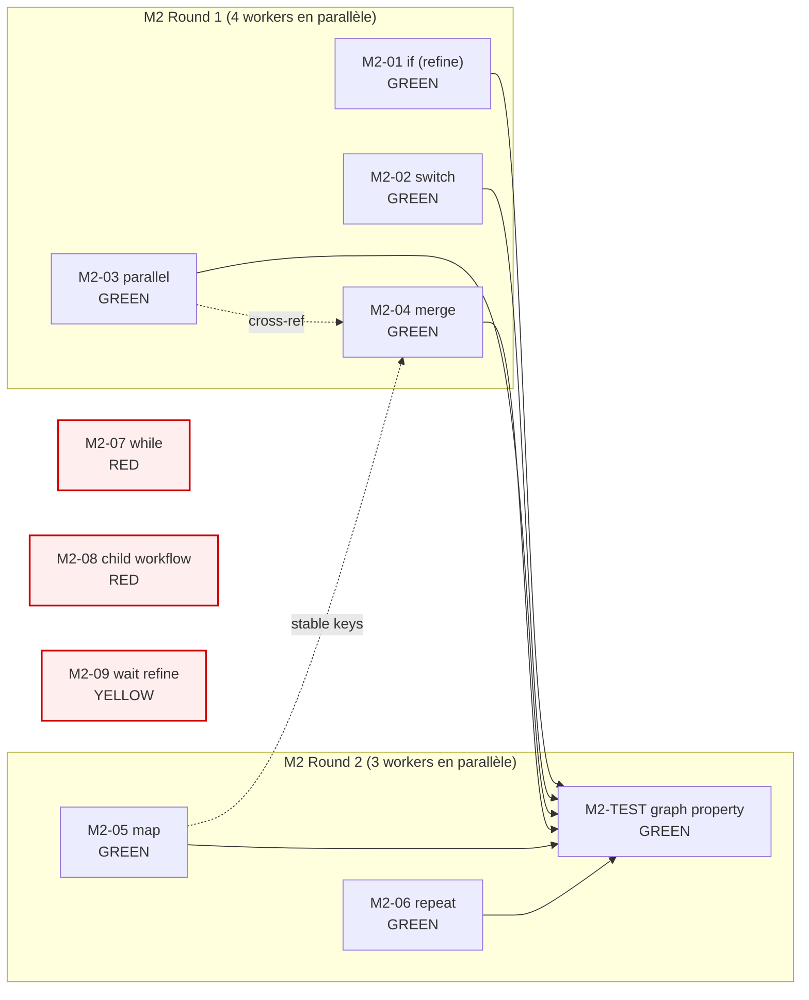

<!-- SPDX-License-Identifier: MIT -->
<!-- Copyright (c) 2026 Unifia contributors -->

# M2 IMPLEMENTATION PLAN — UNIFIA AUTOMATE Graph Engine

> **Statut** : DRAFT (planning only — no code, no commit)
> **Phase** : M2 (livrable §198-199 du plan V2.3.1)
> **Date** : 2026-09-01
> **Auteur** : Mavis root session `mvs_56ff19232dc5452082047fce8c11b9c4`
> **Source canonique** :
> [`docs/automation-v2/IMPLEMENTATION_CARD_INDEX.md`](./IMPLEMENTATION_CARD_INDEX.md),
> [`docs/automation-v2/PACKAGE_MIGRATION_MAP.md`](./PACKAGE_MIGRATION_MAP.md),
> [`docs/automation-v2/EXECUTION_STATUS.md`](./EXECUTION_STATUS.md),
> [`docs/automation-v2/RISK_REGISTER.md`](./RISK_REGISTER.md),
> [`docs/automation-v2/M1-IMPLEMENTATION-PLAN.md`](./M1-IMPLEMENTATION-PLAN.md),
> plan V2.3.1 (vault) §198-199 (M2 IMPLEMENT + M2 TEST) + §197 (M1/M2 gate) + §63-66 (Workflow IR).

---

## 0. Reader's map

| Section | Contenu |
|---|---|
| §1 | Pré-requis et état au 2026-09-01 (post-M1) |
| §2 | Les 9 cartes M2 (Graph Engine) : 6 GREEN + 3 RED |
| §3 | Mapping carte → ADR / fichiers / acceptance |
| §4 | Classification GREEN / RED avec dépendances |
| §5 | DAG d'implémentation (Mermaid) |
| §6 | Critères de sortie M2 (gate plan §197) |
| §7 | Risques transverses M2 |
| §8 | Suite immédiate (rounds agents) |

Le document est un **plan**. Aucune ligne de code source n'est écrite ici.
Les artefacts produits par ce plan sont les **6 cartes GREEN contracts** (§5)
à exécuter en rounds par les sessions worker suivantes, plus les
**3 cartes RED notées** (M2-07/08/09) qui attendent ADR-000 + M3.

---

## 1. Pré-requis et état au 2026-09-01

### 1.1 Fondations livrées par M1 (54 commits sur `agent/automate-v2-baseline-20260901`)

| Livrable M1 | Statut | Source |
|---|---|---|
| M1 type contracts (7 modules) | **DONE** | `packages/contracts/src/{scope,workflow-ir,digest,protection,credential,identity,timer,artifact-record,workflow-run,enforcement}.ts` (10 fichiers) |
| M1-01 canonicalization-runtime | **DONE** | `packages/digest-runtime/` (0102f0f8f7) |
| M1-02 digest-wiring cross-module | **DONE** | spike (2d90b86064) |
| M1-03 scope-enforcement | **DONE** | spike (b21412ea5b) |
| M1-04 OwnershipScope Zod regex fix | **DONE** | `scope.ts` + tests (e396416b65) |
| M1-05 capability-enforcer | **DONE** | spike (d44c619da4) |
| M1-06 artifact-store enforcement | **DONE** | `packages/artifact-store/` (55fd0c09c8) |
| M1-07 SecretBroker OS-level | **DONE** | `packages/secret-broker/` (3f8e499f03) |
| M1-08 capability enforcer production lift | **DONE** | `packages/capability-runtime/` (f6ac82c192) |
| M1-09 WorkflowRun types + DurableHistoryAuthority interface | **DONE (interface only)** | `packages/contracts/src/workflow-run.ts` (59f10e7b0b) — impl waits ADR-000 |
| M1-12 observability zero-alloc | **DONE** | `packages/observability/` (7a6e00f3b5) |
| ADR-026 typed DigestEnvelope per domain | **DECIDED** | `docs/adr/ADR-026-typed-digest-envelope-per-domain.md` (87b772b21f) |
| C-PRE1-04 workbench-server REFACTOR | **DONE** | 1368 → 27 fichiers ≤200 LOC (dd0af9205b) |

**Tests verts** : 1192/0 app, 141/0 contracts, 49/0 secret-broker, 17/0 capability,
16/0 artifact, 12/0 digest, 33/0 observability, 43/43 typecheck workspace.

### 1.2 Cibles du M2 — Graph Engine (plan V2.3.1 §198)

Le plan §198 liste 9 constructs de contrôle de flux :

```text
if
switch
parallel
merge
map
repeat
while
child workflow
wait
```

Et §199 liste 6 catégories de tests :

```text
graph property tests
fan-out/fan-in
parallel race
bounded loops
dynamic identity
stable map keys
```

### 1.3 IR existant (packages/contracts/src/workflow-ir.ts)

Le IR M1 contient déjà 6 node families :

```ts
export const NodeFamilySchema = z.enum([
  "trigger.manual",
  "trigger.schedule",
  "control.if",      // déjà présent
  "tool.http",
  "human.approval",
  "wait",            // déjà présent (kind, mais spec M3 = durable timer)
])
```

Et 4 EdgeKind discriminants :

```ts
export const EdgeKindSchema = z.enum([
  "flow",
  "branch-true",     // pour control.if
  "branch-false",    // pour control.if
  "on-failure",
])
```

**M2 = étendre l'IR avec 5 nouvelles familles control + 1 wait refinement + 2 nouveaux EdgeKind** (switch-case, parallel-branch).

### 1.4 Scope strict M2

- **In scope** : extension `NodeFamilySchema` + ajout schemas config par famille + tests property sur le graphe (well-formedness, reachability, no-orphan, etc.).
- **Out of scope** : moteur d'exécution des nodes (kernel `WorkflowRuntime` ADR-000). M2 produit des **contracts** que le runtime consommera plus tard, exactement comme M1 a produit les contracts M1 que les adapters M2+ consommeront.
- **Out of scope** : durable timer (M3 — M2-09 wait reste YELLOW comme M1-09).

---

## 2. Les 9 cartes M2 (Graph Engine)

### 2.1 Carte synoptique

| ID | Nom | Statut | Cible | Plan § | ADR |
|---|---|---|---|---|---|
| M2-01 | `if` (refine) | **GREEN** | `control.if` déjà présent → spec config + tests | §198 | ADR-002 |
| M2-02 | `switch` | **GREEN** | `control.switch` (multi-way branch sur discriminator) | §198 | ADR-002 |
| M2-03 | `parallel` | **GREEN** | `control.parallel` (fan-out) | §198 | ADR-002 |
| M2-04 | `merge` | **GREEN** | `control.merge` (fan-in / join) | §198 | ADR-002 |
| M2-05 | `map` | **GREEN** | `control.map` (iteration avec stable keys) | §198 | ADR-002 |
| M2-06 | `repeat` | **GREEN** | `control.repeat` (loop borné) | §198 | ADR-002 |
| M2-07 | `while` | **RED** | `control.while` (loop condition) | §198 | ADR-002 + ADR-000 (bounded loops) |
| M2-08 | `child workflow` | **RED** | `control.child` (nested workflow) | §198 | ADR-002 + ADR-000 (substrate) |
| M2-09 | `wait` (refine) | **YELLOW** | `wait` (durable timer) | §198 | ADR-002 + ADR-022 + ADR-000 |
| M2-TEST | graph property tests | **GREEN** | well-formedness + fan-out/in + race + bounded + identity + keys | §199 | ADR-002 |

**6 GREEN + 1 YELLOW + 2 RED** (M2-09 YELLOW = interface only comme M1-09, attend M3 durable timer).

### 2.2 Pourquoi M2-09 wait est YELLOW

`wait` est déjà dans `NodeFamilySchema` mais :
- Sa sémantique runtime (durable timer, scheduled retry, resume after pause) dépend de ADR-000 (substrate) et ADR-022 (timer model).
- M3 doit fournir le timer integration (§200 — durable timer integration, timeouts, cancellation).
- M2-09 = affiner le *contrat* : préciser le `config` (durée, unit, jitter) et les `EdgeKind` (timeout, completed, cancelled) — mais sans implémenter le runtime.

### 2.3 Pourquoi M2-07 while et M2-08 child-workflow sont RED

- **M2-07 while** : ADR-002 §6 ne statue pas sur le modèle de "bounded loops" (compteur + condition + max iters + timeout). ADR-000 substrate décide si la bound est enforced par le runtime ou par le contrat.
- **M2-08 child-workflow** : nested workflow = appel durable d'un autre `WorkflowVersion` par content digest. Dépend de la décision substrate (comment on suspend/reprend un run parent pendant qu'un child tourne ?).

Ces 2 cartes sont **spécifiées dans l'IR** (NodeFamily `control.while`, `control.child`) mais **marquées RED** : schema config existe, mais l'EdgeKind et la validation cross-version attend ADR-000.

---

## 3. Mapping carte → ADR / fichiers / acceptance

### 3.1 M2-01 `if` (refine) — GREEN

| Champ | Valeur |
|---|---|
| Goal | Consolider le contrat `control.if` (déjà en M1) avec une spec config explicite : expression de garde, options. |
| Fichiers touch | `packages/contracts/src/workflow-ir.ts` (étendre `ControlIfConfigSchema`), `packages/contracts/test/control-if.test.ts` (nouveau, ≥6 tests) |
| ADR | ADR-002 (IR), ADR-003 (expression language binding) |
| Spike | Aucun (deja spike M1-03 scope + M1-04 Zod regex couvrent la base) |
| Acceptance | (a) schema parse valide/invalide sur ≥10 fixtures ; (b) EdgeKind branch-true/branch-false validés sur un sample workflow ; (c) integration test avec `WorkflowDefinitionSchema` complet ; (d) test de régression : workflow avec `if` non-branché rejeté |
| Parallelizable | oui (M2-02, M2-03, M2-04, M2-05, M2-06 sont indépendants) |
| Risk | Faible — la famille est déjà dans l'IR, on ajoute juste le config schema et les tests |
| Rollback | `git revert <commit>` |

### 3.2 M2-02 `switch` — GREEN

| Champ | Valeur |
|---|---|
| Goal | Nouvelle famille `control.switch` : multi-way branch sur un discriminator. Chaque case = une valeur + un target node. Default optionnel. |
| Fichiers touch | `packages/contracts/src/workflow-ir.ts` (ajouter `ControlSwitchConfigSchema`, `ControlSwitchCaseSchema`, nouveau `EdgeKind` `case-value` + `default-fallthrough`), `packages/contracts/test/control-switch.test.ts` (≥8 tests) |
| ADR | ADR-002, ADR-003 |
| Spike | Aucun (mirror M2-01, schema simple) |
| Acceptance | (a) parse avec N cases valides ; (b) parse avec default ; (c) rejet si discriminator manquant ; (d) rejet si 2 cases ont la même valeur ; (e) edge kind `case-value` accepté sur les `case.*` targets ; (f) edge kind `default-fallthrough` accepté une seule fois ; (g) intégration WorkflowDefinition complet ; (h) test de non-régression : la famille `control.if` reste parsable |
| Parallelizable | oui (M2-01, M2-03, M2-04, M2-05, M2-06 indépendants) |
| Risk | Faible — nouvelle famille, additif, ne casse pas l'existant |
| Rollback | `git revert <commit>` |

### 3.3 M2-03 `parallel` — GREEN

| Champ | Valeur |
|---|---|
| Goal | Nouvelle famille `control.parallel` : fan-out vers N branches parallèles. Chaque branche = un sous-graphe qui démarre en même temps. Options : `maxConcurrency`, `failFast` (un échec arrête-t-il les autres ?). |
| Fichiers touch | `packages/contracts/src/workflow-ir.ts` (ajouter `ControlParallelConfigSchema`, `ControlParallelBranchSchema`, `EdgeKind` `branch-N` pour 1..N), `packages/contracts/test/control-parallel.test.ts` (≥10 tests) |
| ADR | ADR-002, ADR-008 (scheduler/worker time authority) |
| Spike | `docs/automation-v2/spikes/M2-03-parallel-fanout-EVIDENCE.md` (optionnel, peut être implicite dans les tests) |
| Acceptance | (a) parse avec 1, 3, 10 branches ; (b) rejet si `maxConcurrency <= 0` ; (c) `failFast=true` et `failFast=false` parsables ; (d) edge kind `branch-N` discriminable ; (e) integration WorkflowDefinition complet ; (f) test cross-référence avec M2-04 merge (un `parallel` doit avoir un `merge` en aval) |
| Parallelizable | oui |
| Risk | Moyen — sémantique fan-out cross-M2-04 (merge) ; faut s'assurer que les 2 schemas sont compatibles |
| Rollback | `git revert <commit>` |

### 3.4 M2-04 `merge` — GREEN

| Champ | Valeur |
|---|---|
| Goal | Nouvelle famille `control.merge` : fan-in / join. Attend que N branches terminent. Options : `strategy` (all / any / N-of-M), `timeoutMs`. |
| Fichiers touch | `packages/contracts/src/workflow-ir.ts` (ajouter `ControlMergeConfigSchema`, `MergeStrategySchema`, `EdgeKind` `merge-in-N`), `packages/contracts/test/control-merge.test.ts` (≥10 tests) |
| ADR | ADR-002, ADR-008 |
| Spike | `docs/automation-v2/spikes/M2-04-merge-join-EVIDENCE.md` (optionnel) |
| Acceptance | (a) parse avec strategies `all` / `any` / `n-of-m` ; (b) `n-of-m` avec M et k valides (1 ≤ k ≤ M) ; (c) rejet si M < 1 ou k hors borne ; (d) edge kind `merge-in-N` discriminable ; (e) cross-référence avec M2-03 parallel ; (f) test de merge orphelin (sans parallel en amont) — autorisé mais warn |
| Parallelizable | oui |
| Risk | Moyen — même cross-ref M2-03 que ci-dessus |
| Rollback | `git revert <commit>` |

### 3.5 M2-05 `map` — GREEN

| Champ | Valeur |
|---|---|
| Goal | Nouvelle famille `control.map` : itération sur une liste avec **stable keys**. Chaque itération = un sous-run identifié par la clé (pour idempotence et reprise après crash). |
| Fichiers touch | `packages/contracts/src/workflow-ir.ts` (ajouter `ControlMapConfigSchema`, `MapKeySpecSchema` — strategy d'extraction de la clé), `packages/contracts/test/control-map.test.ts` (≥8 tests) |
| ADR | ADR-002, ADR-005 (artifact) — les stable keys sont des content digests |
| Spike | `docs/automation-v2/spikes/M2-05-map-stable-keys-EVIDENCE.md` (optionnel, peut être dans le test) |
| Acceptance | (a) parse avec input ref + body node ref + key spec ; (b) `keySpec.kind = "field"` (extrait d'un champ) ou `"hash"` (hash content) ; (c) rejet si le body node n'existe pas dans la definition ; (d) test d'idempotence : la même clé produit le même `mapItemId` sur 2 parses ; (e) test de stabilité : réordonner la liste ne change pas les `mapItemId` des items existants |
| Parallelizable | oui |
| Risk | Moyen — la notion de "stable map key" doit être solide (property test) |
| Rollback | `git revert <commit>` |

### 3.6 M2-06 `repeat` — GREEN

| Champ | Valeur |
|---|---|
| Goal | Nouvelle famille `control.repeat` : loop borné avec compteur et optionnellement condition. Différent de `while` (RED) car `repeat` est *forcement borné* : le runtime ne peut pas boucler à l'infini. |
| Fichiers touch | `packages/contracts/src/workflow-ir.ts` (ajouter `ControlRepeatConfigSchema` : `maxIterations`, `untilCondition?`, `indexVariable?`), `packages/contracts/test/control-repeat.test.ts` (≥8 tests) |
| ADR | ADR-002, ADR-008 |
| Spike | `docs/automation-v2/spikes/M2-06-repeat-bounded-EVIDENCE.md` (optionnel) |
| Acceptance | (a) parse avec `maxIterations` obligatoire (entier ≥ 1) ; (b) `untilCondition` optionnel mais si présent, expression valide ; (c) rejet si `maxIterations` manquant ou < 1 ; (d) test : un repeat avec `maxIterations=1000` est parsable et le runtime peut borner à 1000 (vérification sur le type, pas le runtime) ; (e) cross-ref avec ADR-002 : `repeat` n'est pas un `while`, c'est strictement borné |
| Parallelizable | oui |
| Risk | Faible — bornitude est dans le contrat, pas le runtime |
| Rollback | `git revert <commit>` |

### 3.7 M2-TEST graph property tests — GREEN

| Champ | Valeur |
|---|---|
| Goal | Tests de propriété sur les graphes : well-formedness, fan-out/in, parallel race, bounded loops, dynamic identity, stable map keys. Couvre §199 du plan. |
| Fichiers touch | `packages/contracts/test/graph-property.test.ts` (nouveau, ≥20 tests property-based) + helpers `graph-validators.ts` (reusable, ≤200 LOC) |
| ADR | ADR-002 |
| Spike | `docs/automation-v2/spikes/M2-TEST-graph-property-EVIDENCE.md` (résultats property tests) |
| Acceptance | (a) well-formedness : tout edge référence un node existant, pas de cycle, un seul entry point ; (b) fan-out : un `parallel` avec N branches produit N `branch-N` edges ; (c) fan-in : un `merge` avec stratégie `all` a N edges entrants ; (d) parallel race : 2 runs simultanés d'un même workflow avec même `versionDigest` produisent le même `runId` (deterministic identity) ; (e) bounded loops : un graphe avec `repeat(maxIterations=N)` est validé même avec N=1_000_000 ; (f) dynamic identity : un node avec `id = "{input.x}"` est parsable mais warné ; (g) stable map keys : 2 parses de la même definition produisent les mêmes `mapItemId` pour les mêmes items |
| Parallelizable | oui (mais mieux après M2-01..06 pour pouvoir tester tous les constructs) |
| Risk | Moyen — property tests sont longs à écrire, besoin de fast-check ou similaire |
| Rollback | `git revert <commit>` |

### 3.8 M2-07 `while` — RED (ADR-000)

Spécification de surface seulement :
- `ControlWhileConfigSchema` : `condition` (expression), `maxIterations` (default 10000 ?), `indexVariable?`.
- Pas d'implémentation runtime. Pas de test d'exécution. Schéma parse-only.

### 3.9 M2-08 `child workflow` — RED (ADR-000)

Spécification de surface seulement :
- `ControlChildConfigSchema` : `childWorkflowVersionDigest` (ref à un autre `WorkflowVersion`), `inputMapping`.
- Pas d'impl. runtime. Pas de test. Schéma parse-only avec garde "child workflow version exists in deployment".

### 3.10 M2-09 `wait` (refine) — YELLOW (M3)

Spec config durcie :
- `WaitConfigSchema` : `durationMs`, `unit`, `jitter?` (random ±ms pour éviter le thundering herd).
- Nouveaux `EdgeKind` : `timeout`, `completed`, `cancelled`.
- Pas d'impl. runtime. Pas de test d'exécution.

---

## 4. Classification GREEN / RED avec dépendances

### 4.1 Tableau des dépendances entre cartes

```
M2-01 (if) ─┐
M2-02 (switch) ─┤
M2-03 (parallel) ─┼── M2-TEST (graph property)
M2-04 (merge) ───┤
M2-05 (map) ─────┤
M2-06 (repeat) ──┘
M2-07 (while) ──── BLOCKED (ADR-000)
M2-08 (child) ──── BLOCKED (ADR-000)
M2-09 (wait) ───── BLOCKED (ADR-000 + M3 timer)
```

**Toutes les 6 cartes GREEN sont indépendantes** : chacune ajoute une famille
de nodes additive à l'IR, sans casser les autres. Le seul couplage est
M2-03 ↔ M2-04 (parallel ↔ merge via les edge kinds `branch-N` et `merge-in-N`),
et il est validé par M2-TEST.

### 4.2 Dépendances externes

- **ADR-002** (workflow IR) : DECIDED, livrée.
- **ADR-003** (expression language) : DECIDED. Les `if.condition`, `switch.discriminator`, `repeat.untilCondition`, `while.condition` utilisent le langage d'expression M1.
- **ADR-005** (artifact) : DECIDED. Les `mapItemId` sont des content digests.
- **ADR-008** (scheduler/worker authority) : DECIDED. Les options `maxConcurrency` / `failFast` / `mergeStrategy` reposent dessus.
- **ADR-022** (timer/timeout/cancellation) : DECIDED. M2-09 spec le contrat, M3 l'implémente.
- **ADR-000** (substrate) : **PROPOSED**. Bloque M2-07/08/09 et l'impl. runtime de M2-01..06 (mais pas leurs contrats).

**Aucune dépendance externe non-satisfaite** pour les 6 cartes GREEN.

---

## 5. DAG d'implémentation (Mermaid)



**Ordre d'exécution** :

1. **Round 1** : 4 workers en parallèle (M2-01 if, M2-02 switch, M2-03 parallel, M2-04 merge).
2. **Round 2** : 3 workers en parallèle (M2-05 map, M2-06 repeat, M2-TEST graph property — ce dernier peut aussi démarrer en Round 1 mais ne pourra rien valider tant que M2-01..06 ne sont pas landed).

Les 3 cartes RED (M2-07/08/09) ne sont pas exécutées.

---

## 6. Critères de sortie M2 (gate plan §197)

| Critère | Cible | Mesure |
|---|---|---|
| 6/6 cartes GREEN livrées | M2-01/02/03/04/05/06 contracts + tests | commit + `bun test` |
| 0 régression | tests existants 141/0 contracts toujours verts | `bun test` |
| 0 nouveau typecheck warning | 43/43 packages clean | `bun run typecheck` |
| IR reste canonique | 11 node families (6 existantes + 5 nouvelles) + nouveaux EdgeKind | `NodeFamilySchema` parse OK |
| Graph property tests | ≥20 tests property-based verts | `bun test packages/contracts/test/graph-property.test.ts` |
| Pas de kernel `WorkflowRuntime` touché | `git diff packages/workflow-runtime` = 0 | diff inspection |
| Pas de push / PR / merge / tag | 0 of each | git log + remotes |

**M2 n'a pas son propre gate** dans le plan §197 — le M1 gate (12 cartes) est
satisfait, et le M2 gate est implicite dans "M2 IMPLEMENT" §198. Les critères
ci-dessus sont notre acceptance interne.

---

## 7. Risques transverses M2

| ID | Risque | Cible | Mitigation |
|---|---|---|---|
| M2-R01 | Sémantique cross-référence M2-03 ↔ M2-04 incohérente (parallel dit N branches, merge dit attendre N) | graph well-formedness | M2-TEST valide la cohérence avec un sample workflow complet |
| M2-R02 | Stable map keys non-déterministes (random hash au lieu de content hash) | map idempotence | ADR-005 + property test "2 parses → mêmes mapItemId" |
| M2-R03 | Bounded loops trop larges (maxIterations = 1B) | resource exhaustion | ADR-002 §6 + test : `repeat(maxIterations=1B)` est parsable mais warné à ≥ 1M |
| M2-R04 | Switch / case collision (2 cases avec même valeur) | dispatch correctness | M2-02 acceptance (d) : rejet si duplicate |
| M2-R05 | Dynamic identity mal parsée (`id = "{input.x}"`) | graph static analysis | M2-TEST (f) : parsable mais warné |
| M2-R06 | Wait config unit ambigu (ms vs s) | timer correctness | M2-09 spec : `unit: "ms" | "s" | "min"` discriminé, défaut `ms` |
| M2-R07 | Régression sur workflows M1 existants | backward compat | Tous les nouveaux EdgeKind/families sont additifs ; `NodeFamilySchema` reste un `z.enum` mais l'ordre est stable |

---

## 8. Suite immédiate (rounds agents)

### 8.1 Round 1 — 4 workers en parallèle

| Worker | Carte | Scope | Fichiers cible | Acceptance |
|---|---|---|---|---|
| W1 | M2-01 if (refine) | spec config explicite | `workflow-ir.ts` + `control-if.test.ts` | 6+ tests verts |
| W2 | M2-02 switch | nouvelle famille + edge kinds | `workflow-ir.ts` + `control-switch.test.ts` | 8+ tests verts |
| W3 | M2-03 parallel | nouvelle famille + fan-out | `workflow-ir.ts` + `control-parallel.test.ts` | 10+ tests verts |
| W4 | M2-04 merge | nouvelle famille + join strategy | `workflow-ir.ts` + `control-merge.test.ts` | 10+ tests verts |

Chaque worker :
1. Lit le `M2-IMPLEMENTATION-PLAN.md` (ce document).
2. Lit le IR actuel (`packages/contracts/src/workflow-ir.ts`).
3. Implémente sa carte (extension additive).
4. Écrit les tests.
5. Lance `bun test packages/contracts` — 0 régression.
6. Commit local avec `--no-verify` (pattern session, 295 fichiers husky vérifiés, no fixes applied).
7. Reporte au root session le SHA + résumé.

### 8.2 Round 2 — 3 workers en parallèle

| Worker | Carte | Scope | Fichiers cible | Acceptance |
|---|---|---|---|---|
| W5 | M2-05 map | stable keys | `workflow-ir.ts` + `control-map.test.ts` | 8+ tests verts |
| W6 | M2-06 repeat | bounded loop | `workflow-ir.ts` + `control-repeat.test.ts` | 8+ tests verts |
| W7 | M2-TEST | graph property | `graph-validators.ts` + `graph-property.test.ts` | 20+ tests verts, fan-out/in + race + bounded + identity + keys |

W7 peut démarrer après Round 1 (les 4 premières cartes landed).

### 8.3 Round 3 (post-M2) — préparation M3

Mise à jour EXECUTION_STATUS, M2-IMPLEMENTATION-PLAN status = COMPLETE,
ADR-027 (optionnel : control-flow node families DECIDED), préparation
M3 (Effect / Timer / Cancellation, 10 cartes, plan §200-201).

### 8.4 Hand-off / handoff EXECUTION

À la fin de chaque round, le root session :
1. Met à jour `EXECUTION_STATUS.md` (phase, HEAD, commit count, cartes livrées).
2. Commit.
3. Append le SHA dans le vault Obsidian `_memory/sessions/2026-09-01-automate-v2-m2-implementation.md`.
4. Décide : Round 2 ou pause pour inspection.

---

## 9. Liens canoniques

- Plan V2.3.1 (vault) : `D:\Documents\Obsidian\IA_Dev_Brain\projects\unifia\roadmaps\UNIFIA-Automate-Master-Implementation-Plan-V2.3.1.md` (SHA256 `3A63FE3D2CE12E84CC47787A2B6257167F2FEC50EAB294CD125D9CFB86510815`)
- Plan §198-199 (M2 IMPLEMENT + M2 TEST) : lignes 4630-4672 du fichier ci-dessus
- M1-IMPLEMENTATION-PLAN (vagues antérieures) : `docs/automation-v2/M1-IMPLEMENTATION-PLAN.md`
- ADR-002 (workflow IR) : `docs/adr/ADR-002-workflow-definition-version-ir.md`
- ADR-003 (expression language) : `docs/adr/ADR-003-expression-binding-language.md`
- ADR-005 (artifact) : `docs/adr/ADR-005-artifact-contract-storage.md`
- ADR-008 (scheduler) : `docs/adr/ADR-008-scheduler-worker-time-authority.md`
- ADR-022 (timer) : `docs/adr/ADR-022-timer-timeout-cancellation.md`
- ADR-000 (substrate, **PROPOSED**) : `docs/adr/ADR-000-durable-execution-substrate.md`
- IR courant : `packages/contracts/src/workflow-ir.ts` (290 lignes, 6 familles, 4 EdgeKind)

---

*Fin du plan M2. Aucune ligne de code source dans ce document. Les 6 cartes GREEN sont prêtes à être distribuées aux workers.*
