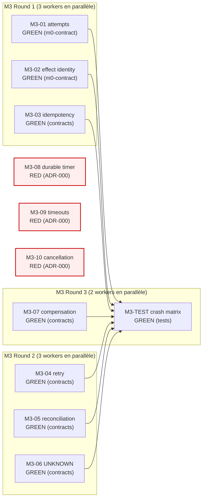

<!-- SPDX-License-Identifier: MIT -->
<!-- Copyright (c) 2026 Unifia contributors -->

# M3 IMPLEMENTATION PLAN — UNIFIA AUTOMATE Effect / Timer / Cancellation

> **Statut** : DRAFT (planning only — no code, no commit)
> **Phase** : M3 (livrable §200-201 du plan V2.3.1)
> **Date** : 2026-09-02
> **Auteur** : Mavis root session `mvs_56ff19232dc5452082047fce8c11b9c4`
> **Source canonique** :
> [`docs/automation-v2/IMPLEMENTATION_CARD_INDEX.md`](./IMPLEMENTATION_CARD_INDEX.md),
> [`docs/automation-v2/EXECUTION_STATUS.md`](./EXECUTION_STATUS.md),
> [`docs/automation-v2/M2-IMPLEMENTATION-PLAN.md`](./M2-IMPLEMENTATION-PLAN.md),
> [`docs/automation-v2/M1-IMPLEMENTATION-PLAN.md`](./M1-IMPLEMENTATION-PLAN.md),
> plan V2.3.1 (vault) §200-201 (M3 IMPLEMENT + M3 TEST) + §85-100 (effect identity, idempotence, retry, reconciliation, UNKNOWN_EXTERNAL_STATE, compensation, durable timer, timeouts, cancellation).

---

## 0. Reader's map

| Section | Contenu |
|---|---|
| §1 | Pré-requis et état au 2026-09-02 (post-M2) |
| §2 | Les 10 cartes M3 (Effet / Timer / Cancellation) : 7 GREEN + 3 RED |
| §3 | Mapping carte → ADR / fichiers / acceptance |
| §4 | Classification GREEN / RED avec dépendances |
| §5 | DAG d'implémentation (Mermaid) |
| §6 | Critères de sortie M3 |
| §7 | Risques transverses M3 |
| §8 | Suite immédiate (rounds agents) |

Le document est un **plan**. Aucune ligne de code source n'est écrite ici.
Les artefacts produits par ce plan sont les **7 cartes GREEN contracts**
(§5) à exécuter en rounds par les sessions worker suivantes, plus les
**3 cartes RED notées** (M3-08/09/10) qui attendent ADR-000 + le kernel.

---

## 1. Pré-requis et état au 2026-09-02

### 1.1 Fondations livrées (75 commits sur `agent/automate-v2-baseline-20260901`)

| Phase | Statut | Preuve |
|---|---|---|
| PRE-0/1/1.1/Threat Model/Profiles/Gates/ADR-001..024 | **DONE** | 25 ADR DECIDED |
| ADR-026 typed DigestEnvelope | **DECIDED** | 87b772b21f |
| M0 spikes (6) | **DONE** | spikes/M0-0[1-6]-EVIDENCE.md |
| M1 type contracts (10 modules) | **DONE** | packages/contracts/src/*.ts |
| M1-01..M1-12 (7 GREEN + 2 optionnels + 1 YELLOW) | **DONE** | 9/12 cartes |
| ADR-000 | **CHANGES_REQUIRED** | 2 product policy decisions ouvertes (P-1, P-2) |
| M2-IMPLEMENTATION-PLAN | **DONE** | 9 cartes (6 GREEN + 1 YELLOW + 2 RED) |
| **M2-01..06 + M2-TEST** | **DONE** | **6/6 cartes GREEN + M2-TEST 46/46 PASS, mutation-testé** |
| M0 contract package (I0-I3 + I2) | **DONE** | `packages/automate-m0-contract/` — 130 tests, 239 expects |

**Tests contracts : 285/0** (239 baseline + 46 M2-TEST).
**Tests automate-m0-contract : 130/0**.
**Typecheck : 43/43 packages clean**.
**Biome : 355 fichiers, 0 erreur, 0 warning**.

### 1.2 Cibles du M3 (plan §200-201)

Le plan §200 liste 10 IMPLEMENT items :

```text
attempts            # M3-01 : nombre d'essais par side effect
effect identity     # M3-02 : EffectKey stable, dérivation injective
idempotency         # M3-03 : déclaration provider-level + use-site
retry               # M3-04 : backoff/jitter, conditions d'arrêt
reconciliation      # M3-05 : rejouer un run contre un state externe interrogeable
UNKNOWN_EXTERNAL_STATE  # M3-06 : signal explicite quand state est opaque
compensation        # M3-07 : Saga / compensations pour annuler partiellement
durable timer integration  # M3-08 : scheduler durable (wait, deadline, sleep until)
timeouts            # M3-09 : per-node / per-run
cancellation        # M3-10 : annulation externe + propagation
```

Et §201 liste 10 crash matrix positions :

```text
before durable transition
after durable transition
before side effect
during side effect
after remote success before acknowledgement
during approval
during timer
during retry
during cancellation
during shutdown
```

### 1.3 M0 contract package — base réutilisable

`packages/automate-m0-contract/src/` contient déjà :

- **`effect.ts`** (313 LOC) — `EffectKey` (branded string), `EffectIdDeriver` port (injection de l'algo de hash, ADR-001 pas encore décidé), `mayAutoReplayUnderUncertainty` (admet PURE et IDEMPOTENT seulement, REPEATABLE exclu), `actionUnderUncertainty` (3 actions distinctes : retry / ask / surface).
- **`ids.ts`** (169 LOC) — branded opaque strings : `WorkflowRunId`, `WorkflowId`, `StepId`, `EffectId`, `TimerId` avec well-formedness floor (UUID / ULID / opaque tous acceptés).
- **`timer.ts`** (163 LOC) — `DurableTimerState` state machine : PENDING / SCHEDULED / FIRED / CANCELLED. Transition table écrite en full, pas dérivée. Authoritative time = paramètre (jamais `Date.now()`).

**M3 s'appuie dessus** : M3-02 (effect identity) consomme `EffectKey` + `EffectIdDeriver`. M3-08 (durable timer) consomme `DurableTimerState`. M3-10 (cancellation) introduit un nouveau state `CancellationState` (roule vers M0-M02 listé comme outstanding).

### 1.4 Scope strict M3

- **In scope** : extension des contracts `@unifia/contracts` (Node IR pour M3-08 wait refine, timeouts per-node/per-run, cancellation graph signal) ET des contracts `automate-m0-contract` (déjà en cours, M0 I-stages).
- **In scope** : 10 crash matrix positions comme property tests (invariants, pas exécution).
- **Out of scope** : kernel `packages/workflow-runtime` (M3-08/09/10 + M1-09/10/11 attendent ADR-000). Le pattern M2 s'applique : M3 produit des **contracts** que le runtime consommera.
- **Out of scope** : implémentation du retry/reconciliation (M3-04/05) — ce sont des **stratégies** déclarées dans l'IR, le runtime les évalue.

---

## 2. Les 10 cartes M3 (Effect / Timer / Cancellation)

### 2.1 Carte synoptique

| ID | Nom | Statut | Cible principale | Plan § | ADR |
|---|---|---|---|---|---|
| M3-01 | attempts | **GREEN** | `EffectAttemptConfig` (maxAttempts, minInterval) dans `automate-m0-contract` | §200 | ADR-007 (side-effect retry) |
| M3-02 | effect identity | **GREEN** | `EffectKey` branded + `EffectIdDeriver` port + invariants (déjà partiellement dans M0 I2) | §200 | ADR-001 (canonical serialization) |
| M3-03 | idempotency | **GREEN** | `IdempotencyClass` (NONE / PROVIDER / USER / BUSINESS) dans l'IR | §200 | ADR-007 |
| M3-04 | retry | **GREEN** | `RetryPolicySchema` (kind, maxAttempts, backoffMs, jitter) | §200 | ADR-007, ADR-008 (scheduler) |
| M3-05 | reconciliation | **GREEN** | `ReconciliationConfig` (probeExpression, failOn) dans l'IR | §200 | ADR-007 |
| M3-06 | UNKNOWN_EXTERNAL_STATE | **GREEN** | `UnknownExternalStateAction` enum (FAIL / RECONCILE_PROBE / RECONCILE_REPLAY) | §200 | ADR-007, ADR-009 (policy) |
| M3-07 | compensation | **GREEN** | `CompensationBinding` (forward node + compensation node) dans l'IR | §200 | ADR-007, ADR-008 |
| M3-08 | durable timer integration | **RED** | `WaitConfig` (durée, unit, jitter) déjà esquissé M2-09 — impl M3 | §200 | ADR-022 (timer), ADR-000 |
| M3-09 | timeouts | **RED** | `TimeoutConfig` per-node / per-run (existant partiel) — impl M3 | §200 | ADR-022, ADR-000 |
| M3-10 | cancellation | **RED** | `CancellationState` + `CancellationToken` + propagation graph | §200 | ADR-008, ADR-000 |
| M3-TEST | crash matrix | **GREEN** | 10 positions × invariants property-based | §201 | ADR-007, ADR-008, ADR-022 |

**7 GREEN + 3 RED** (M3-08/09/10 = même blocage que M2-07/08/09).

### 2.2 Pourquoi M3-08/09/10 sont RED

- **M3-08 durable timer** : `WaitConfig` (M2-09) spécifie déjà `duration`, `unit`, `jitter` au niveau contrat. L'**intégration** (le scheduler durable qui honore ces configs et survit à un crash) dépend du substrate choice. ADR-022 est DECIDED, mais l'implémentation runtime dépend d'ADR-000.
- **M3-09 timeouts** : `TimeoutConfig` existe déjà partiellement dans `workflow-ir.ts` (`timeoutMs` per-node et `defaultTimeoutMs` per-workflow). L'**enforcement** (timer qui tue un run au-delà du timeout) dépend du kernel.
- **M3-10 cancellation** : `CancellationState` est listé dans M0-M02 comme outstanding (needs the harness). L'API contrat est faisable (token, handler, propagation rule), mais l'impl runtime (handler qui propage à travers un run en cours) attend le kernel.

**M3 contrats** peuvent tous être écrits maintenant (comme M2). M3 runtime attend ADR-000.

---

## 3. Mapping carte → ADR / fichiers / acceptance

### 3.1 M3-01 attempts (GREEN) — automate-m0-contract

| Champ | Valeur |
|---|---|
| Goal | Configurer le nombre maximum d'essais par side effect + intervalle minimum entre essais |
| Fichiers touch | `packages/automate-m0-contract/src/effect.ts` (extension), `packages/automate-m0-contract/test/effect-and-timer.test.ts` |
| ADR | ADR-007 (side-effect retry semantics) |
| Acceptance | (a) `EffectAttemptConfigSchema` parse avec `maxAttempts ≥ 1` ; (b) `minIntervalMs ≥ 0` ; (c) un effect avec `maxAttempts=0` rejeté ; (d) la durée totale par défaut = `maxAttempts * averageEffectDuration` (comment, pas computation) |
| Tests | ≥4 nouveaux tests |
| Parallelizable | oui (M3-02..07 sont indépendants) |
| Rollback | `git revert <commit>` |

### 3.2 M3-02 effect identity (GREEN) — automate-m0-contract

| Champ | Valeur |
|---|---|
| Goal | `EffectKey` branded + `EffectIdDeriver` port + invariants : retry préserve l'identité, dérivation injective, key déterministe |
| Fichiers touch | `packages/automate-m0-contract/src/effect.ts` (déjà partiellement dans M0 I2), `packages/automate-m0-contract/test/effect-and-timer.test.ts` |
| ADR | ADR-001 (canonical serialization, **PROPOSED** mais structure-only OK) |
| Acceptance | (a) `assertRetryPreservesIdentity` rejette une dérivation non-injective ; (b) `mayAutoReplayUnderUncertainty` admet PURE + IDEMPOTENT, rejette REPEATABLE ; (c) `actionUnderUncertainty` retourne 3 actions distinctes (retry/ask/surface) ; (d) itération par stable key survit un reorder ; (e) itération par ordinal visibly does not (et le test l'assume) |
| Tests | ≥6 nouveaux tests (déjà 130 dans M0 I2 — focus sur retry-preserves-identity, deterministic-replay) |
| Parallelizable | oui |
| Rollback | `git revert <commit>` |

### 3.3 M3-03 idempotency (GREEN) — contracts

| Champ | Valeur |
|---|---|
| Goal | Déclarer la classe d'idempotence d'un side effect au niveau de l'IR |
| Fichiers touch | `packages/contracts/src/workflow-ir.ts` (extension), `packages/contracts/test/idempotency.test.ts` (nouveau) |
| ADR | ADR-007 |
| Acceptance | (a) `IdempotencyClassSchema` enum : `NONE | PROVIDER | USER | BUSINESS` ; (b) `EffectNodeSchema` (nouveau) avec `idempotency: IdempotencyClassSchema` ; (c) un `tool.http` sans `idempotencyKey` rejeté si `idempotency=NONE` ; (d) un `tool.http` avec `idempotencyKey` parsable si `idempotency=PROVIDER` |
| Tests | ≥6 nouveaux tests |
| Parallelizable | oui |
| Rollback | `git revert <commit>` |

### 3.4 M3-04 retry (GREEN) — contracts

| Champ | Valeur |
|---|---|
| Goal | Politique de retry au niveau d'un node (overlaps avec `FailurePolicySchema` M1) |
| Fichiers touch | `packages/contracts/src/workflow-ir.ts` (extension), `packages/contracts/test/retry.test.ts` (nouveau) |
| ADR | ADR-007, ADR-008 |
| Acceptance | (a) `RetryPolicySchema` avec `kind: enum[fixed, exponential, decorrelated-jitter]` ; (b) `backoffMs` par défaut 1000 ; (c) `maxAttempts: int ≥ 1` ; (d) `maxBackoffMs: int ≥ backoffMs` optionnel ; (e) `jitterRatio: number ∈ [0, 1]` optionnel ; (f) cross-ref avec M1 `FailurePolicySchema` (les deux peuvent coexister, retry est un superset) |
| Tests | ≥7 nouveaux tests |
| Parallelizable | oui |
| Rollback | `git revert <commit>` |

### 3.5 M3-05 reconciliation (GREEN) — contracts

| Champ | Valeur |
|---|---|
| Goal | Pour les effects avec `idempotency=NONE`, le runtime peut rejouer le run contre un probe externe interrogeable |
| Fichiers touch | `packages/contracts/src/workflow-ir.ts` (extension), `packages/contracts/test/reconciliation.test.ts` (nouveau) |
| ADR | ADR-007 |
| Acceptance | (a) `ReconciliationConfigSchema` avec `probeExpression: string` (le call API qui interroge l'état externe) ; (b) `expectedResult: enum[absent, present, error]` (l'état que la probe DOIT retourner pour que le run continue) ; (c) `failOn: enum[unexpected_present, unexpected_absent, any_mismatch]` (que faire si l'état réel ne match pas) ; (d) un effect avec `idempotency=NONE` sans `reconciliation` est warn-ed (pas rejeté — l'IR accepte, l'editor/runtime warn) |
| Tests | ≥6 nouveaux tests |
| Parallelizable | oui |
| Rollback | `git revert <commit>` |

### 3.6 M3-06 UNKNOWN_EXTERNAL_STATE (GREEN) — contracts

| Champ | Valeur |
|---|---|
| Goal | Quand la probe de réconciliation retourne un état opaque (timeout, 5xx sans détail), l'IR encode l'action à prendre |
| Fichiers touch | `packages/contracts/src/workflow-ir.ts` (extension), `packages/contracts/test/unknown-external-state.test.ts` (nouveau) |
| ADR | ADR-007, ADR-009 |
| Acceptance | (a) `UnknownExternalStateActionSchema` enum : `FAIL | RECONCILE_PROBE | RECONCILE_REPLAY` ; (b) `ReconciliationConfig` étendu avec `onUnknown: UnknownExternalStateActionSchema` ; (c) `RECONCILE_REPLAY` exige `idempotency != NONE` (sinon replay dangereux) ; (d) `FAIL` toujours autorisé ; (e) test cross-ref M3-05 ↔ M3-06 |
| Tests | ≥6 nouveaux tests |
| Parallelizable | oui |
| Rollback | `git revert <commit>` |

### 3.7 M3-07 compensation (GREEN) — contracts

| Champ | Valeur |
|---|---|
| Goal | Pour les effects forward, déclarer une compensation (Saga pattern) |
| Fichiers touch | `packages/contracts/src/workflow-ir.ts` (extension), `packages/contracts/test/compensation.test.ts` (nouveau) |
| ADR | ADR-007, ADR-008 |
| Acceptance | (a) `CompensationBindingSchema` : `forwardNode: string` (id), `compensationNode: string` (id) ; (b) une `CompensationBinding` ne peut pas référencer un node forward qui n'a pas d'effect (compensation sans forward n'a pas de sens) ; (c) les compensations forment un sous-graphe inversé (chaque compensation a sa propre compensation ?) — non, on l'interdit : une compensation n'a **pas** de compensation (Sagas) ; (d) test d'intégration avec un workflow 3-step où step 2 a une compensation |
| Tests | ≥6 nouveaux tests |
| Parallelizable | oui (après M3-01..04 pour bénéficier des schemas retry/idempotency) |
| Rollback | `git revert <commit>` |

### 3.8 M3-08 durable timer integration (RED, ADR-000) — contracts

| Champ | Valeur |
|---|---|
| Goal | Configurer un wait dans l'IR (déjà `WaitConfigSchema` esquissé M2-09) + intégration scheduler durable (kernel) |
| Fichiers touch | `packages/contracts/src/workflow-ir.ts` (consolider `WaitConfigSchema` + `WaitUnitSchema` + nouveaux EdgeKind `timeout`/`completed`/`cancelled`) ; **PAS** de modif `workflow-runtime` (kernel bloqué) |
| ADR | ADR-022 (timer/timeout/cancellation), ADR-000 (substrate) |
| Acceptance (contrat) | (a) `WaitConfigSchema` parse `durationMs: int ≥ 0`, `unit: enum[ms, s, min]` ; (b) `jitterRatio: number ∈ [0, 1]` optionnel ; (c) EdgeKind `timeout` / `completed` / `cancelled` ajoutés à `EdgeKindSchema` |
| Acceptance (impl) | **BLOQUÉ** — kernel |
| Parallelizable | oui (contrat) / non (impl) |
| Rollback | `git revert <commit>` |

### 3.9 M3-09 timeouts (RED, ADR-000) — contracts

| Champ | Valeur |
|---|---|
| Goal | Configurer un timeout per-node et per-run |
| Fichiers touch | `packages/contracts/src/workflow-ir.ts` (consolider `TimeoutConfigSchema`, possiblement nouveau fichier `packages/contracts/src/timeout.ts` pour la clarté) |
| ADR | ADR-022, ADR-000 |
| Acceptance (contrat) | (a) `TimeoutConfigSchema` parse `kind: enum[fixed, deadline, none]` ; (b) `deadlineAt: timestamp` (optionnel, ISO 8601) ; (c) `maxDurationMs: int ≥ 0` (optionnel) ; (d) cross-ref avec `defaultTimeoutMs` workflow-level ; (e) per-node `timeoutMs` déjà M1 — non-régression |
| Acceptance (impl) | **BLOQUÉ** — kernel |
| Parallelizable | oui (contrat) |
| Rollback | `git revert <commit>` |

### 3.10 M3-10 cancellation (RED, ADR-000) — contracts

| Champ | Valeur |
|---|---|
| Goal | Annulation externe d'un run + propagation à travers le graph |
| Fichiers touch | `packages/contracts/src/cancellation.ts` (nouveau), `packages/contracts/test/cancellation.test.ts` (nouveau) |
| ADR | ADR-008, ADR-000 |
| Acceptance (contrat) | (a) `CancellationTokenSchema` branded (opaque string) ; (b) `CancellationStateSchema` enum : `RUNNING | CANCELLING | CANCELLED | FAILED_TO_CANCEL` ; (c) `CancellationRequestSchema` avec `requestedAt`, `reason: enum[user, system, parent, timeout]` ; (d) `CancellationHandlerSchema` par node : `kind: enum[ignore, cleanup, fail, compensate]` ; (e) cross-ref avec M3-07 (handler `compensate` exige que le node ait une compensation) |
| Acceptance (impl) | **BLOQUÉ** — kernel |
| Parallelizable | oui (contrat) |
| Rollback | `git revert <commit>` |

### 3.11 M3-TEST crash matrix (GREEN) — tests

| Champ | Valeur |
|---|---|
| Goal | Property tests pour les 10 positions de crash matrix du plan §201 |
| Fichiers touch | `packages/automate-m0-contract/test/crash-matrix.test.ts` (nouveau), `packages/contracts/test/crash-matrix-integration.test.ts` (nouveau) |
| ADR | ADR-007, ADR-008, ADR-022 |
| Acceptance | Pour chaque position, un test qui spécifie l'invariant : (1) `before durable transition` — si crash, état restauré identique (idempotence) ; (2) `after durable transition` — si crash, replay re-dérive la même décision ; (3) `before side effect` — si crash, no effect sent (peut renvoyer REPLAY) ; (4) `during side effect` — si crash, effet réel possible, marqué `UNKNOWN_EXTERNAL_STATE` ; (5) `after remote success before acknowledgement` — si crash, runtime re-dérive et re-send, provider-side idempotency dédoublonne ; (6) `during approval` — si crash, approbation récupérable ; (7) `during timer` — si crash, timer rescheduled ; (8) `during retry` — si crash, retry counter persisté ; (9) `during cancellation` — si crash, cancellation state persisté, replay continue le cleanup ; (10) `during shutdown` — si crash, all in-flight state durably persisted |
| Tests | ≥10 tests (1 par position) — property-based |
| Parallelizable | oui (après M3-01..07 pour bénéficier de tous les schemas) |
| Rollback | `git revert <commit>` |

---

## 4. Classification GREEN / RED avec dépendances

### 4.1 Tableau des dépendances

```
M3-01 (attempts) ────────┐
M3-02 (effect identity) ─┤
M3-03 (idempotency) ─────┤
M3-04 (retry) ───────────┼── M3-TEST (crash matrix)
M3-05 (reconciliation) ──┤
M3-06 (UNKNOWN) ─────────┤
M3-07 (compensation) ────┘
M3-08 (durable timer) ─── BLOCKED (ADR-000) — contrat possible
M3-09 (timeouts) ──────── BLOCKED (ADR-000) — contrat possible
M3-10 (cancellation) ──── BLOCKED (ADR-000) — contrat possible
```

**Toutes les 7 cartes GREEN sont mutuellement indépendantes**. M3-04 (retry) étend `FailurePolicySchema` M1 (cross-ref documenté mais pas bloquant). M3-07 (compensation) réfère à M3-03 (idempotency) pour `compensate` handler — relation non-bloquante.

### 4.2 Dépendances externes

- **ADR-001** (canonical serialization) : **PROPOSED**. M3-02 (effect identity) laisse la dérivation derrière un `EffectIdDeriver` port. Structure OK.
- **ADR-007** (side-effect retry) : **DECIDED**.
- **ADR-008** (scheduler/worker authority) : **DECIDED**.
- **ADR-009** (policy) : **DECIDED**.
- **ADR-022** (timer/timeout/cancellation) : **DECIDED**.
- **ADR-000** (substrate) : **CHANGES_REQUIRED**. Bloque M3-08/09/10 (impl runtime) — pas les contrats.

---

## 5. DAG d'implémentation (Mermaid)



**Ordre d'exécution** :

1. **Round 1** : 3 workers en parallèle (M3-01, M3-02 dans `automate-m0-contract` ; M3-03 dans `contracts`).
2. **Round 2** : 3 workers en parallèle (M3-04, M3-05, M3-06 dans `contracts`).
3. **Round 3** : 2 workers en parallèle (M3-07 dans `contracts` ; M3-TEST dans `automate-m0-contract` + `contracts`).

**Stratégie 2 phases pour les modifs partagées** (cf. incident M2-01) :
- **M3-01 + M3-02** : 1 worker unifié pour `packages/automate-m0-contract/src/effect.ts` (fichier partagé).
- **M3-03 + M3-04 + M3-05 + M3-06 + M3-07** : 1 worker unifié pour `packages/contracts/src/workflow-ir.ts` (fichier partagé) — pas de modif M2-08/09/10 pour éviter collision, M3-09 a son propre fichier `timeout.ts`.
- **M3-08** : 1 worker pour le contrat (nouveau fichier `packages/contracts/src/timer.ts` ou extension `workflow-ir.ts`).
- **M3-09** : 1 worker pour `packages/contracts/src/timeout.ts` (nouveau fichier, indépendant).
- **M3-10** : 1 worker pour `packages/contracts/src/cancellation.ts` (nouveau fichier, indépendant).
- **M3-TEST** : 1 worker pour 2 fichiers de tests.

---

## 6. Critères de sortie M3 (gate implicite)

| Critère | Cible | Mesure |
|---|---|---|
| 7/7 cartes GREEN livrées | M3-01..07 contracts + tests | commits + `bun test` |
| 0 régression | 285 + 130 tests verts (avant M3) | `bun test` |
| 0 nouveau typecheck warning | 43/43 packages clean | `bun run typecheck` |
| 0 modif kernel `workflow-runtime` | `git diff packages/workflow-runtime` = 0 | diff inspection |
| Pas de push / PR / merge / tag | 0 of each | git log + remotes |
| 3 cartes RED documentées | M3-08/09/10 bloquées explicitement | ce plan + EXECUTION_STATUS |

---

## 7. Risques transverses M3

| ID | Risque | Cible | Mitigation |
|---|---|---|---|
| M3-R01 | Retry trop agressif (jitterRatio=0, backoffMs=0) → DDoS provider externe | resource exhaustion | M3-04 acceptance : backoffMs ≥ 100, jitterRatio ∈ [0, 1], `maxBackoffMs` obligatoire |
| M3-R02 | Idempotency `NONE` par défaut → effet réel non-rejouable | double-effect silencieux | M3-03 acceptance : `tool.http` sans `idempotencyKey` rejeté si `NONE` |
| M3-R03 | UNKNOWN_EXTERNAL_STATE collapsé en boolean | retry aveugle par accident | M3-06 acceptance : `actionUnderUncertainty` retourne 3 actions distinctes (déjà dans M0 I2) |
| M3-R04 | Compensation sans idempotency → effet compensatoire peut aussi doubler | double-effect compensatoire | M3-07 acceptance : `compensate` handler exige que le forward ait `idempotency != NONE` |
| M3-R05 | Cancellation en cascade mal-propagée (parent cancel, child continue) | state divergent | M3-10 acceptance : `CancellationReason: parent` propage automatiquement, `kind: ignore` interdit sur un node child |
| M3-R06 | M3-TEST crash matrix pas testable sans harness | tests sans exécution | M3-TEST décrit les **invariants** (property tests) — pas l'exécution. C'est le même pattern que M2-TEST graph property |
| M3-R07 | Collision de write sur `workflow-ir.ts` entre 5 cartes (M3-03..07) | régression | Stratégie 2 phases : 1 worker unifié pour les 5 schémas en 1 commit atomique, puis tests parallèles |

---

## 8. Suite immédiate (rounds agents)

### 8.1 Round 1 — 2 workers (en parallèle, sur des packages différents)

| Worker | Carte | Scope | Fichiers cible | Acceptance |
|---|---|---|---|---|
| W1 | M3-01 attempts | `automate-m0-contract/src/effect.ts` + test | extension `EffectAttemptConfigSchema` | 4+ tests verts |
| W2 | M3-02 effect identity | `automate-m0-contract/src/effect.ts` + test (même fichier) | renforcement invariants (déjà M0 I2) | 6+ tests verts |

**Note** : W1 et W2 touchent le même fichier. **Approche 2 phases** :
- Phase 1 : 1 worker unifié W1+W2 (combine les deux, commit atomique)
- Phase 2 : 1 worker de tests séparé

OU :
- Phase 1 : 1 worker W1 (effect.ts attempts)
- Phase 2 : 1 worker W2 (effect.ts effect identity, en se basant sur le commit de W1)

Je choisis la **deuxième option** : W1 passe en premier, W2 passe après, M3-03 (idempotency) en parallèle sur `contracts/`.

| Worker | Carte | Scope | Fichiers cible | Acceptance |
|---|---|---|---|---|
| W3 | M3-03 idempotency | `packages/contracts/src/workflow-ir.ts` (extension) + test | `IdempotencyClassSchema` + `EffectNodeSchema` | 6+ tests verts |

### 8.2 Round 2 — 1 worker unifié (5 cartes contracts sur le même fichier)

| Worker | Cartes | Scope | Fichiers cible | Acceptance |
|---|---|---|---|---|
| W4 | M3-04/05/06/07 + M3-08 (contrat) | extensions `workflow-ir.ts` | `RetryPolicySchema` + `ReconciliationConfig` + `UnknownExternalStateAction` + `CompensationBinding` + consolidation `WaitConfigSchema` | 25+ tests verts (commit atomique) |

### 8.3 Round 3 — 3 workers en parallèle (fichiers différents)

| Worker | Carte | Scope | Fichiers cible | Acceptance |
|---|---|---|---|---|
| W5 | M3-09 timeouts | nouveau `packages/contracts/src/timeout.ts` | `TimeoutConfigSchema` (consolidation) | 6+ tests verts |
| W6 | M3-10 cancellation | nouveau `packages/contracts/src/cancellation.ts` | `CancellationTokenSchema` + `CancellationStateSchema` | 8+ tests verts |
| W7 | M3-TEST crash matrix | 2 fichiers tests | `automate-m0-contract/test/crash-matrix.test.ts` + `contracts/test/crash-matrix-integration.test.ts` | 10+ property tests verts |

### 8.4 Round 4 (post-M3) — préparation tracks parallèles

Mise à jour EXECUTION_STATUS, M3-IMPLEMENTATION-PLAN status = COMPLETE,
préparation tracks parallèles (11 cartes, plan §202) qui dépendent des
contracts M3 (certains démarrent après M3, d'autres attendent M3 + autres
pré-requis comme A1, B1, E1).

### 8.5 Hand-off

À la fin de chaque round, le root session :
1. Met à jour `EXECUTION_STATUS.md`.
2. Commit.
3. Append le SHA dans le vault Obsidian `_memory/sessions/2026-09-02-automate-v2-m3-implementation.md`.
4. Décide : Round suivant ou pause pour inspection.

---

## 9. Liens canoniques

- Plan V2.3.1 (vault) : `D:\Documents\Obsidian\IA_Dev_Brain\projects\unifia\roadmaps\UNIFIA-Automate-Master-Implementation-Plan-V2.3.1.md` (SHA256 `3A63FE3D2CE12E84CC47787A2B6257167F2FEC50EAB294CD125D9CFB86510815`)
- Plan §200-201 (M3 IMPLEMENT + M3 TEST) : lignes 4675-4727
- ADR-007 (side-effect retry) : `docs/adr/ADR-007-side-effect-retry-semantics.md`
- ADR-008 (scheduler) : `docs/adr/ADR-008-scheduler-worker-time-authority.md`
- ADR-009 (policy) : `docs/adr/ADR-009-policy-authority.md`
- ADR-022 (timer) : `docs/adr/ADR-022-timer-timeout-cancellation.md`
- ADR-000 (substrate, **CHANGES_REQUIRED**) : `docs/adr/ADR-000-durable-execution-substrate.md`
- M0 contract package : `packages/automate-m0-contract/src/{effect,ids,timer}.ts`
- M2 IR étendu : `packages/contracts/src/workflow-ir.ts` (11 node families, 6 EdgeKind)
- Sessions vault : `projects/unifia/_memory/sessions/2026-09-0[1-2]-*.md`

---

*Fin du plan M3. Aucune ligne de code source dans ce document. Les 7 cartes GREEN sont prêtes à être distribuées aux workers en 3 rounds.*
